# Town of Host Refined (TOHR)

Mod History: [TOH](https://github.com/tukasa0001/TownOfHost) -> [TONX (TOHE)](https://github.com/KARPED1EM/TownOfNext) -> [TOH-RE](https://github.com/Loonie-Toons/Re-Edited) -> [TOHEN](https://github.com/0xDrMoe/TownofHost-Enhanced) -> [TOHR (this mod)](https://github.com/Loonie-Toons/TownOfHostRefined) 
Other mod credits: [TOHE+](https://github.com/Gurge44/TOHE_PLUS), [Project Lotus](https://github.com/ImaMapleTree/Lotus/), [TOUR](https://github.com/eDonnes124/Town-Of-Us-R), [TOR](https://github.com/TheOtherRolesAU/TheOtherRoles), [Stellar Roles](https://github.com/Mr-Fluuff/StellarRolesAU), [TOHY](https://github.com/Yumenopai/TownOfHost_Y) 

This mod is an imposter mod, [Download the true mod TOHE today](https://github.com/0xDrMoe/TownofHost-Enhanced).

TOHR is a continuation of [TOH-RE](https://github.com/Loonie-Toons/Re-Edited), utilizing [TOHEN](https://github.com/0xDrMoe/TownofHost-Enhanced) as a base. 
The aim is to uphold the legacy of [TOH-RE](https://github.com/Loonie-Toons/Re-Edited), recognized as one of the top host-only Among Us mods. 

The use of [TOHEN](https://github.com/0xDrMoe/TownofHost-Enhanced) as a base is for the sake of efficiency, and as such credit is given. 
Unnecessary changes made in [TOHEN](https://github.com/0xDrMoe/TownofHost-Enhanced) have been reverted.

TOHR, a host-only Among Us mod, is derived from [Town of Host Enhanced](https://github.com/0xDrMoe/TownofHost-Enhanced). 
The objective of this fork is to enhance [Town of Host Enhanced](https://github.com/0xDrMoe/TownofHost-Enhanced) in various aspects. 
Notably, TOHR is provided completely free, in contrast to TOHEN. 

> **Thank you for choosing Town of Host Refined, and may you enjoy some fantastic games!** 

For a small list of changes made to improve the mod, here's a few:
- Renamed Evil Guesser back to [Assassin](#Assassin)
- Renamed Nice Guesser back to [Vigilante](#Vigilante)
- Renamed Anti Adminer back to [Disruptor](#Disruptor)
- Renamed Evil Tracker back to [Agent](#Agent)
- Renamed Jailer back to [Jailor](#Jailor) (for better English and game accuracy)
- Renamed Vigilante to [Warrior](#Warrior) (due to conflicting role names)
- Renamed Taskinator to [Unabomber](#Unabomber) (better name choice)
- Renamed Keeper to [Sentinel](#Sentinel) (better name choice)
- Renamed Guess Master to [Inquisitor](#Inquisitor) (role name consistency)
- Renamed Telecommunication to [Monitor](#Monitor) (shorter name)
- Reworked min and max Neutral settings
   - Each Neutral type gets their own min and max settings
- Min and max Madmate settings
   - This also separates Parasite and Crewpostor from the Neutral Killing counter
- More features
   - One being a new neutral mode, which makes Neutral Evil roles not immediately end the game
- QOL improvements
   - Role text is now bigger, to match Town of Host
- Removed the old Trickster in favor of the better [Trickster](#Trickster)
   - This new version of [Trickster](#Trickster) is based off Town of Salem 2
- Various bug fixes
   - An example being that Monarch now works correctly with multiple Monarchs
- Tweaked some roles to be better
  - Pixie was reworked into a Neutral Evil role, and the name was changed to [Advocate](#Advocate) to avoid confusion
- Completely reworked [Bomber](#Bomber) to be like Town of Us Reactivated
  - Old Bomber has been renamed to [Creeper](#Creeper)
- Completely reworked [Werewolf](#Werewolf) to be like Town of Us Reactivated
  - Old Werewolf has been renamed to [Harbinger](#Harbinger)

# Roles (267)
| Impostor (68) | Crewmate (59) | Crewmate Killing (15) | Neutral Benign (11) | Neutral Evil (21) | Neutral Killing (27) | Madmate (4) | Modifier (62) |
|:---:|:---:|:---:|:---:|:---:|:---:|:---:|:---:|
| [Agent](#Agent) | [Addict](#Addict) | [Bastion](#Bastion) | [Amnesiac](#Amnesiac) | [Advocate](#Advocate) | [Agitator](#Agitator) | [Convict](#Convict) | [Antidote](#Antidote) |
| [Anonymous](#Anonymous) | [Alchemist](#Alchemist) | [Bodyguard](#Bodyguard) | [Follower](#Follower) | [Carnivore](#Carnivore) | [Arsonist](#Arsonist) | [Crewpostor](#Crewpostor) | [Autopsy](#Autopsy) |
| [Arrogance](#Arrogance) | [Aurial](#Aurial) | [Crusader](#Crusader) | [Hater](#Hater) | [Collector](#Collector) | [Bandit](#Bandit) | [Parasite](#Parasite) | [Avenger](#Avenger) |
| [Assassin](#Assassin) | [Benefactor](#Benefactor) | [Deceiver](#Deceiver) | [Lawyer](#Lawyer) | [Cultist](#Cultist) | [Blood Knight](#Blood-Knight) | [Refugee](#Refugee) | [Aware](#Aware) |
| [Berserker](#Berserker) | [Captain](#Captain) | [Drainer](#Drainer) | [Maverick](#Maverick) | [Cursed Soul](#Cursed-Soul) | [Demon](#Demon) |  | [Bait](#Bait) |
| [Blackmailer](#Blackmailer) | [Celebrity](#Celebrity) | [Jailor](#Jailor) | [Opportunist](#Opportunist) | [Doomsayer](#Doomsayer) | [Glitch](#Glitch) |  | [Beartrap](#Beartrap) |
| [Bomber](#Bomber) | [Chameleon](#Chameleon) | [Judge](#Judge) | [Pursuer](#Pursuer) | [Executioner](#Executioner) | [Harbinger](#Harbinger) |  | [Bewilder](#Bewilder) |
| [Bounty Hunter](#Bounty-Hunter) | [Cleanser](#Cleanser) | [Knight](#Knight) | [Romantic](#Romantic) | [Hacker](#Hacker) | [Hex Master](#Hex-Master) |  | [Bloodlust](#Bloodlust) |
| [Camouflager](#Camouflager) | [Cleric](#Cleric) | [Retributionist](#Retributionist) | [Shaman](#Shaman) | [Innocent](#Innocent) | [Huntsman](#Huntsman) |  | [Bloody](#Bloody) |
| [Cantankerous](#Cantankerous) | [Coroner](#Coroner) | [Reverie](#Reverie) | [Unabomber](#Unabomber) | [Jester](#Jester) | [Illusioner](#Illusioner) |  | [Burst](#Burst) |
| [Chronomancer](#Chronomancer) | [Deputy](#Deputy) | [Sheriff](#Sheriff) | [Witch](#Witch) | [Masochist](#Masochist) | [Infectious](#Infectious) |  | [Circumvent](#Circumvent) |
| [Consigliere](#Consigliere) | [Detective](#Detective) | [Trickster](#Trickster) |  | [Phantom](#Phantom) | [Jackal](#Jackal) |  | [Clumsy](#Clumsy) |
| [Consort](#Consort) | [Dictator](#Dictator) | [Veteran](#Veteran) |  | [Pirate](#Pirate) | [Jinx](#Jinx) |  | [Consenses](#Consenses) |
| [Councillor](#Councillor) | [Doctor](#Doctor) | [Vigilante](#Vigilante) |  | [Innocent](#Innocent) | [Juggernaut](#Juggernaut) |  | [Cyber](#Cyber) |
| [Creeper](#Creeper) | [Enderman](#Enderman) | [Warrior](#Warrior) |  | [Revolutionist](#Revolutionist) | [Illusioner](#Illusioner) |  | [Democrat](#Democrat) |
| [Cursed Wolf](#Cursed-Wolf) | [Engineer](#Engineer) |  |  | [Seeker](#Seeker) | [Necromancer](#Necromancer) |  | [Diseased](#Diseased) |
| [Dazzler](#Dazzler) | [Enigma](#Enigma) |  |  | [Soul Collector](#Soul-Collector) | [Pelican](#Pelican) |  | [Disregarded](#Disregarded) |
| [Deathpact](#Deathpact) | [Enlistee](#Enlistee) |  |  | [Terrorist](#Terrorist) | [Pickpocket](#Pickpocket) |  | [Double Shot](#Double-Shot) |
| [Devourer](#Devourer) | [Escort](#Escort) |  |  | [Vector](#Vector) | [Poisoner](#Poisoner) |  | [Egoist](#Egoist) |
| [Disperser](#Disperser) | [Fortune Teller](#Fortune-Teller) |  |  | [Vulture](#Vulture) | [Plaguebearer](#Plaguebearer) |  | [Fragile](#Fragile) |
| [Disruptor](#Disruptor) | [Grenadier](#Grenadier) |  |  | [Workaholic](#Workaholic) | [Potion Master](#Potion-Master) |  | [Flash](#Flash) |
| [Eraser](#Eraser) | [Guardian](#Guardian) |  |  |  | [Pyromaniac](#Pyromaniac) |  | [Ghoul](#Ghoul) |
| [Escapist](#Escapist) | [Imitator](#Imitator) |  |  |  | [Serial Killer](#Serial-Killer) |  | [Gravestone](#Gravestone) |
| [Fireworker](#Fireworker) | [Inquisitor](#Inquisitor) |  |  |  | [Shroud](#Shroud) |  | [Guesser](#Guesser) |
| [Gangster](#Gangster) | [Lazy Guy](#Lazy-Guy) |  |  |  | [Stalker](#Stalker) |  | [Last Impostor](#Last-Impostor) |
| [Godfather](#Godfather) | [Lighter](#Lighter) |  |  |  | [Traitor](#Traitor) |  | [Lazy](#Lazy) |
| [Greedy](#Greedy) | [Lookout](#Lookout) |  |  |  | [Virus](#Virus) |  | [Lovers](#Lovers) |
| [Inhibitor](#Inhibitor) | [Luckey](#Luckey) |  |  |  | [Werewolf](#Werewolf) |  | [Loyal](#Loyal) |
| [Instigator](#Instigator) | [Marshall](#Marshall) |  |  |  | [Wraith](#Wraith) |  | [Lucky](#Lucky) |
| [Janitor](#Janitor) | [Mayor](#Mayor) |  |  |  |  |  | [Madmate](#Madmate) |
| [Kamikaze](#Kamikaze) | [Mechanic](#Mechanic) |  |  |  |  |  | [Mare](#Mare) |
| [Kidnapper](#Kidnapper) | [Medic](#Medic) |  |  |  |  |  | [Mimic](#Mimic) |
| [Lightning](#Lightning) | [Medium](#Medium) |  |  |  |  |  | [Mystic](#Mystic) |
| [Ludopath](#Ludopath) | [Merchant](#Merchant) |  |  |  |  |  | [Necroview](#Necroview) |
| [Lurker](#Lurker) | [Mole](#Mole) |  |  |  |  |  | [Nimble](#Nimble) |
| [Mafioso](#Mafioso) | [Monarch](#Monarch) |  |  |  |  |  | [Oblivious](#Oblivious) |
| [Mastermind](#Mastermind) | [Monitor](#Monitor) |  |  |  |  |  | [Overclocked](#Overclocked) |
| [Mercenary](#Mercenary) | [Mortician](#Mortician) |  |  |  |  |  | [Repairman](#Repairman) |
| [Miner](#Miner) | [Observer](#Observer) |  |  |  |  |  | [Sleuth](#Sleuth) |
| [Morphling](#Morphling) | [Oracle](#Oracle) |  |  |  |  |  | [Snail](#Snail) |
| [Nemesis](#Nemesis) | [Overseer](#Overseer) |  |  |  |  |  | [Stealer](#Stealer) |
| [Nightmare](#Nightmare) | [Pacifist](#Pacifist) |  |  |  |  |  | [Stubborn](#Stubborn) |
| [Ninja](#Ninja) | [President](#President) |  |  |  |  |  | [Swift](#Swift) |
| [Pitfall](#Pitfall) | [Psychic](#Psychic) |  |  |  |  |  | [Tiebreaker](#Tiebreaker) |
| [Prosecutor](#Prosecutor) | [Scientist](#Scientist) |  |  |  |  |  | [Torch](#Torch) |
| [Puppeteer](#Puppeteer) | [Seer](#Seer) |  |  |  |  |  | [Unlucky](#Unlucky) |
| [Quick Shooter](#Quick-Shooter) | [Sentinel](#Sentinel) |  |  |  |  |  | [VIP](#VIP) |
| [Saboteur](#Saboteur) | [Snitch](#Snitch) |  |  |  |  |  | [Void Ballot](#Void-Ballot) |
| [Scavenger](#Scavenger) | [Spiritualist](#Spiritualist) |  |  |  |  |  | [Watcher](#Watcher) |
| [Shapemaster](#Shapemaster) | [Spy](#Spy) |  |  |  |  |  | [Workhorse](#Workhorse) |
| [Shapeshifter](#Shapeshifter) | [Super Star](#Super-Star) |  |  |  |  |  |  |
| [Sniper](#Sniper) | [Swapper](#Swapper) |  |  |  |  |  |  |
| [Spellcaster](#Spellcaster) | [Task Manager](#Task-Manager) |  |  |  |  |  |  |
| [Soul Catcher](#Soul-Catcher) | [Time Manager](#Time-Manager) |  |  |  |  |  |  |
| [Swooper](#Swooper) | [Time Master](#Time-Master) |  |  |  |  |  |  |
| [Telekinetic](#Telekinetic) | [Tracefinder](#Tracefinder) |  |  |  |  |  |  |
| [Time Thief](#Time-Thief) | [Tracker](#Tracker) |  |  |  |  |  |  |
| [Trapster](#Trapster) | [Transporter](#Transporter) |  |  |  |  |  |  |
| [Twister](#Twister) | [Warper](#Warper) |  |  |  |  |  |  |
| [Underdog](#Underdog) | [Witness](#Witness) |  |  |  |  |  |  |
| [Undertaker](#Undertaker) |  |  |  |  |  |  |  |
| [Vampire](#Vampire) |  |  |  |  |  |  |  |
| [Vindicator](#Vindicator) |  |  |  |  |  |  |  |
| [Visionary](#Visionary) |  |  |  |  |  |  |  |
| [Warlock](#Warlock) |  |  |  |  |  |  |  |
| [Wildling](#Wildling) |  |  |  |  |  |  |  |

## Experimental Roles
Experimental roles are roles that may be unstable and as such, are not recommended. 
Details about each role will be very brief as they may change at any time. 

### Experimental Impostor Roles
- Killing Machine
   - Low kill cooldown, can only kill
- Zombie
   - Slow, low kill cooldown, low vision
- Butcher
   - Unsupported role
       - Makes like 50 bodies spawn when they kill
       - Does not work correctly for vanilla clients
- Hangman
   - Strangle players, removing them from play

### Experimental Crewmate Roles
- Admirer
   - Convert any player to the Crewmate side
- Investigator
   - See exact role of target / See whether target is a crewmate role

### Experimental Neutral Roles
- Doppelganger
   - Become who you kill
- God
   - Existence known to all, wins at end of game if still alive
- Spiritcaller
   - Kill players to spawn evils spirit, who help you 
- Copycat
   - [Amnesiac](#Amnesiac) but it uses the kill button on a player instead

### Experimental Modifiers
- YouTuber
   - Win if you die first
- Fool
   - Blocks fixing sabotages
- Rolebane
   - Erases the killer's role to their role base (Crewmate, Engineer, Scientist, Impostor, Shapeshifter)
- Shuffled
   - Vote type is random

# Mod Settings
Many aspects of the mod can be customized. 
There are three categories: System Settings, Game Settings, and Game Modifiers. 
Due to the amount of settings, they will not be listed here. 

# Roles

# Impostor Roles

## Agent

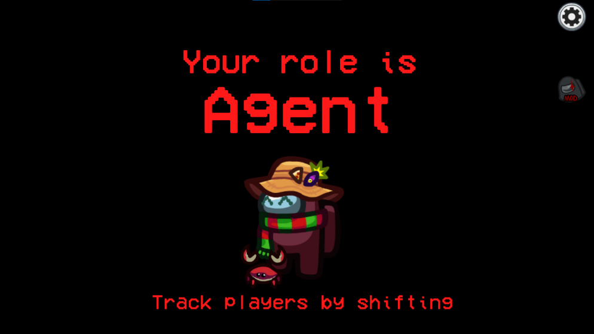

__Faction__: Impostor (Killing) 
__Base__: Shapeshifter 
__Ability__: Track players by shapeshifting 
__Indicator/Symbols__: Arrows 
__Win Condition__: Kill all crewmates 
__Can Use Pet System__: No 

Origin: [Town of Host Re-Edited](https://github.com/Loonie-Toons/Re-Edited) 

#### Role Description
The Agent is an Impostor who can shapeshift to choose a target. 

------------------------------------------------------------------------------------------------------------------------------------------------------------------------------------------

## Anonymous

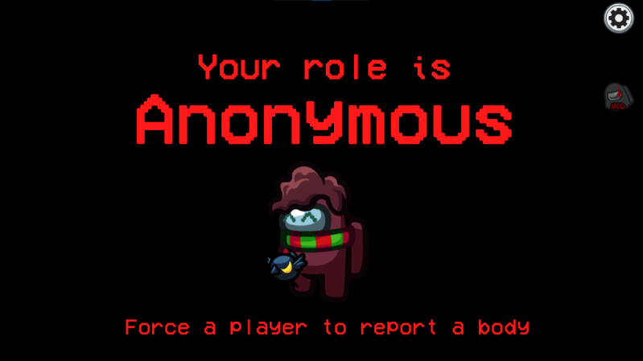

__Faction__: Impostor (Hindering) 
__Base__: Shapeshifter 
__Ability__: Force a player to report a body 
__Indicator/Symbols__: None 
__Win Condition__: Kill all crewmates 
__Can Use Pet System__: No 

Origin: [Town of Host Re-Edited](https://github.com/Loonie-Toons/Re-Edited) 

#### Role Description
The Anonymous is an Impostor that can use their shift button to force a player to report a body the Anonymous killed. 
If the Anonymous didn't kill anyone and tries to use their ability, the target will report themself. 

------------------------------------------------------------------------------------------------------------------------------------------------------------------------------------------

## Arrogance

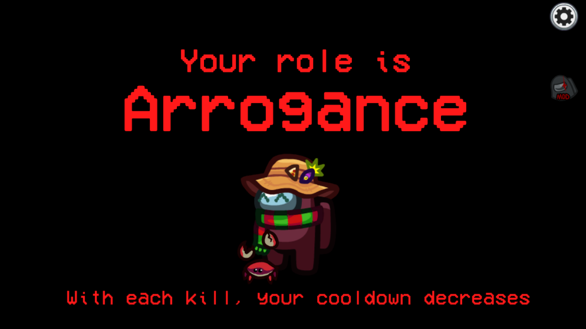

__Faction__: Impostor (Killing) 
__Base__: Impostor 
__Ability__: Get a lower cooldown per kill 
__Indicator/Symbols__: None 
__Win Condition__: Kill all crewmates 

Origin: [Town of Host Edited](https://github.com/KARPED1EM/TownOfNext) 

#### Role Description
The Arrogance is an Impostor that functions identically to the [Juggernaut](#Juggernaut). 
The key difference is that the Arrogance is on the Impostor team. 
For each kill you make, your kill cooldown lowers. 

------------------------------------------------------------------------------------------------------------------------------------------------------------------------------------------

## Assassin

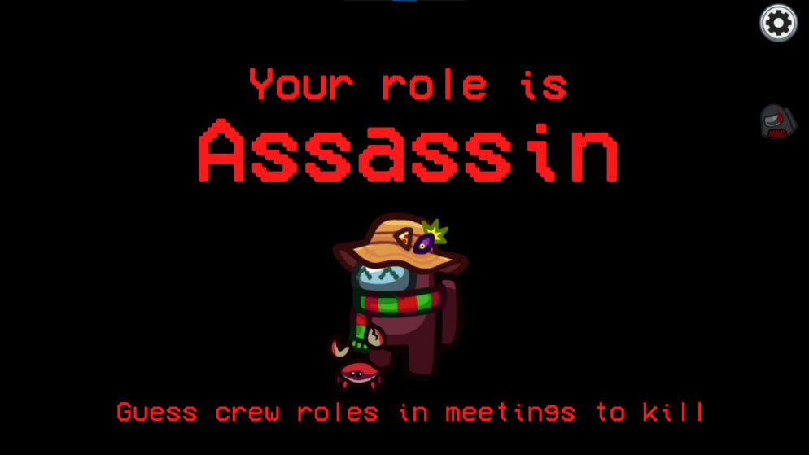

__Faction__: Impostor (Killing) 
__Base__: Impostor 
__Ability__: Guess roles in meetings to kill 
__Indicator/Symbols__: None 
__Win Condition__: Kill all crewmates 
__Can Use Pet System__: No 

Origin: [Town of Us Reactivated](https://github.com/eDonnes124/Town-Of-Us-R) 

#### Role Description
The Assassin is a regular Impostor with one added bonus: Guessing! 
Guessing is a mechanic where you guess a player's role to kill them. 
Guessing wrong kills you instead. 
To guess, use the command `/bt [playerId] role` or use the UI if you have the mod installed. 
Player IDs are displayed next to player names during meetings. 

> **Fun Fact!** 
> There is a crewmate variant called [Vigilante](#Vigilante) and a neutral variant called [Doomsayer](#Doomsayer)!

------------------------------------------------------------------------------------------------------------------------------------------------------------------------------------------

## Berserker

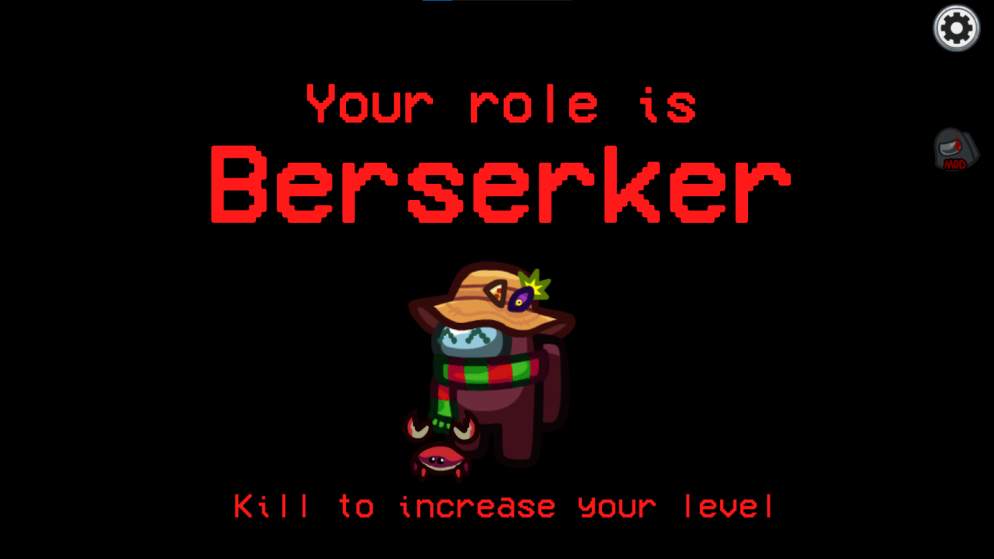

__Faction__: Impostor (Killing) 
__Base__: Impostor 
__Ability__: Become stronger with each kill 
__Indicator/Symbols__: None 
__Win Condition__: Kill all crewmates 
__Can Use Pet System__: No 

Origin: Town of Salem 2 

#### Role Description
The Berserker is an Impostor who becomes stronger on each kill they make. 
Upon reaching the needed level, your kill cooldown is lowered. 
Upon reaching the needed level, your kills behave like a [Scavenger](#Scavenger). 
Upon reaching the needed level, you no longer have scavenged kills but instead have explosive kills. 
Upon reaching the needed level, you become immortal. 

------------------------------------------------------------------------------------------------------------------------------------------------------------------------------------------

## Blackmailer

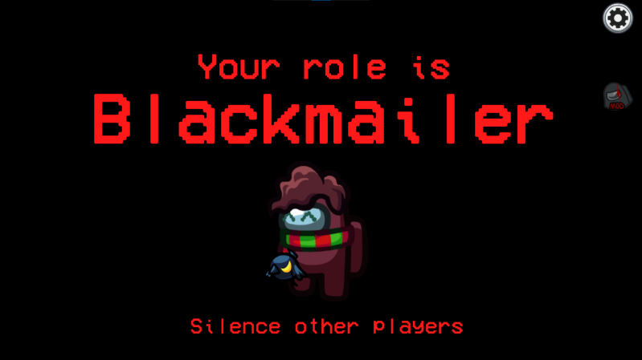

__Faction__: Impostor (Hindering) 
__Base__: Impostor 
__Ability__: Silence others 
__Indicator/Symbols__: Big red X in meetings 
__Win Condition__: Kill all crewmates 
__Can Use Pet System__: No 

Origin: [Town of Us Reactivated](https://github.com/eDonnes124/Town-Of-Us-R) 

#### Role Description
The Blackmailer is an Impostor that can silence other players, termed blackmailing. 
To blackmail a player, use your kill button once on said player. 
To kill, click it twice. 

During a meeting, a blackmailed player will be shown with a big red X. 
A chat message will also be sent. 

Blackmailed players cannot chat, even if they tried. 

------------------------------------------------------------------------------------------------------------------------------------------------------------------------------------------

## Bomber

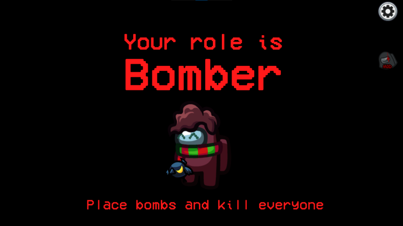

__Faction__: Impostor (Killing) 
__Base__: Impostor/Shapeshifter 
__Ability__: Place bombs to kill others 
__Indicator/Symbols__: None 
__Win Condition__: Kill all crewmates 
__Can Use Pet System__: Yes 

Origin: [Town of Us Reactivated](https://github.com/eDonnes124/Town-Of-Us-R) 

#### Role Description
The Bomber is an Impostor that can use the shift button to place a bomb. 
Any player within the bomb radius dies when it explodes. 
The Bomber and other Impostors can die to the bomb. 

------------------------------------------------------------------------------------------------------------------------------------------------------------------------------------------

## Bounty Hunter

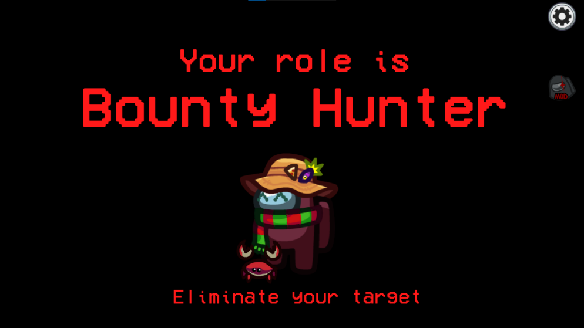

__Faction__: Impostor (Killing) 
__Base__: Shapeshifter 
__Ability__: Lower cooldown when killing bounty 
__Indicator/Symbols__: None 
__Win Condition__: Kill all crewmates 
__Can Use Pet System__: No 

Origin: [TheOtherRoles](https://github.com/TheOtherRolesAU/TheOtherRoles) 

#### Role Description
The Bounty Hunter gets a bounty indicatd in a darker red, and changes at regular intervals. 
If the Bounty Hunter kills the bounty, they are rewarded with a low kill cooldown. 
If the Bounty Hunter kills anyone else, they are punished with a high kill cooldown. 

------------------------------------------------------------------------------------------------------------------------------------------------------------------------------------------

## Camouflager

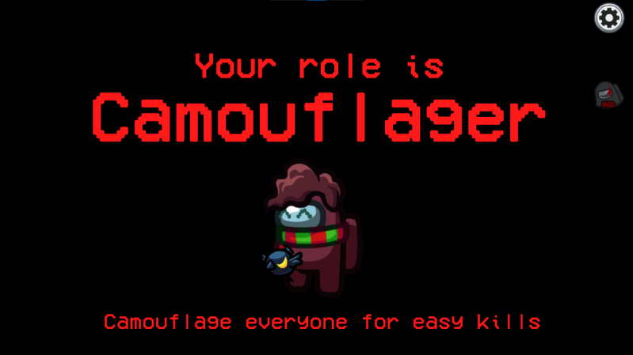

__Faction__: Impostor (Concealing) 
__Base__: Shapeshifter 
__Ability__: Turn everyone gray temporarily 
__Indicator/Symbols__: None 
__Win Condition__: Kill all crewmates 
__Can Use Pet System__: No 

Origin: [Town of Us Reactivated](https://github.com/eDonnes124/Town-Of-Us-R) 

#### Role Description
The Camouflager is an Impostor that can shift to turn everyone gray, allowing for completely anonymous kills. 
The camouflage ends when the Camouflager unshifts. 

------------------------------------------------------------------------------------------------------------------------------------------------------------------------------------------

## Cantankerous

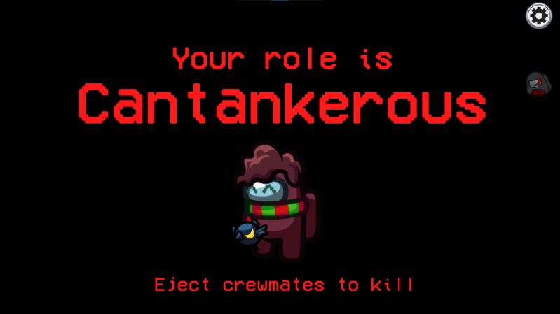

__Faction__: Impostor (Killing) 
__Base__: Impostor 
__Ability__: Exile non-Impostors to gain the ability to kill 
__Indicator/Symbols__: None 
__Win Condition__: Kill all crewmates 
__Can Use Pet System__: No 

Origin: [TOHE+](https://github.com/Gurge44/TOHE_PLUS) 

#### Role Description
The Cantankerous is an Impostor that can only kill if they have a point. 
To gain points, a non-Impostor (Crewmate or Neutral) needs to be exiled during a meeting. 

------------------------------------------------------------------------------------------------------------------------------------------------------------------------------------------

## Chronomancer

__Faction__: Impostor (Killing) 
__Base__: Impostor 
__Ability__: No kill cooldown after waiting Xs 
__Indicator/Symbols__: None 
__Win Condition__: Kill all crewmates 
__Can Use Pet System__: No 

Origin: [Town of Us Reactivated](https://github.com/eDonnes124/Town-Of-Us-R) 

#### Role Description
The Chronomancer gets no kill cooldown if they wait out past their kill cooldown to a set value. 

------------------------------------------------------------------------------------------------------------------------------------------------------------------------------------------

## Consigliere

__Faction__: Impostor (Support) 
__Base__: Impostor 
__Ability__: Reveal role of target 
__Indicator/Symbols__: None 
__Win Condition__: Kill all crewmates 
__Can Use Pet System__: No 

Origin: [Town of Host Re-Edited](https://github.com/Loonie-Toons/Re-Edited) 

#### Role Description
The Consigliere is an Impostor that can reveal the roles of other players, at the sacrifice of resetting their kill cooldown. 
Click the kill button once to reveal the target's role. 
Click the kill button twice to kill normally. 

If you are out of reveals, the kill button kills regardless. 

------------------------------------------------------------------------------------------------------------------------------------------------------------------------------------------
## Consort

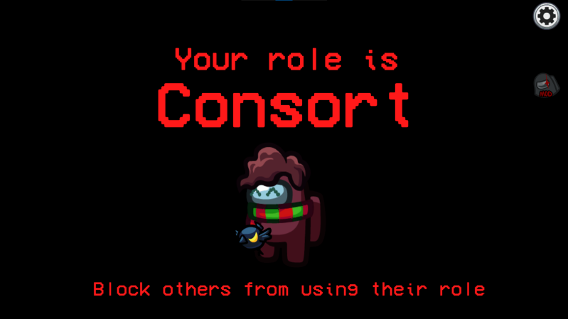

__Faction__: Impostor (Support) 
__Base__: Impostor 
__Ability__: Roleblock other players 
__Indicator/Symbols__: None 
__Win Condition__: Kill all crewmates 
__Can Use Pet System__: No 

Origin: Town of Host Refined 

#### Role Description
The Consort is an Impostor that can roleblock other players, preventing them from doing various actions. 
Click the kill button once to roleblock. 
Click the kill button twice to kill. 
If you are out of roleblock uses, the kill button kills regardless. 

Roleblock count resets after a meeting. 

> **Fun Fact!** 
> There's a crewmate variant called [Escort](#Escort)!

------------------------------------------------------------------------------------------------------------------------------------------------------------------------------------------

## Councillor

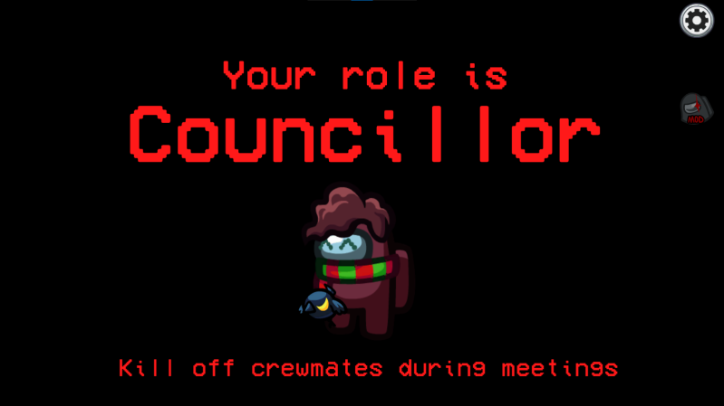

__Faction__: Impostor (Killing) 
__Base__: Impostor 
__Ability__: Murder players in meetings 
__Indicator/Symbols__: None 
__Win Condition__: Kill all crewmates 
__Can Use Pet System__: No 

Origin: [Town of Host Re-Edited](https://github.com/Loonie-Toons/Re-Edited) 

#### Role Description
The Councillor is an Impostor who can kill in meetings. 
Unlike the [Assassin](#Assassin), you do not need to know the target role, but you have a limited amount of meeting kills. 

------------------------------------------------------------------------------------------------------------------------------------------------------------------------------------------

## Creeper

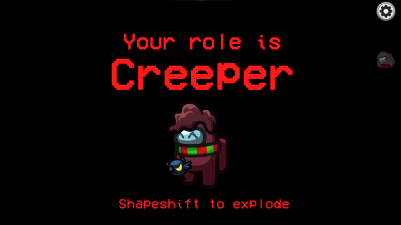

__Faction__: Impostor (Killing) 
__Base__: Shapeshifter 
__Ability__: Explode 
__Indicator/Symbols__: None 
__Win Condition__: Kill all crewmates 
__Can Use Pet System__: Yes 

Origin: [Project Lotus](https://github.com/ImaMapleTree/Lotus/) 

#### Role Description
The Creeper is an Impostor that can explode by shapeshifting. 
Whether or not Impostors are immune or the Creeper dies in the explosion is dependent on the settings. 

------------------------------------------------------------------------------------------------------------------------------------------------------------------------------------------

## Cursed Wolf

__Faction__: Impostor (Killing) 
__Base__: Impostor 
__Ability__: Reflect attacks onto the source 
__Indicator/Symbols__: None 
__Win Condition__: Kill all crewmates 
__Can Use Pet System__: No 

Origin: [TOHY](https://github.com/Yumenopai/TownOfHost_Y) 

#### Role Description
The Cursed Wolf is an Impostor that, when attacked, reflects nearly any attack onto the source. 
The attack type will either appear as a misfire or a [Veteran](#Veteran) kill, depending on the settings.

------------------------------------------------------------------------------------------------------------------------------------------------------------------------------------------

## Dazzler

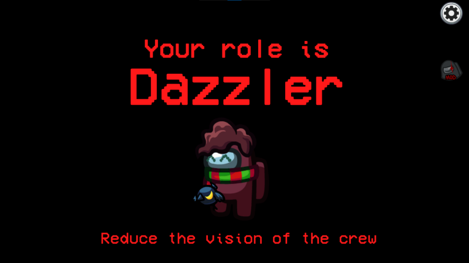

__Faction__: Impostor (Hindering) 
__Base__: Shapeshifter 
__Ability__: Lower the vision of others 
__Indicator/Symbols__: None 
__Win Condition__: Kill all crewmates 
__Can Use Pet System__: No 

Origin: [Town of Host Re-Edited](https://github.com/Loonie-Toons/Re-Edited) 

#### Role Description
The Dazzler is an Impostor that can use their shift button to lower the vision of the selected target. 

------------------------------------------------------------------------------------------------------------------------------------------------------------------------------------------

## Deathpact

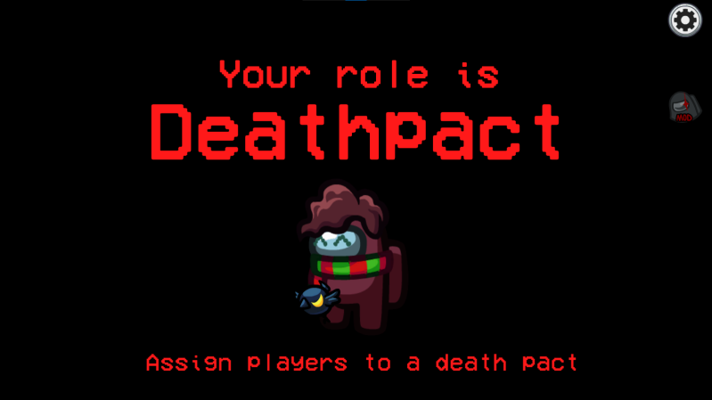

__Faction__: Impostor (Killing) 
__Base__: Shapeshifter 
__Ability__: Mark players with a death pact 
__Indicator/Symbols__: Red diamond 
__Win Condition__: Kill all crewmates 
__Can Use Pet System__: No 

Origin: [Town of Host Re-Edited](https://github.com/Loonie-Toons/Re-Edited) 

#### Role Description
The Deathpact is an Impostor that can put players into a death pact using the Shift menu. 
Once all death pacts have been assigned, all players in the death pact must meet in a set time else they all die. 

------------------------------------------------------------------------------------------------------------------------------------------------------------------------------------------

## Devourer

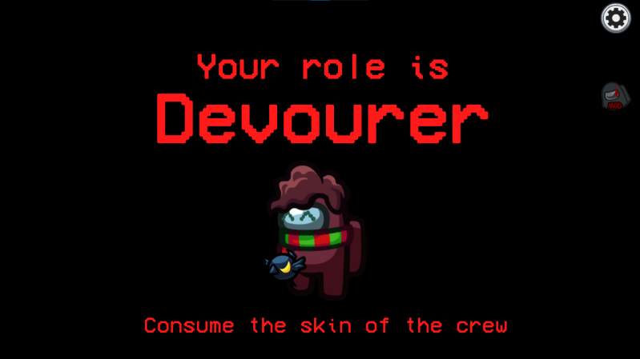

__Faction__: Impostor (Hindering) 
__Base__: Shapeshifter 
__Ability__: Make players unrecognizable 
__Indicator/Symbols__: None 
__Win Condition__: Kill all crewmates 
__Can Use Pet System__: No 

Origin: [Town of Host Re-Edited](https://github.com/Loonie-Toons/Re-Edited) 

#### Role Description
The Devourer is an Impostor that can use their shift button to eat the skin and cosmetics of the target. 
This renders the target unrecognizable. 
The Devourer's kill cooldown decreases for each player skin eaten. 

------------------------------------------------------------------------------------------------------------------------------------------------------------------------------------------

## Disperser

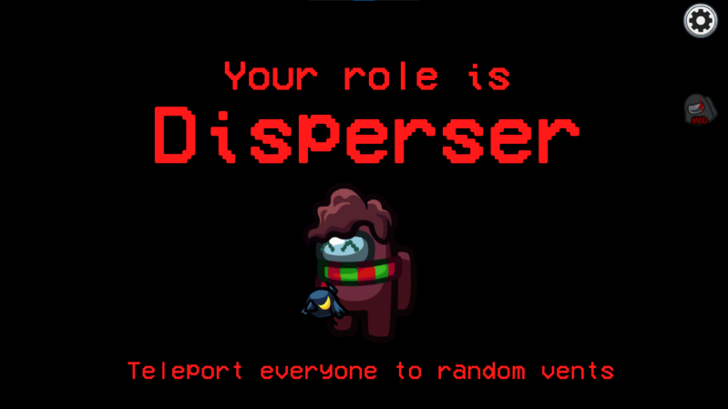

__Faction__: Impostor (Hindering) 
__Base__: Shapeshifter 
__Ability__: Swap the positions of all players 
__Indicator/Symbols__: None 
__Win Condition__: Kill all crewmates 
__Can Use Pet System__: No 

Origin: [Town of Host Re-Edited](https://github.com/Loonie-Toons/Re-Edited) 

#### Role Description
The Disperser is an Impostor that can use the shift button to swap the positions of all players. 

------------------------------------------------------------------------------------------------------------------------------------------------------------------------------------------

## Disruptor

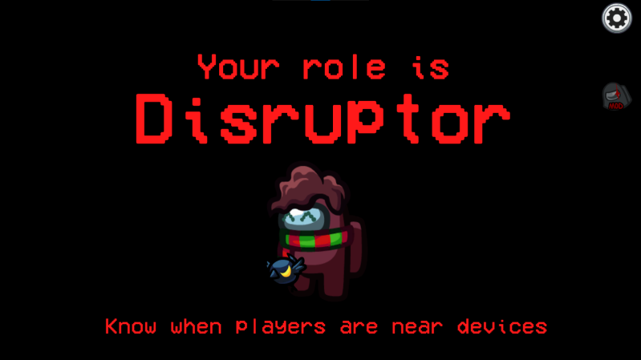

__Faction__: Impostor (Killing) 
__Base__: Impostor 
__Ability__: Detect device usage 
__Indicator/Symbols__: None 
__Win Condition__: Kill all crewmates 
__Can Use Pet System__: No 

Origin: [Town of Host Re-Edited](https://github.com/Loonie-Toons/Re-Edited) 

#### Role Description
The Disruptor is an Impostor that can detect when any non-Impostor is near a device (eg cameras or admin). 
The Disruptor is told which devices are possibly in use. 

> **Fun Fact!** 
> There is a crewmate variant called [Monitor](#Monitor)!

------------------------------------------------------------------------------------------------------------------------------------------------------------------------------------------

## Eraser

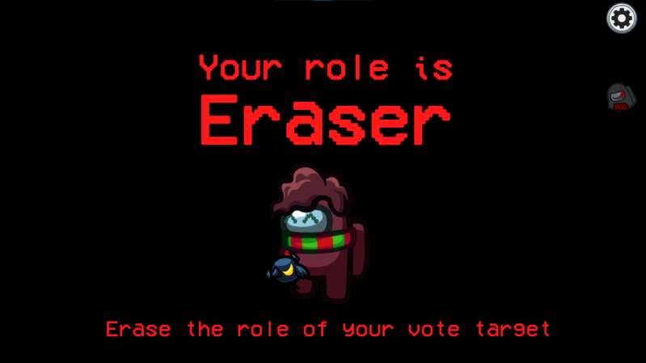

__Faction__: Impostor (Hindering) 
__Base__: Impostor 
__Ability__: Erase the role of vote target 
__Indicator/Symbols__: None 
__Win Condition__: Kill all crewmates 
__Can Use Pet System__: No 

Origin: [Town of Host Re-Edited](https://github.com/Loonie-Toons/Re-Edited) 

#### Role Description
The Eraser is an Impostor that can erase the roles of players, resetting them to their base role (Crewmate, [Engineer](#Engineer), and [Scientist](#Scientist))
To erase a role, vote for the player. 

------------------------------------------------------------------------------------------------------------------------------------------------------------------------------------------

## Escapist

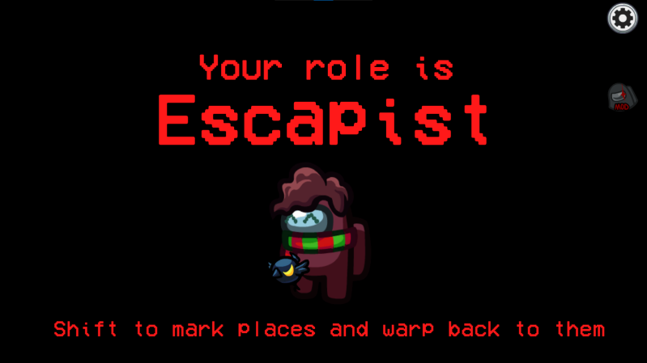

__Faction__: Impostor (Concealing) 
__Base__: Impostor/Shapeshifter 
__Ability__: Escape to set coordinates 
__Indicator/Symbols__: None 
__Win Condition__: Kill all crewmates 
__Can Use Pet System__: Yes 

Origin: [Town of Us Reactivated](https://github.com/eDonnes124/Town-Of-Us-R) 

#### Role Description
The Escapist is an Impostor that can use their pet/shift button to mark a position. 
When they pet/shift again, they will warp back to that position. 

> **Fun Fact!** 
> There is a crewmate variant called [Warper](#Warper)!

------------------------------------------------------------------------------------------------------------------------------------------------------------------------------------------
## Fireworker

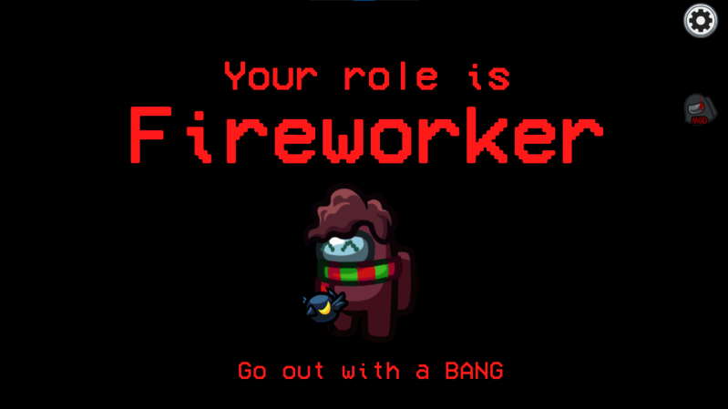

__Faction__: Impostor (Support) 
__Base__: Impostor/Shapeshifter 
__Ability__: Place fireworks and set them off when alone 
__Indicator/Symbols__: None 
__Win Condition__: Kill all crewmates 
__Can Use Pet System__: Yes 

Origin: [Town of Host](https://github.com/tukasa0001/TownOfHost)

#### Role Description
The Fireworker is an Impostor that can use their pet/shift button to set a firework on the ground. 
Once the Fireworker is the final Impostor, they can use their pet/shift button to set them off. 

------------------------------------------------------------------------------------------------------------------------------------------------------------------------------------------

## Gangster

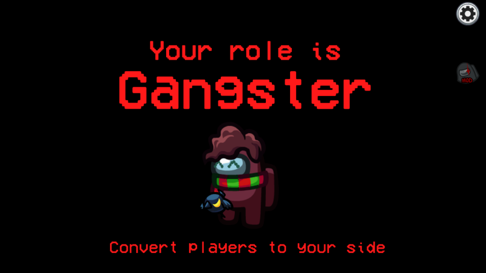

__Faction__: Impostor (Support) 
__Base__: Impostor 
__Ability__: Recruit others to the Impostor team 
__Indicator/Symbols__: None 
__Win Condition__: Kill all crewmates 
__Can Use Pet System__: No 

Origin: [Town of Host Edited](https://github.com/KARPED1EM/TownOfNext) 

#### Role Description
The Gangster is an Impostor that can convert crewmates and neutrals into Impostors.  
When converted, they receive the [Madmate](#Madmate) modifier. 

The Gangster kills normally if the target cannot be converted or the Gangster is out of conversions. 

------------------------------------------------------------------------------------------------------------------------------------------------------------------------------------------

## Godfather

__Faction__: Impostor (Support) 
__Base__: Impostor 
__Ability__: Turn killers into Impostors 
__Indicator/Symbols__: None 
__Win Condition__: Kill all crewmates 
__Can Use Pet System__: No 

Origin: [Town of Host Re-Edited](https://github.com/Loonie-Toons/Re-Edited) 

#### Role Description
The Godfather is an Impostor that can select a target in a meeting 
This target is marked in a way so if a killer were to kill that target, they'll become an Impostor. 
Depending on the settings, their role will be overwritten ([Refugee](#Refugee)) or apply the [Madmate](#Madmate) modifier.br>

------------------------------------------------------------------------------------------------------------------------------------------------------------------------------------------

## Greedy

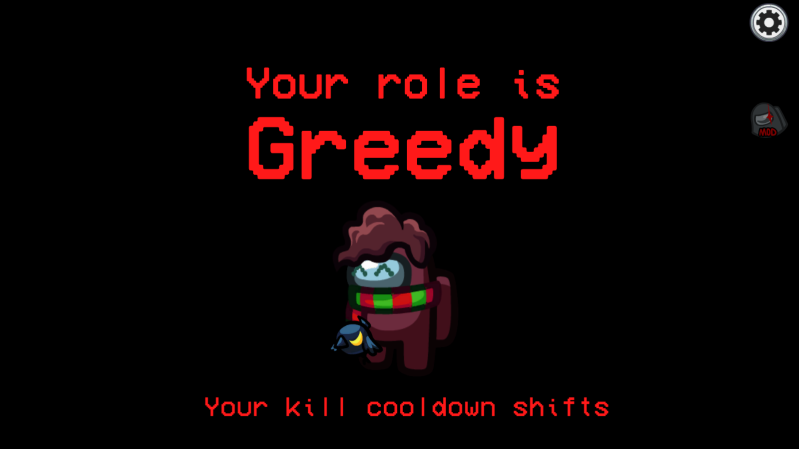

__Faction__: Impostor (Killing) 
__Base__: Impostor 
__Ability__: Alternating kill cooldowns 
__Indicator/Symbols__: None 
__Win Condition__: Kill all crewmates 
__Can Use Pet System__: No 

Origin: [TOHY](https://github.com/Yumenopai/TownOfHost_Y) 

#### Role Description
The Greedy is an Impostor with two kill cooldowns that swap with each kill. 
After a meeting, the first kill cooldown is always assigned. 

------------------------------------------------------------------------------------------------------------------------------------------------------------------------------------------

## Inhibitor

__Faction__: Impostor (Killing) 
__Base__: Impostor 
__Ability__: Unable to kill during sabotages 
__Indicator/Symbols__: None 
__Win Condition__: Kill all crewmates 
__Can Use Pet System__: No 

Origin: [Town of Host Re-Edited](https://github.com/Loonie-Toons/Re-Edited) 

#### Role Description
The Inhibtor is an Impostor that is unable to kill during any sabotage. 

------------------------------------------------------------------------------------------------------------------------------------------------------------------------------------------

## Instigator

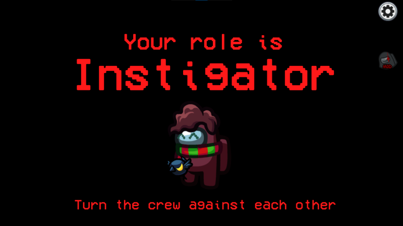

__Faction__: Impostor (Killing) 
__Base__: Impostor 
__Ability__: Kill extra crewmates during an ejection 
__Indicator/Symbols__: None 
__Win Condition__: Kill all crewmates 
__Can Use Pet System__: No 

Origin: [Town of Host Enhanced](https://github.com/0xDrMoe/TownofHost-Enhanced) 

#### Role Description
The Instigator is an Impostor that kills extra crewmates if a crewmate is ejected while the Instigator is alive. 
The amount of crewmates that die is set in the settings 

------------------------------------------------------------------------------------------------------------------------------------------------------------------------------------------

## Janitor

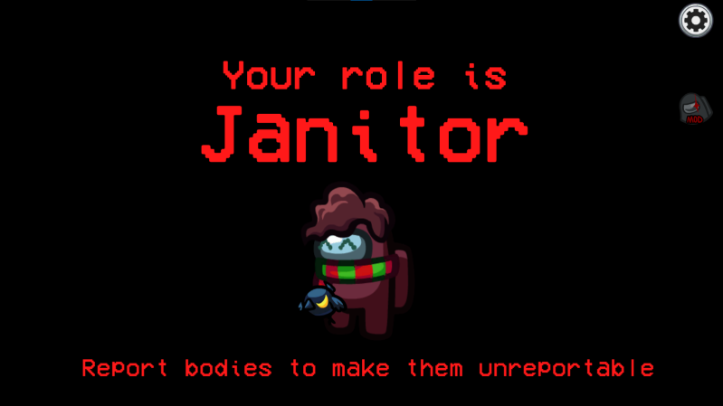

__Faction__: Impostor (Support) 
__Base__: Impostor 
__Ability__: Make bodies unreportable 
__Indicator/Symbols__: None 
__Win Condition__: Kill all crewmates 
__Can Use Pet System__: No 

Origin: [Town of Us Reactivated](https://github.com/eDonnes124/Town-Of-Us-R) 

#### Role Description
The Janitor is an Impostor that can clean up bodies, making the unreportable. 
If the Janitor's kill cooldown is up, their report button will be their clean button. 
If the kill cooldown is not up, the report button functions as a report button. 

Cleaning a body resets the kill cooldown. 

> **Fun Fact!** 
> There is a neutral variant called [Medusa](#Medusa)! 

------------------------------------------------------------------------------------------------------------------------------------------------------------------------------------------

## Kamikaze

__Faction__: Impostor (Support) 
__Base__: Impostor 
__Ability__: Mark players to remove from play when you die 
__Indicator/Symbols__: None 
__Win Condition__: Kill all crewmates 
__Can Use Pet System__: No 

Origin: Town of Host Refined 

#### Role Description
The Kamikaze is an Impostor that can mark players to make them die with the Kamikaze. 
To mark a player, click the kill button once on them. 
To kill normally, click twice. 

------------------------------------------------------------------------------------------------------------------------------------------------------------------------------------------

## Kidnapper

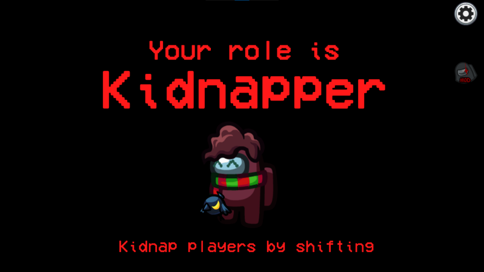

__Faction__: Impostor (Killing) 
__Base__: Shapeshifter 
__Ability__: Kidnap players to bring them to you 
__Indicator/Symbols__: None 
__Win Condition__: Kill all crewmates 
__Can Use Pet System__: No 

Origin: Town of Host Refined 

#### Role Description
The Kidnapper is an Impostor that can select a player using the Shift menu to teleport them to the Kidnapper. 

------------------------------------------------------------------------------------------------------------------------------------------------------------------------------------------

## Lightning

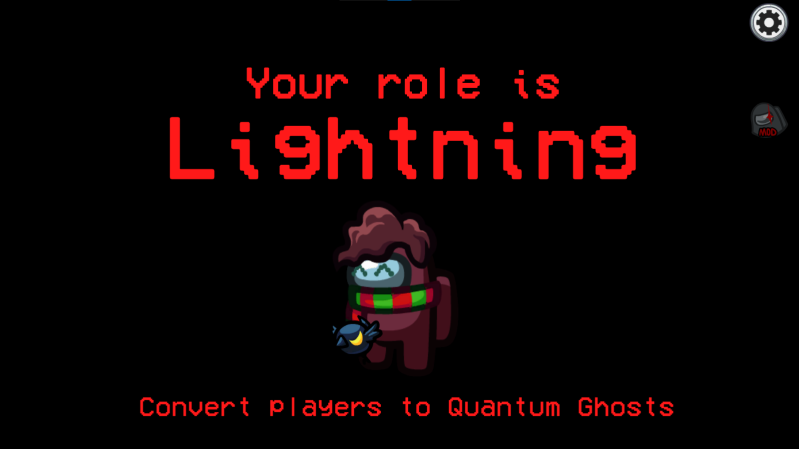

__Faction__: Impostor (Concealing) 
__Base__: Impostor 
__Ability__: Turn players into quantum ghosts 
__Indicator/Symbols__: Red square 
__Win Condition__: Kill all crewmates 
__Can Use Pet System__: No 

Origin: [Town of Host Edited](https://github.com/KARPED1EM/TownOfNext) 

#### Role Description
The Lightning is an Impostor that can turn players into quantum ghosts using the kill button. 
When a player is marked, they die after a set time. 

Optionally, the killer of the Lightning may also turn into a quantum ghost.

------------------------------------------------------------------------------------------------------------------------------------------------------------------------------------------

## Ludopath

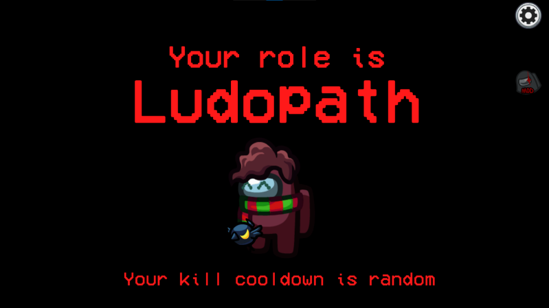

__Faction__: Impostor (Killing) 
__Base__: Impostor 
__Ability__: Randomized kill cooldown 
__Indicator/Symbols__: None 
__Win Condition__: Kill all crewmates 
__Can Use Pet System__: No 

Origin: [Town of Host Re-Edited](https://github.com/Loonie-Toons/Re-Edited) 

#### Role Description
The Ludopath is an Impostor that has a randomized kill cooldown ranging from 1 to the value set in the settings. 
If the Ludopath does not make a kill before a meeting, they will have the highest kill cooldown they can receive. 
This can also occur if a [Pacifist](#Pacifist) uses their ability before the Ludopath can make a kill. 

------------------------------------------------------------------------------------------------------------------------------------------------------------------------------------------

## Lurker

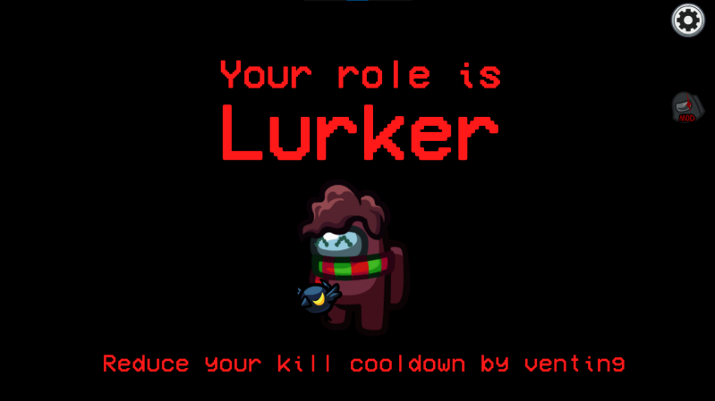

__Faction__: Impostor (Killing) 
__Base__: Impostor 
__Ability__: Decrease kill cooldown by venting 
__Indicator/Symbols__: None 
__Win Condition__: Kill all crewmates 
__Can Use Pet System__: No 

Origin: [Town of Host Re-Edited](https://github.com/Loonie-Toons/Re-Edited) 

#### Role Description
The Lurker is an Impostor that can vent to decrease their kill cooldown. 

------------------------------------------------------------------------------------------------------------------------------------------------------------------------------------------

## Mafioso

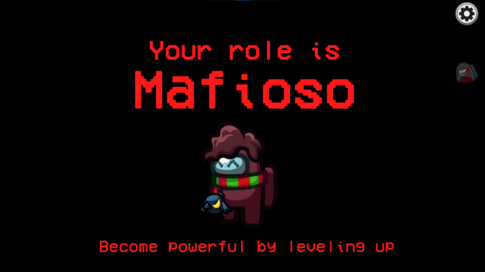

__Faction__: Impostor (Killing) 
__Base__: Impostor 
__Ability__: Tier up progressively to get stronger 
__Indicator/Symbols__: None 
__Win Condition__: Kill all crewmates 
__Can Use Pet System__: No 

Origin: [TOHE+](https://github.com/Gurge44/TOHE_PLUS) 

#### Role Description
The Mafioso is an Impostor that can do certain actions to gain XP to level up. 

### Tiers
| Level | Effect |
| ----- | ------ |
| Tier 0 | Regular Impostor, high kill cooldown, short kill range |
| Tier 1 | Normal kill cooldown, long kill range |
| Tier 2 | Low kill cooldown |
| Tier 3 | Delayed kills |

------------------------------------------------------------------------------------------------------------------------------------------------------------------------------------------

## Mastermind

__Faction__: Impostor (Concealing) 
__Base__: Impostor 
__Ability__: Make players kill for you 
__Indicator/Symbols__: None 
__Win Condition__: Kill all crewmates 
__Can Use Pet System__: No 

Origin: [Project Lotus](https://github.com/ImaMapleTree/Lotus/) 

#### Role Description
The Mastermind is an Impostor that can make players kill for them, much like the [Puppeteer](#Puppeteer). 
Unlike [Puppeteer](#Puppeteer), the target can choose who dies, but will die if they don't kill anyone. 
If the target attempts to kill the Mastermind, the Mastermind kills the target. 

Only players that have access to the kill button on their client can be affected by the Mastermind. 

The Mastermind can double click to kill normally. 
When using the manipulation, there is a calculation that determines what the cooldown output will be after manipulating someone. 
This uses Mastermind's various settings. 

------------------------------------------------------------------------------------------------------------------------------------------------------------------------------------------

## Mercenary

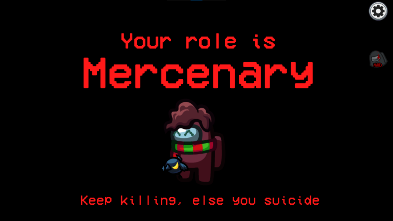

__Faction__: Impostor (Killing) 
__Base__: Shapeshifter 
__Ability__: Kill or die 
__Indicator/Symbols__: None 
__Win Condition__: Kill all crewmates 
__Can Use Pet System__: No 

Origin: [Town of Host Re-Edited](https://github.com/Loonie-Toons/Re-Edited) 

#### Role Description
The Mercenary is an Impostor on a timer. 
If the timer hits zero, they die. 
Killing resets the timer. 
Timer does not start until they make their first kill. 

------------------------------------------------------------------------------------------------------------------------------------------------------------------------------------------

## Miner

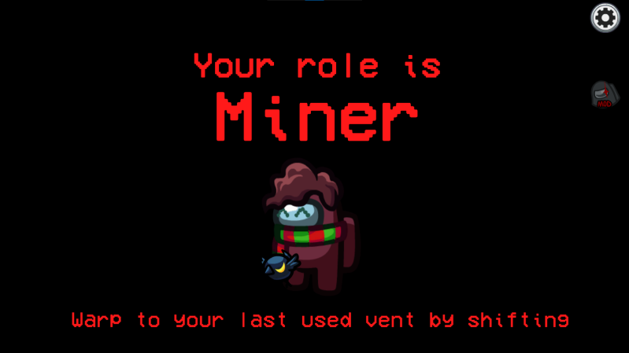

__Faction__: Impostor (Concealing) 
__Base__: Shapeshifter/Impostor 
__Ability__: Mark a vent to warp back to 
__Indicator/Symbols__: None 
__Win Condition__: Kill all crewmates 
__Can Use Pet System__: Yes 

Origin: [Project Lotus](https://github.com/ImaMapleTree/Lotus/) 

#### Role Description
The Miner is an Impostor that can mark a vent to warp back to. 
When the Miner use their shift/pet button after marking a vent, the Miner will be warped back to the marked vent. 
If the Miner tries to warp with no vent marked, nothing happens. 

------------------------------------------------------------------------------------------------------------------------------------------------------------------------------------------

## Morphling

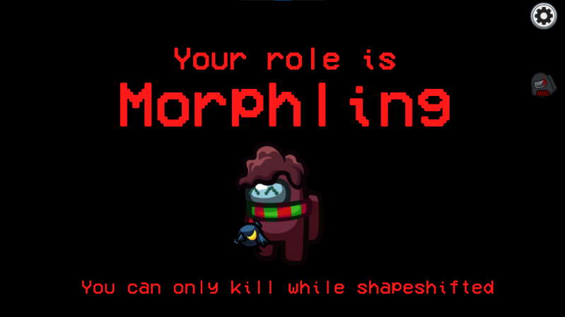

__Faction__: Impostor (Support) 
__Base__: Shapeshifter 
__Ability__: May only kill while shifted 
__Indicator/Symbols__: None 
__Win Condition__: Kill all crewmates 
__Can Use Pet System__: No 

Origin: [Town of Host Re-Edited](https://github.com/Loonie-Toons/Re-Edited) 

#### Role Description
The Morphling is an Impostor that functions identically to the [Shapeshifter](#Shapeshifter), but with one key difference: They can only kill while shapeshifted. 

------------------------------------------------------------------------------------------------------------------------------------------------------------------------------------------

## Nemesis

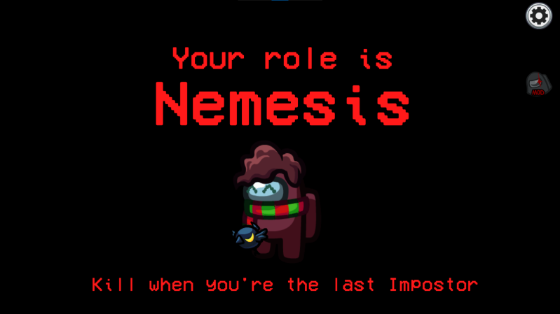

__Faction__: Impostor (Support) 
__Base__: Impostor/Shapeshifter 
__Ability__: Kill crewmates after dying 
__Indicator/Symbols__: None 
__Win Condition__: Kill all crewmates 
__Can Use Pet System__: No 

Origin: [Town of Host Re-Edited](https://github.com/Loonie-Toons/Re-Edited) 

#### Role Description
The Nemesis is an Impostor that cannot kill until they are the last Impostor alive. 
If the Nemesis dies at any point, they can use `/rv playerID` to kill that player. 
Optionally, the Nemesis can also shapeshift. 

> **Fun Fact!** 
> There is a crewmate variant called [Retributionist](#Retributionist)!

------------------------------------------------------------------------------------------------------------------------------------------------------------------------------------------

## Nightmare

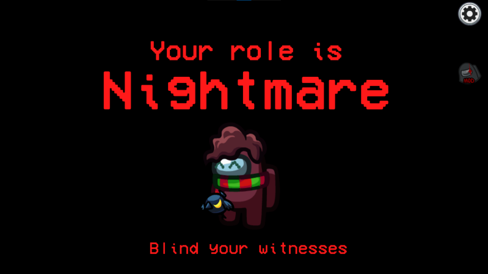

__Faction__: Impostor (Hindering) 
__Base__: Impostor 
__Ability__: Blind others briefly after a kill 
__Indicator/Symbols__: None 
__Win Condition__: Kill all crewmates 
__Can Use Pet System__: No 

Origin: Town of Host Refined 

#### Role Description
The Nightmare is an Impostor with a basic ability. 
When the Nightmare kills, all nearby players are briefly blinded. 

------------------------------------------------------------------------------------------------------------------------------------------------------------------------------------------

## Ninja

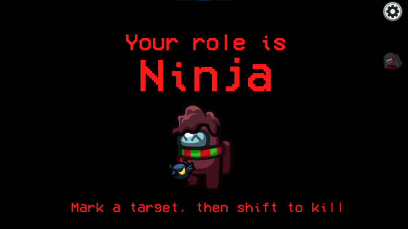

__Faction__: Impostor (Killing) 
__Base__: Shapeshifter/Impostor 
__Ability__: Mark a player to eliminate from anywhere 
__Indicator/Symbols__: None 
__Win Condition__: Kill all crewmates 
__Can Use Pet System__: Yes 

Origin: [TheOtherRoles](https://github.com/TheOtherRolesAU/TheOtherRoles) 

#### Role Description
The Ninja is an Impostor that can mark a player with their kill button. 
When the Ninja shapeshifts, the marked player is killed by the Ninja. 

------------------------------------------------------------------------------------------------------------------------------------------------------------------------------------------

## Pitfall

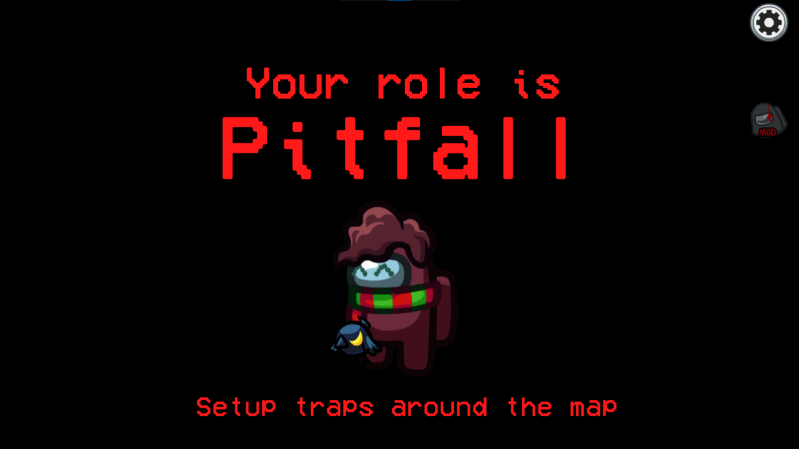

__Faction__: Impostor (Hindering) 
__Base__: Shapeshifter/Impostor 
__Ability__: Place traps around the map 
__Indicator/Symbols__: None 
__Win Condition__: Kill all crewmates 
__Can Use Pet System__: Yes 

Origin: [Town of Host Re-Edited](https://github.com/Loonie-Toons/Re-Edited) 

#### Role Description
The Pitfall is an Impostor that can use their shift/pet button to mark the area around the area as a trap. 
Players who enter this area will be immobilized for a short period of time and their vision will be affected. 

------------------------------------------------------------------------------------------------------------------------------------------------------------------------------------------

## Prosecutor

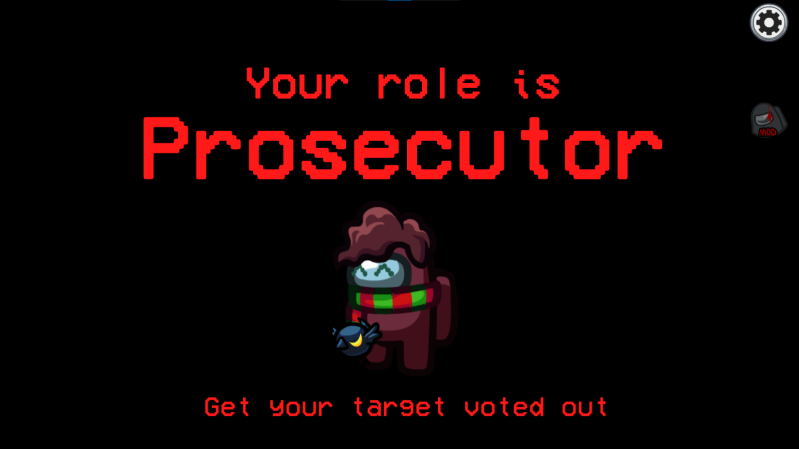

__Faction__: Impostor (Support) 
__Base__: Impostor 
__Ability__: Have target to exile to win 
__Indicator/Symbols__: None 
__Win Condition__: Kill all crewmates 
__Can Use Pet System__: No 

Origin: Town of Host Refined 

#### Role Description
The Prosecutor is an Impostor that has a target, much like an [Executioner](#Executioner). 
If the target is voted off while the Prosecutor is alive, the Impostors win. 
If the target is killed, the Prosecutor becomes a regular Impostor. 

Other Impostors do not know who the Prosecutor target is. 

------------------------------------------------------------------------------------------------------------------------------------------------------------------------------------------

## Puppeteer

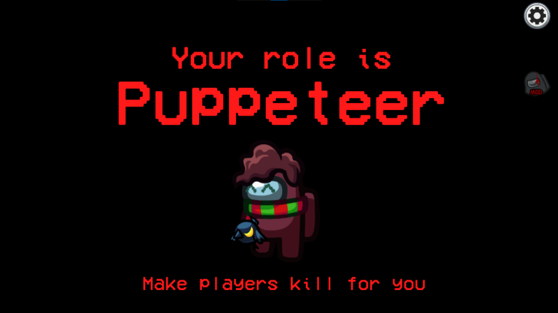

__Faction__: Impostor (Concealing) 
__Base__: Impostor 
__Ability__: Make crewmates kill for you 
__Indicator/Symbols__: None 
__Win Condition__: Kill all crewmates 
__Can Use Pet System__: No 

Origin: [Town of Host](https://github.com/tukasa0001/TownOfHost)

#### Role Description
The Puppeteer is an Impostor that can make players kill others. 

As the Puppeteer, use your kill button on a player once to add them as a puppet. 
When a puppet goes near a non-Impostor player, they will murder them. 
A puppet will not kill a player shielded by a [Medic](#Medic), but will still trigger the shield. 
A puppet will bypass a [Cleric](#Cleric) shield.

To kill normally, click the kill button twice on a player. 

------------------------------------------------------------------------------------------------------------------------------------------------------------------------------------------

## Quick Shooter

__Faction__: Impostor (Killing) 
__Base__: Impostor/Shapeshifter 
__Ability__: Store bullets to use later 
__Indicator/Symbols__: None 
__Win Condition__: Kill all crewmates 
__Can Use Pet System__: Yes 

Origin: [Town of Host Edited](https://github.com/KARPED1EM/TownOfNext) 

#### Role Description
The Quick Shooter is an Impostor that can use their shift button when their kill cooldown is up to store that kill for later. 
If the Quick Shooter uses the shift button while the kill button is on cooldown, then nothing is stored. 

------------------------------------------------------------------------------------------------------------------------------------------------------------------------------------------

## Saboteur

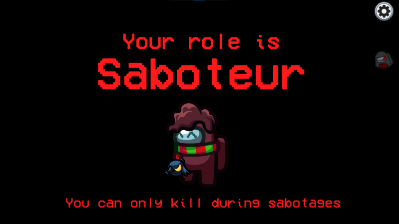

__Faction__: Impostor (Killing) 
__Base__: Impostor 
__Ability__: Can only kill during a sabotage 
__Indicator/Symbols__: None 
__Win Condition__: Kill all crewmates 
__Can Use Pet System__: No 

Origin: [Town of Host Re-Edited](https://github.com/Loonie-Toons/Re-Edited) 

#### Role Description
The Saboteur is an Impostor that is only able to kill while a sabotage is active. 

------------------------------------------------------------------------------------------------------------------------------------------------------------------------------------------

## Scavenger

__Faction__: Impostor (Concealing) 
__Base__: Impostor 
__Ability__: Hidden bodies 
__Indicator/Symbols__: None 
__Win Condition__: Kill all crewmates 
__Can Use Pet System__: No 

Origin: [Town of Host Edited](https://github.com/KARPED1EM/TownOfNext) 

#### Role Description
The Scavenger is an Impostor that has completely hidden kills. 
When the Scavenger kills, their kills are removed from play. 
The Scavenger's kills do show on vitals, but will not be reportable due to them being removed. 

------------------------------------------------------------------------------------------------------------------------------------------------------------------------------------------

## Shapemaster

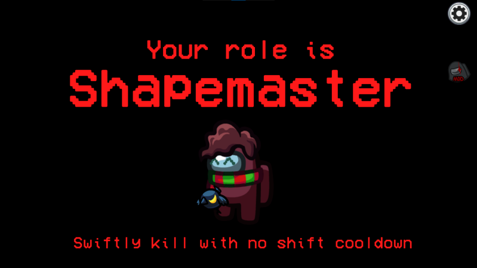

__Faction__: Impostor (Concealing) 
__Base__: Shapeshifter 
__Ability__: No shift cooldown 
__Indicator/Symbols__: None 
__Win Condition__: Kill all crewmates 
__Can Use Pet System__: No 

Origin: [Town of Host](https://github.com/tukasa0001/TownOfHost)

#### Role Description
The Shapemaster is an Impostor that functions exactly like the [Shapeshifter](#Shapeshifter). 
The only difference is that the Shapemaster has no cooldown on the Shapeshift ability. 
Additionally, the Shapemaster cannot be transformed for as long as a regular [Shapeshifter](#Shapeshifter).

------------------------------------------------------------------------------------------------------------------------------------------------------------------------------------------

## Shapeshifter

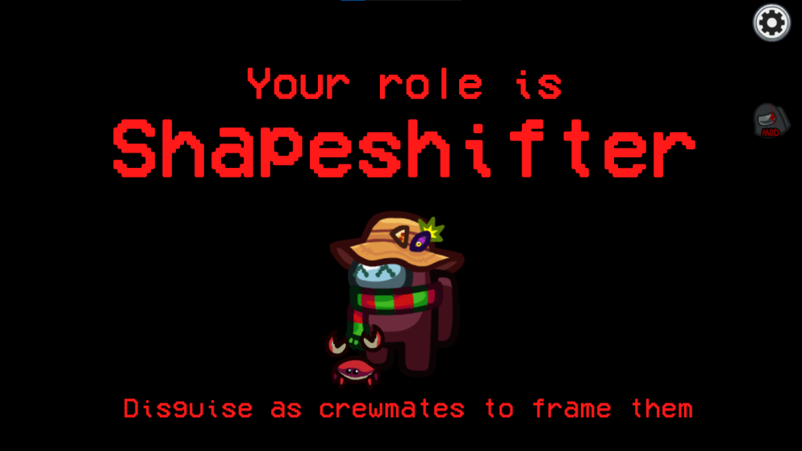

__Faction__: Impostor (Vanilla) 
__Base__: Shapeshifter 
__Ability__: Shapeshift 
__Indicator/Symbols__: None 
__Win Condition__: Kill all crewmates 
__Can Use Pet System__: No 

Origin: Vanilla Among Us 

#### Role Description
The Shapeshifter is just a regular Impostor with the added ability of shapeshifting. Shapeshift into crewmates to frame them.

------------------------------------------------------------------------------------------------------------------------------------------------------------------------------------------

## Sniper

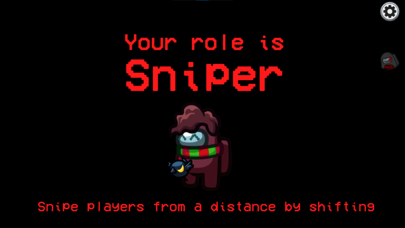

__Faction__: Impostor (Killing) 
__Base__: Impostor/Shapeshifter 
__Ability__: Kill from a long distance 
__Indicator/Symbols__: None 
__Win Condition__: Kill all crewmates 
__Can Use Pet System__: Yes 

Origin: [Town of Host](https://github.com/tukasa0001/TownOfHost)

#### Role Description
The Sniper is an Impostor with a ranged attack. 
Using the shift button, the Sniper can aim a bullet to be shot. 
The first shift is the starting point, and the second shift is the general direction of the bullet. 

------------------------------------------------------------------------------------------------------------------------------------------------------------------------------------------

## Spellcaster

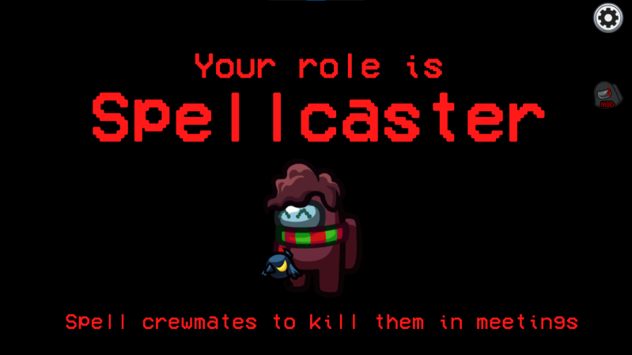

__Faction__: Impostor (Killing) 
__Base__: Impostor 
__Ability__: Cast spells on the crew to kill them in meetings 
__Indicator/Symbols__: Red cross in meetings 
__Win Condition__: Kill all crewmates 
__Can Use Pet System__: No 

Origin: [TheOtherRoles](https://github.com/TheOtherRolesAU/TheOtherRoles) 

#### Role Description
The Spellcaster is an Impostor that can use the kill button to spell a player. 
If the Spellcaster is not dead after the next meeting, all spelled players die. 

> **Fun Fact!** 
> There is a neutral variant called [Hex Master](#Hex-Master)! 

------------------------------------------------------------------------------------------------------------------------------------------------------------------------------------------

## Soul Catcher

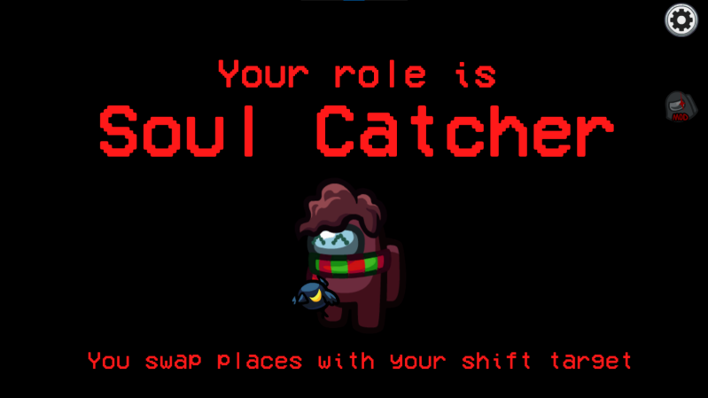

__Faction__: Impostor (Concealing) 
__Base__: Shapeshifter 
__Ability__: Swap places with who you shift into 
__Indicator/Symbols__: None 
__Win Condition__: Kill all crewmates 
__Can Use Pet System__: No 

Origin: [Town of Host Edited](https://github.com/KARPED1EM/TownOfNext) 

#### Role Description
The Soul Catcher is an Impostor that swaps places with the player they shapeshift into. 
This allows you to appear to actually become that player. 

------------------------------------------------------------------------------------------------------------------------------------------------------------------------------------------

## Swooper

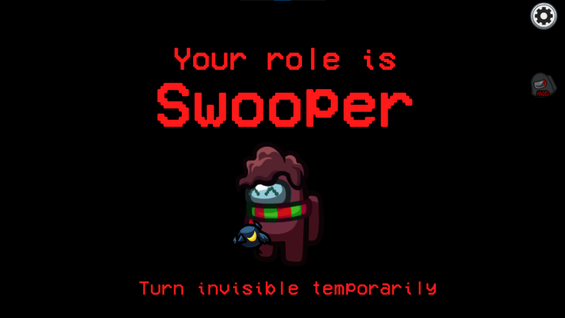

__Faction__: Impostor (Concealing) 
__Base__: Impostor 
__Ability__: Temporarily go invisible 
__Indicator/Symbols__: None 
__Win Condition__: Kill all crewmates 
__Can Use Pet System__: No 

Origin: [Town of Us Reactivated](https://github.com/eDonnes124/Town-Of-Us-R) 

#### Role Description
The Swooper is an Impostor that can temporarily turn invisible by venting. 
While invisible, you can kill in plain sight without being seen. 
If you vent while invisible, you'll stop swooping prematurely. 

> **Fun Fact!** 
> There is a crewmate variant called [Chameleon](#Chameleon) and a neutral variant called [Wraith](#Wraith)! 

------------------------------------------------------------------------------------------------------------------------------------------------------------------------------------------

## Telekinetic

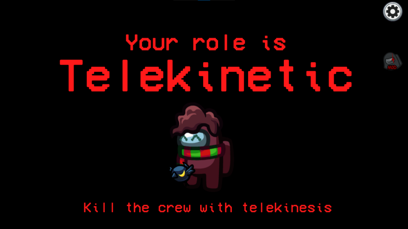

__Faction__: Impostor (Killing) 
__Base__: Impostor/Shapeshifter 
__Ability__: Mark a player to make them suicide 
__Indicator/Symbols__: None 
__Win Condition__: Kill all crewmates 
__Can Use Pet System__: Yes 

Origin: Town of Host Refined 

#### Role Description
The Telekinetic is an Impostor that can mark a player using the kill button, then shapeshift to make them suicide. 

------------------------------------------------------------------------------------------------------------------------------------------------------------------------------------------

## Time Thief

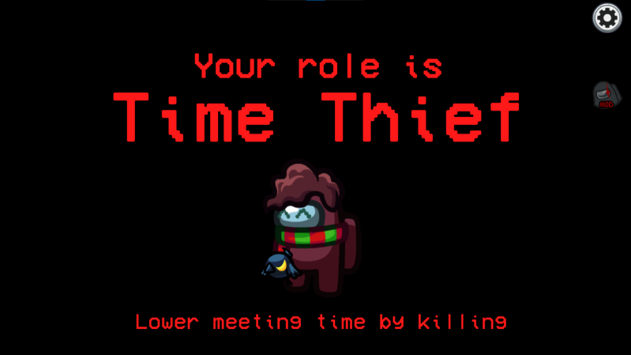

__Faction__: Impostor (Support) 
__Base__: Impostor 
__Ability__: Lower meeting time 
__Indicator/Symbols__: None 
__Win Condition__: Kill all crewmates 
__Can Use Pet System__: No 

Origin: [Town of Host](https://github.com/tukasa0001/TownOfHost)

#### Role Description
The Time Thief is an Impostor that can reduce meeting time by killing. 
The time is restored when the Time Thief dies. 

------------------------------------------------------------------------------------------------------------------------------------------------------------------------------------------

## Trapster

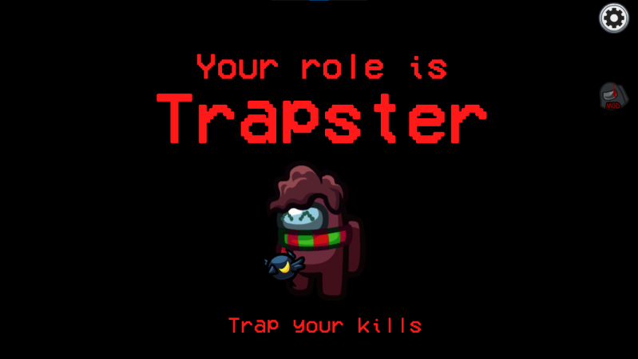

__Faction__: Impostor (Killing) 
__Base__: Impostor 
__Ability__: Trap bodies 
__Indicator/Symbols__: None 
__Win Condition__: Kill all crewmates 
__Can Use Pet System__: No 

Origin: [Town of Host Re-Edited](https://github.com/Loonie-Toons/Re-Edited) 

#### Role Description
The Trapster is an Impostor that has their primary form of killing assigned to the report button. 
When killing someone, that body will be trapped, resulting in anyone trying to report that body to die. 
Optionally, bodies created by the traps can also be trapped. 
Additionally, the Trapster's own body may also be trapped. 
And of course, anyone reporting the Trapster's body may also get their bodies trapped. 

------------------------------------------------------------------------------------------------------------------------------------------------------------------------------------------

## Twister

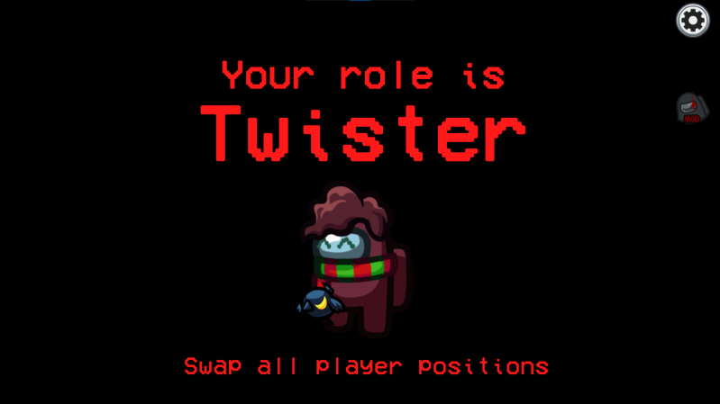

__Faction__: Impostor (Hindering) 
__Base__: Impostor/Shapeshifter 
__Ability__: Swap players' locations with another 
__Indicator/Symbols__: None 
__Win Condition__: Kill all crewmates 
__Can Use Pet System__: Yes 

Origin: [Town of Host Re-Edited](https://github.com/Loonie-Toons/Re-Edited) 

#### Role Description
The Twister is an Impostor that can make players swap with one another, much like the [Transporter](#Transporter). 
When the Twister uses their shift/pet button, the swap occurs. 

------------------------------------------------------------------------------------------------------------------------------------------------------------------------------------------

## Underdog

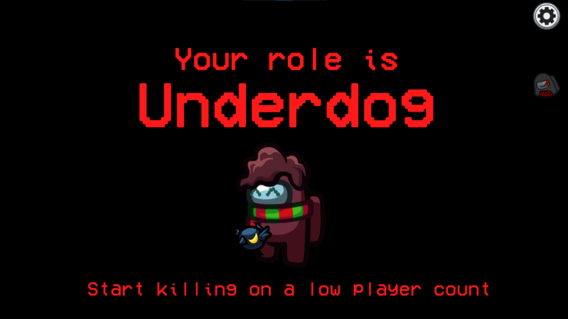

__Faction__: Impostor (Killing) 
__Base__: Impostor 
__Ability__: Low kill cooldown when low player count 
__Indicator/Symbols__: None 
__Win Condition__: Kill all crewmates 
__Can Use Pet System__: No 

Origin: [Town of Host Re-Edited](https://github.com/Loonie-Toons/Re-Edited) 

#### Role Description
The Underdog is an Impostor that has a long kill cooldown until enough players have died, to where they receive a low kill cooldown. 

------------------------------------------------------------------------------------------------------------------------------------------------------------------------------------------

## Undertaker

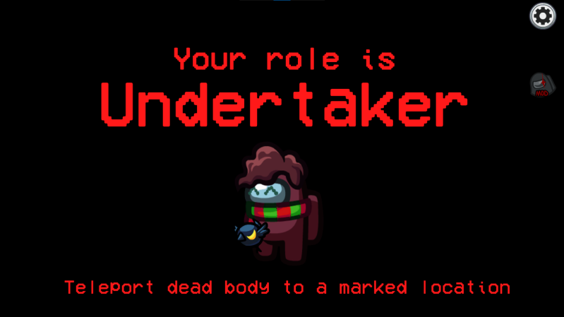

__Faction__: Impostor (Concealing) 
__Base__: Impostor/Shapeshifter 
__Ability__: Teleport kills to set location 
__Indicator/Symbols__: None 
__Win Condition__: Kill all crewmates 
__Can Use Pet System__: Yes 

Origin: [Town of Host Re-Edited](https://github.com/Loonie-Toons/Re-Edited) 

#### Role Description
The Undertaker is an Impostor that can use their shift/pet button to set a location. 
When the Undertaker kills after setting a location, their kill will be teleported to that location. 

------------------------------------------------------------------------------------------------------------------------------------------------------------------------------------------

## Vampire

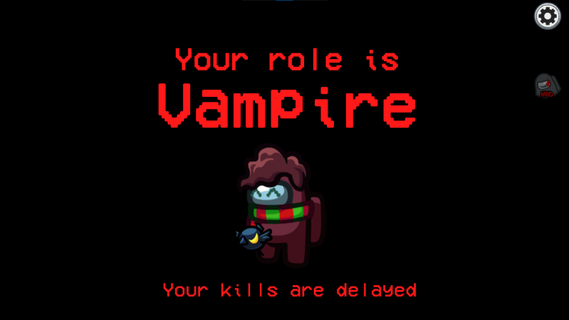

__Faction__: Impostor (Concealing) 
__Base__: Impostor 
__Ability__: Delayed kills 
__Indicator/Symbols__: None 
__Win Condition__: Kill all crewmates 
__Can Use Pet System__: No 

Origin: [TheOtherRoles](https://github.com/TheOtherRolesAU/TheOtherRoles) 

#### Role Description
The Vampire is an Impostor that has delayed kills. 
The kill button is the bite button, which will cause the victim to die after a set amount of time. 

> **Fun Fact!** 
> There is a neutral variant called [Poisoner](#Poisoner)!

------------------------------------------------------------------------------------------------------------------------------------------------------------------------------------------

## Vindicator

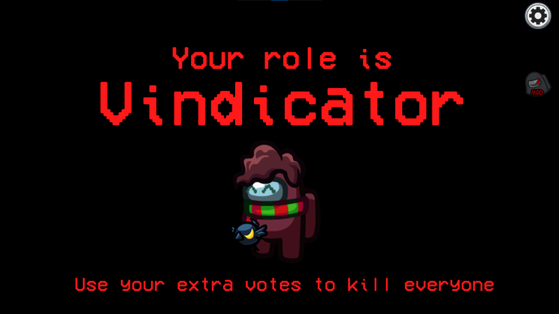

__Faction__: Impostor (Support) 
__Base__: Impostor 
__Ability__: Extra votes 
__Indicator/Symbols__: None 
__Win Condition__: Kill all crewmates 
__Can Use Pet System__: No 

Origin: [Town of Host Plus](https://github.com/Loonie-Toons/TownOfHostPlus) 

#### Role Description
The Vindicator is an Impostor with extra votes. 

> **Fun Fact!** 
> There is a crewmate variant called [Mayor](#Mayor)!

------------------------------------------------------------------------------------------------------------------------------------------------------------------------------------------

## Visionary

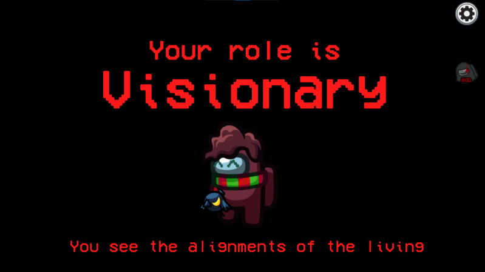

__Faction__: Impostor (Support) 
__Base__: Impostor 
__Ability__: Visible alive alignments 
__Indicator/Symbols__: None 
__Win Condition__: Kill all crewmates 
__Can Use Pet System__: No 

Origin: [Town of Host Re-Edited](https://github.com/Loonie-Toons/Re-Edited) 

#### Role Description
The Visionary is an Impostor that can see the alignments of all living players. 
The Visionary cannot see alignments of dead players. 

------------------------------------------------------------------------------------------------------------------------------------------------------------------------------------------

## Warlock

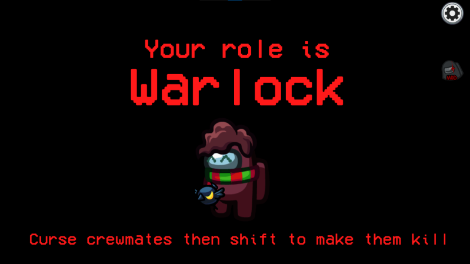

__Faction__: Impostor (Concealing) 
__Base__: Impostor/Shapeshifter 
__Ability__: Make target kill closest player 
__Indicator/Symbols__: None 
__Win Condition__: Kill all crewmates 
__Can Use Pet System__: Yes 

Origin: [TheOtherRoles](https://github.com/TheOtherRolesAU/TheOtherRoles) 

#### Role Description
The Warlock is an Impostor that can make players kill other players. 
To curse a player, use the kill button on a player. 
To make the cursed player kill, use the shift/pet button. 

------------------------------------------------------------------------------------------------------------------------------------------------------------------------------------------

## Wildling

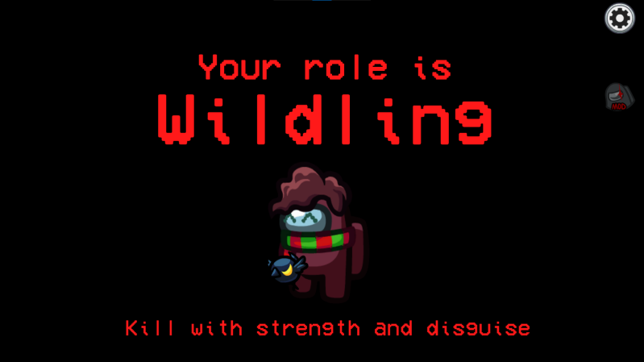

__Faction__: Impostor (Concealing) 
__Base__: Shapeshifter 
__Ability__: Become temporarily immortal after killing 
__Indicator/Symbols__: None 
__Win Condition__: Kill all crewmates 
__Can Use Pet System__: No 

Origin: [Town of Host Plus](https://github.com/Loonie-Toons/TownOfHostPlus) 

#### Role Description
The Wildling is an Impostor that can shapeshift. 
On top of this, when the Wildling kills, they temporarily become immortal. 
Additionally, the Wildling can not use vents. 

------------------------------------------------------------------------------------------------------------------------------------------------------------------------------------------

# Crewmate Roles

## Addict

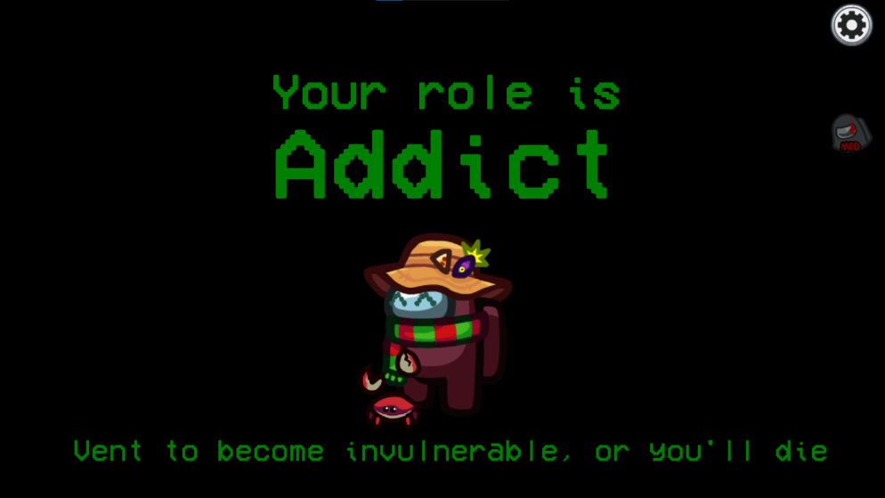

__Faction__: Crewmate (Basic) 
__Base__: Engineer 
__Ability__: Suicide if they do not vent in time 
__Indicator/Symbols__: None 
__Win Condition__: Eliminate all Impostors 
__Can Use Pet System__: No 

Origin: [Town of Host Re-Edited](https://github.com/Loonie-Toons/Re-Edited) 

#### Role Description
The Addict is a crewmate that dies if it does not vent in time. 
If it vents in time, it temporarily becomes immortal. 

------------------------------------------------------------------------------------------------------------------------------------------------------------------------------------------

## Alchemist

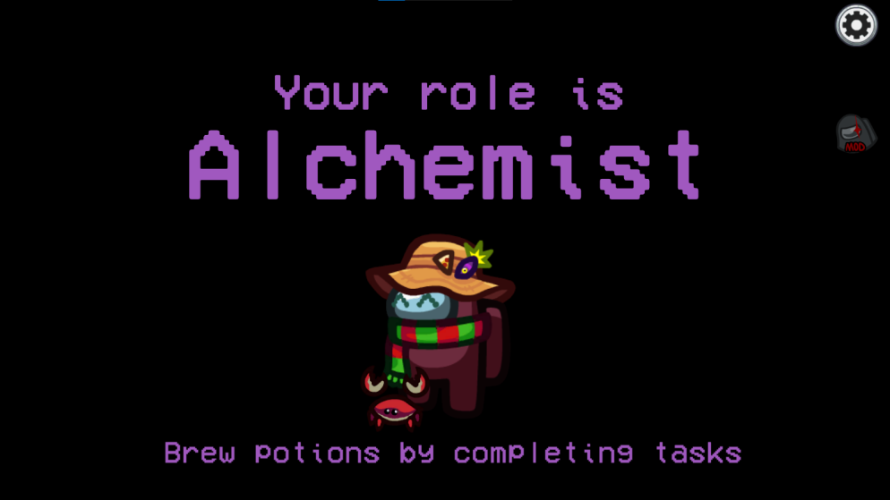

__Faction__: Crewmate (Basic) 
__Base__: Crewmate/Engineer 
__Ability__: Complete tasks to brew potions 
__Indicator/Symbols__: None 
__Win Condition__: Eliminate all Impostors 
__Can Use Pet System__: Yes 

Origin: [Town of Host Re-Edited](https://github.com/Loonie-Toons/Re-Edited) 

#### Role Description
The Alchemist is a crewmate that brews potion by completing tasks. 
The potions you can get is random. 
To drink them, vent. 

### Potions
| Name | Description |
| ------------- | --------------------------------------------- |
| Water Bottle | Does nothing |
| Potion of Resistance | Gives the Alchemist a temporary shield that protects them from one kill |
| Potion of Night Vision | Gives the Alchemist enhanced vision for a short period of time |
| Potion of Fixing | Allows the Alchemist to fix one sabotage instantly |
| Potion of Warping | Allows the Alchemist to teleport to a random player |
| Potion of Poison | Kills the Alchemist |
| Potion of Harming | Gives the Alchemist an identical effect to the [Bloodlust](#Bloodlust) modifier |

------------------------------------------------------------------------------------------------------------------------------------------------------------------------------------------

## Aurial

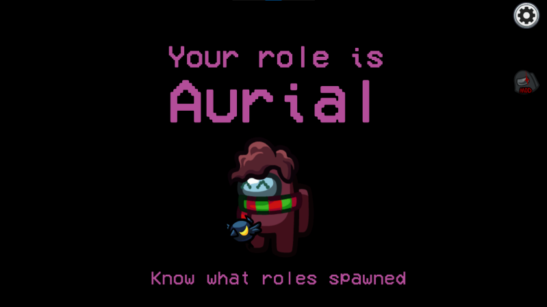

__Faction__: Crewmate (Support) 
__Base__: Crewmate 
__Ability__: Know what roles spawned 
__Indicator/Symbols__: None 
__Win Condition__: Eliminate all Impostors 
__Can Use Pet System__: No 

Origin: [TOHE+](https://github.com/Gurge44/TOHE_PLUS) 

#### Role Description
The Aurial is a crewmate that knows what roles spawned. 
When the Aurial completes a task, they are told one role that spawned. **It's only said once so make sure to remember it!** 
The Aurial is unable to sense other Aurials. 

------------------------------------------------------------------------------------------------------------------------------------------------------------------------------------------

## Benefactor

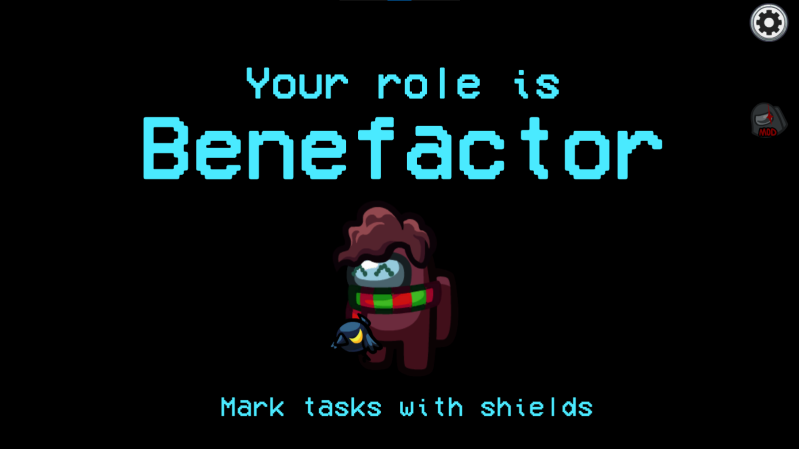

__Faction__: Crewmate (Support) 
__Base__: Crewmate 
__Ability__: Make tasks sources of shields 
__Indicator/Symbols__: None 
__Win Condition__: Eliminate all Impostors 
__Can Use Pet System__: No 

Origin: [TOHE+](https://github.com/Gurge44/TOHE_PLUS) 

#### Role Description
The Benefactor is a crewmate that can cast temporal shields onto tasks. 
When the Benefactor completes a task, that task is marked with a shield. 
The next player to complete that task gets a temporary shield. 

------------------------------------------------------------------------------------------------------------------------------------------------------------------------------------------

## Captain

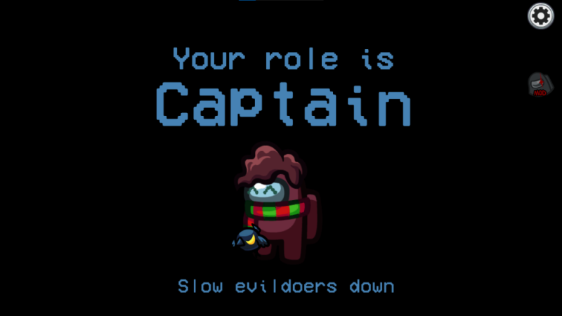

__Faction__: Crewmate (Power) 
__Base__: Crewmate 
__Ability__: Slow evildoers 
__Indicator/Symbols__: None 
__Win Condition__: Eliminate all Impostors 
__Can Use Pet System__: No 

Origin: [Town of Host Enhanced](https://github.com/0xDrMoe/TownofHost-Enhanced) 

#### Role Description
The Captain is a crewmate that slows a random non-crew player down whenever the Captain completes a task. 
All crewmates know who the Captain is, indicated with a star. 

If the Captain is exiled, anyone who participated in voting the Captain will have a modifier removed.  

------------------------------------------------------------------------------------------------------------------------------------------------------------------------------------------

## Celebrity

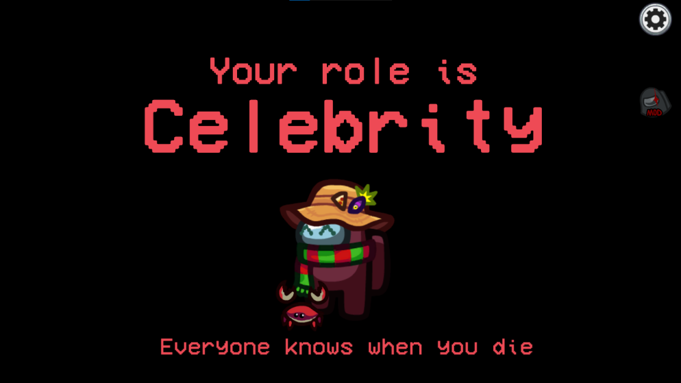

__Faction__: Crewmate (Basic) 
__Base__: Crewmate 
__Ability__: Everyone knows when you die 
__Indicator/Symbols__: None 
__Win Condition__: Eliminate all Impostors 
__Can Use Pet System__: No 

Origin: [Town of Host Edited](https://github.com/KARPED1EM/TownOfNext) 

#### Role Description
The Celebrity is a crewmate that sends a notification to everyone when they die. 

> **Fun Fact!** 
> There is a modifier variant called [Cyber](#Cyber)! 

------------------------------------------------------------------------------------------------------------------------------------------------------------------------------------------

## Chameleon

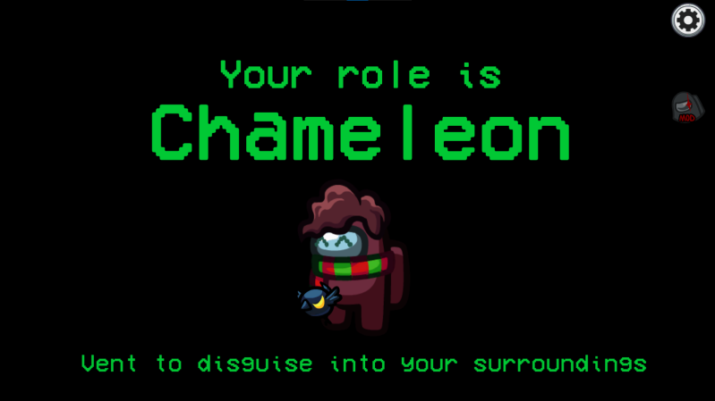

__Faction__: Crewmate (Support) 
__Base__: Engineer 
__Ability__: Temporary invisiblity 
__Indicator/Symbols__: None 
__Win Condition__: Eliminate all Impostors 
__Can Use Pet System__: No 

Origin: [Project Lotus](https://github.com/ImaMapleTree/Lotus) 

#### Role Description
The Swooper is an Impostor that can temporarily turn invisible by venting. 
While invisible, you can snoop around in plain sight without being seen. 
If you vent while invisible, you'll stop being invisible prematurely. 

> **Fun Fact!** 
> There is an impostor variant called [Swooper](#Swooper) and a neutral variant called [Wraith](#Wraith)! 

------------------------------------------------------------------------------------------------------------------------------------------------------------------------------------------

## Cleanser

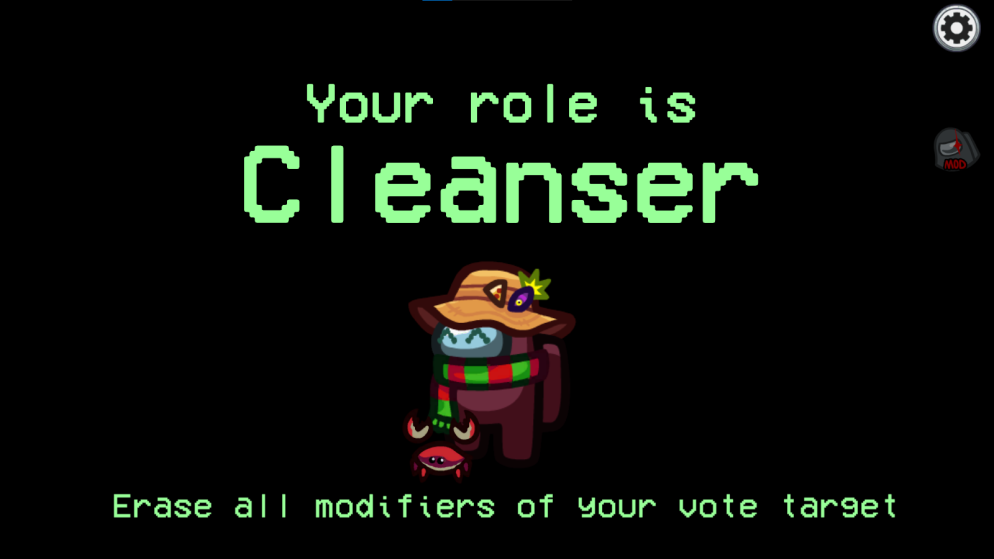

__Faction__: Crewmate (Basic) 
__Base__: Crewmate 
__Ability__: Remove all modifiers from vote target 
__Indicator/Symbols__: None 
__Win Condition__: Eliminate all Impostors 
__Can Use Pet System__: No 

Origin: [Town of Host Re-Edited](https://github.com/Loonie-Toons/Re-Edited) 

#### Role Description
The Cleanser is a crewmate that can erase modifiers from people. 
This can be done by voting for them. 
After being cleansed, you can no longer receive modifiers. 

------------------------------------------------------------------------------------------------------------------------------------------------------------------------------------------

## Cleric

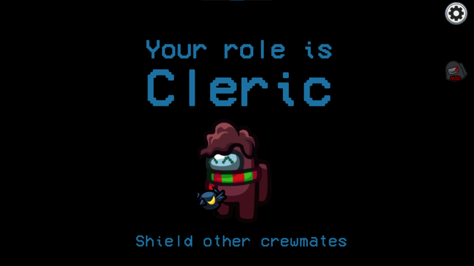

__Faction__: Crewmate (Support) 
__Base__: Impostor 
__Ability__: Cast one time shields onto players 
__Indicator/Symbols__: None 
__Win Condition__: Eliminate all Impostors 
__Can Use Pet System__: No 

Origin: Town of Host Refined 

#### Role Description
The Cleric is a crewmate that can cast a shield onto players, which protect them from one attack. 
After a meeting, shields are removed and the Cleric regains their shields. 

------------------------------------------------------------------------------------------------------------------------------------------------------------------------------------------

## Coroner

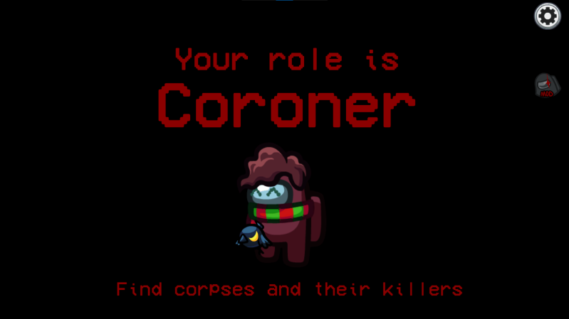

__Faction__: Crewmate (Support) 
__Base__: Crewmate 
__Ability__: Get an arrow pointing to the killer 
__Indicator/Symbols__: None 
__Win Condition__: Eliminate all Impostors 
__Can Use Pet System__: No 

Origin: [Town of Host Re-Edited](https://github.com/Loonie-Toons/Re-Edited) 

#### Role Description
The Coroner is a crewmate that can get the killer's trace and find the killer. 
When the Coroner attempts to report a body, they will instead track the killer. 
Follow the arrow to find the killer, just don't die. 

------------------------------------------------------------------------------------------------------------------------------------------------------------------------------------------

## Deputy

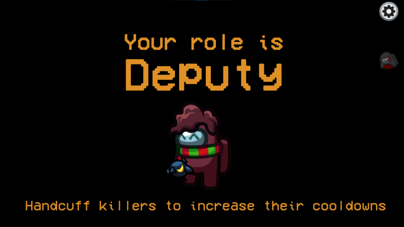

__Faction__: Crewmate (Support) 
__Base__: Impostor 
__Ability__: Reset a player's cooldown to a set value 
__Indicator/Symbols__: None 
__Win Condition__: Eliminate all Impostors 
__Can Use Pet System__: No 

Origin: [Town of Host Re-Edited](https://github.com/Loonie-Toons/Re-Edited) 

#### Role Description
The Deputy is a crewmate that can reset the cooldown of other players. 
To reset a player's kill cooldown, use your kill button on them. 
Their kill cooldown will be reset to whatever value is set in the settings. 

------------------------------------------------------------------------------------------------------------------------------------------------------------------------------------------

## Detective

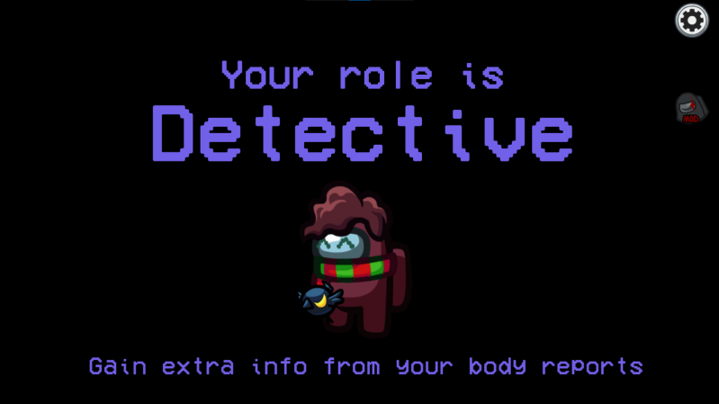

__Faction__: Crewmate (Support) 
__Base__: Crewmate 
__Ability__: Know the role of the bodies you report 
__Indicator/Symbols__: None 
__Win Condition__: Eliminate all Impostors 
__Can Use Pet System__: No 

Origin: [Town of Host Edited](https://github.com/KARPED1EM/TownOfNext) 

#### Role Description
The Detective is a crewmate that gains extra info from dead bodies. 
When the Detective reports a body, they will know the role of the body and optionally the killer's role. 

------------------------------------------------------------------------------------------------------------------------------------------------------------------------------------------

## Dictator

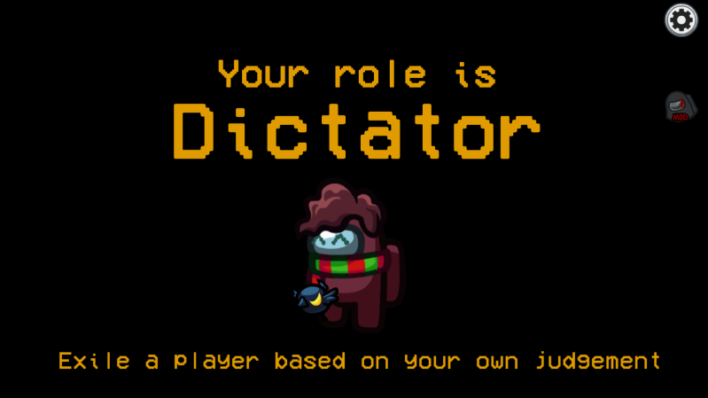

__Faction__: Crewmate (Power) 
__Base__: Crewmate 
__Ability__: Eject one player at the cost of your life 
__Indicator/Symbols__: None 
__Win Condition__: Eliminate all Impostors 
__Can Use Pet System__: No 

Origin: [Town of Host](https://github.com/tukasa0001/TownOfHost) 

#### Role Description
The Dictator is a crewmate that can exile any player they choose, at the cost of their own life. 
When the Dictator votes, all other votes are cancelled and the target the Dictator chose is exiled. 

Optionally, the Dictator may need their tasks complete to dictate a player. 

------------------------------------------------------------------------------------------------------------------------------------------------------------------------------------------

## Doctor

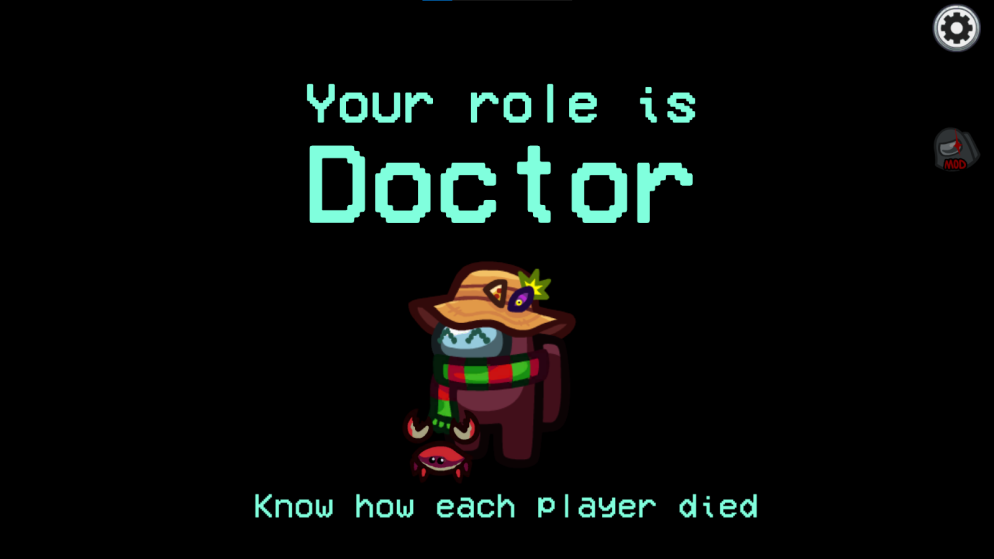

__Faction__: Crewmate (Basic) 
__Base__: Scientist 
__Ability__: See how others die 
__Indicator/Symbols__: None 
__Win Condition__: Eliminate all Impostors 
__Can Use Pet System__: No 

Origin: [Town of Host](https://github.com/tukasa0001/TownOfHost)

#### Role Description
The Doctor has access to vitals and can see cause of death. 

> **Fun Fact!** 
> There is a modifier variant called [Autopsy](#Autopsy)! 

------------------------------------------------------------------------------------------------------------------------------------------------------------------------------------------

## Enderman

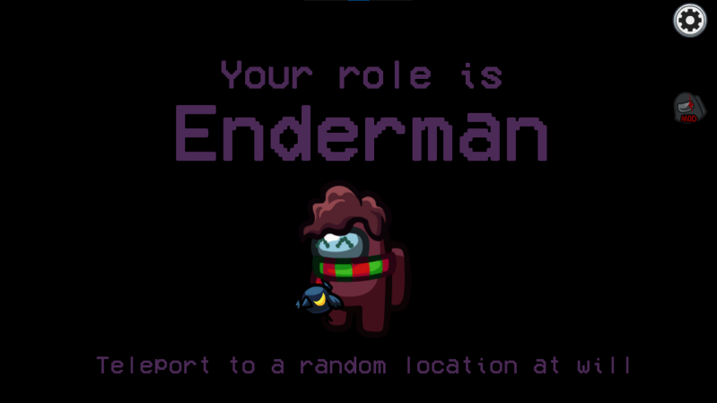

__Faction__: Crewmate (Support) 
__Base__: Crewmate 
__Ability__: Teleport to a random vent at will 
__Indicator/Symbols__: None 
__Win Condition__: Eliminate all Impostors 
__Can Use Pet System__: Yes (Required) 

Origin: Town of Host Refined 

#### Role Description
The Enderman is a crewmate that can teleport to a random vent by using their pet button. 

------------------------------------------------------------------------------------------------------------------------------------------------------------------------------------------

## Engineer

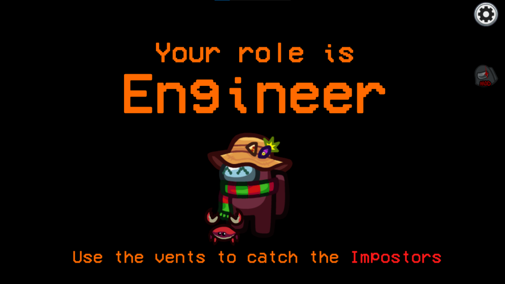

__Faction__: Crewmate (Vanilla) 
__Base__: Engineer 
__Ability__: Venting 
__Indicator/Symbols__: None 
__Win Condition__: Eliminate all Impostors 
__Can Use Pet System__: No 

Origin: Vanilla Among Us 

#### Role Description
The Engineer is just a crewmate with the added ability of venting, much like an Impostor. 
Engineers cannot vent during a comms sabotage. 

------------------------------------------------------------------------------------------------------------------------------------------------------------------------------------------

## Enigma

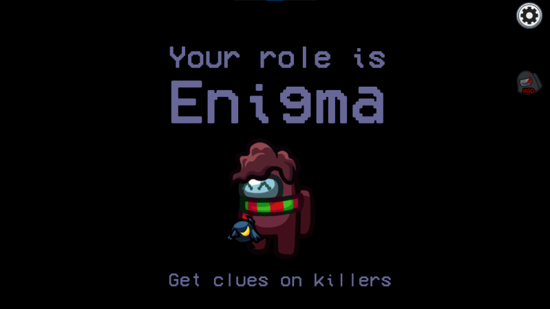

__Faction__: Crewmate (Support) 
__Base__: Crewmate 
__Ability__: Clues to killers 
__Indicator/Symbols__: None 
__Win Condition__: Eliminate all Impostors 
__Can Use Pet System__: No 

Origin: [Town of Host Enhanced](https://github.com/0xDrMoe/TownofHost-Enhanced) 

#### Role Description
The Enigma is a crewmate that can get clues to the killer, such as outfit, color, friend code, and others. 
The level of clue depends on how many tasks the Enigma has finished. 

------------------------------------------------------------------------------------------------------------------------------------------------------------------------------------------

## Enlistee

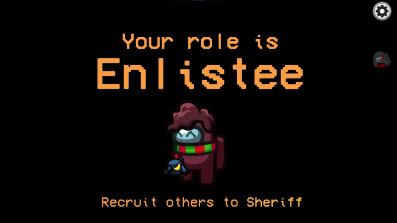

__Faction__: Crewmate (Power) 
__Base__: Impostor 
__Ability__: Turn people into Sheriff 
__Indicator/Symbols__: None 
__Win Condition__: Eliminate all Impostors 
__Can Use Pet System__: No 

Origin: Town of Host Refined 

#### Role Description
The Enlistee is a crewmate that can turn any non-Impostor role that uses an Impostor base into a [Sheriff](#Sheriff). 
Optionally, the Enlistee may know other [Sheriffs](#Sheriff) and [Sheriffs](#Sheriff) may know the Enlistee. 

------------------------------------------------------------------------------------------------------------------------------------------------------------------------------------------

## Escort

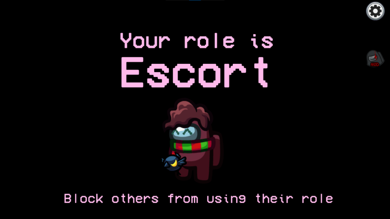

__Faction__: Crewmate (Support) 
__Base__: Impostor 
__Ability__: Roleblock other players 
__Indicator/Symbols__: None 
__Win Condition__: Eliminate all Impostors 
__Can Use Pet System__: No 

Origin: Town of Host Refined 

#### Role Description
The Escort is a crewmate that can roleblock other players, preventing them from doing various actions. 
Click the kill button to roleblock. 
If you are out of roleblock uses, the kill button does nothing. 

Roleblock count resets after a meeting. 

> **Fun Fact!** 
> There's an Impostor variant called [Consort](#Consort)!

------------------------------------------------------------------------------------------------------------------------------------------------------------------------------------------

## Fortune Teller

__Faction__: Crewmate (Support) 
__Base__: Crewmate 
__Ability__: Get hints to roles of other players 
__Indicator/Symbols__: None 
__Win Condition__: Eliminate all Impostors 
__Can Use Pet System__: No 

Origin: [Town of Host Edited](https://github.com/KARPED1EM/TownOfNext) 

#### Role Description
The Fortune Teller is a crewmate that can get hints to the roles of other players by voting for them. 
The results are very straight forward, just listing the roles. 

------------------------------------------------------------------------------------------------------------------------------------------------------------------------------------------

## Grenadier

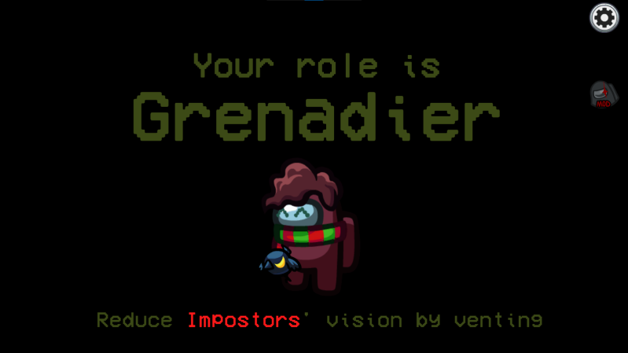

__Faction__: Crewmate (Support) 
__Base__: Crewmate/Engineer 
__Ability__: Blind nearby evildoers 
__Indicator/Symbols__: None 
__Win Condition__: Eliminate all Impostors 
__Can Use Pet System__: Yes 

Origin: [Town of Host Edited](https://github.com/KARPED1EM/TownOfNext) 

#### Role Description
The Grenadier is a crewmate that can blind nearby evildoers by using their vent/pet button. 
The blinding is temporary and will wear off after a set time. 

------------------------------------------------------------------------------------------------------------------------------------------------------------------------------------------

## Guardian

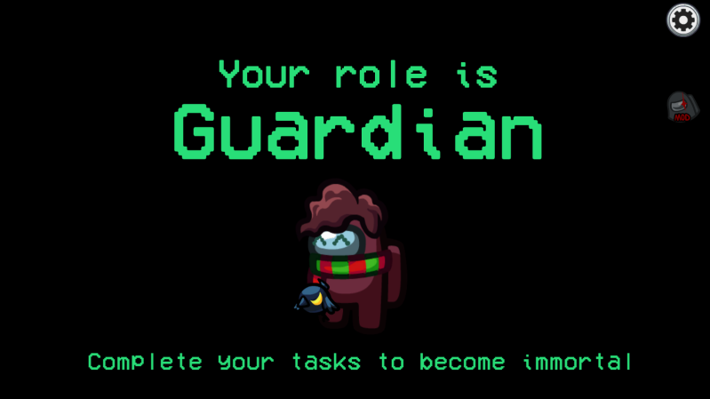

__Faction__: Crewmate (Power) 
__Base__: Crewmate 
__Ability__: Become immortal when done tasks 
__Indicator/Symbols__: None 
__Win Condition__: Eliminate all Impostors 
__Can Use Pet System__: No 

Origin: [Town of Host Re-Edited](https://github.com/Loonie-Toons/Re-Edited) 

#### Role Description
The Guardian is a crewmate that can become immortal. 
To become immortal, complete all your tasks. 

------------------------------------------------------------------------------------------------------------------------------------------------------------------------------------------

## Imitator

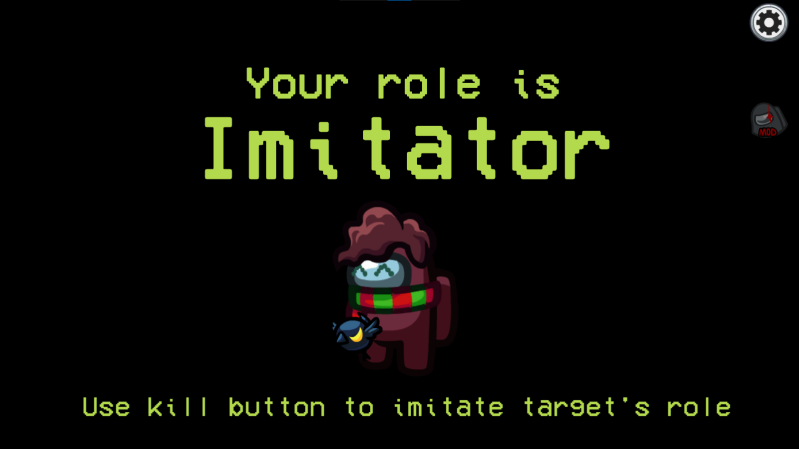

__Faction__: Crewmate (Power) 
__Base__: Impostor 
__Ability__: Imitate other crewmate roles 
__Indicator/Symbols__: None 
__Win Condition__: Eliminate all Impostors 
__Can Use Pet System__: No 

Origin: [Town of Host Re-Edited](https://github.com/Loonie-Toons/Re-Edited) 

#### Role Description
The Imitator is a crewmate that can use their kill button to imitate many crewmate roles. 
To imitate a role, use your kill button on a player to imitate their role. 
Not all roles can be imitated. 

Optionally, evil roles with a crewmate variant will grant the crewmate variant when attempting to imitate. 

------------------------------------------------------------------------------------------------------------------------------------------------------------------------------------------

## Inquisitor

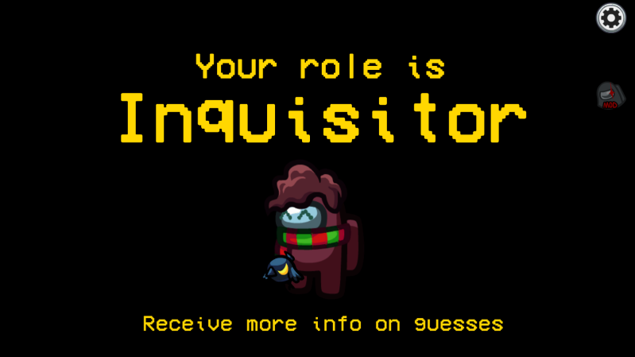

__Faction__: Crewmate (Power) 
__Base__: Impostor 
__Ability__: Gain extra guessing info 
__Indicator/Symbols__: None 
__Win Condition__: Eliminate all Impostors 
__Can Use Pet System__: No 

Origin: [Town of Host Enhanced](https://github.com/0xDrMoe/TownofHost-Enhanced) 

#### Role Description
The Inquisitor is a crewmate that receives extra info when a player dies to a guesser role. 
The Inquisitor will be told if a guess was a misfire, and what the guesser tried to guess. 

------------------------------------------------------------------------------------------------------------------------------------------------------------------------------------------

## Lazy Guy

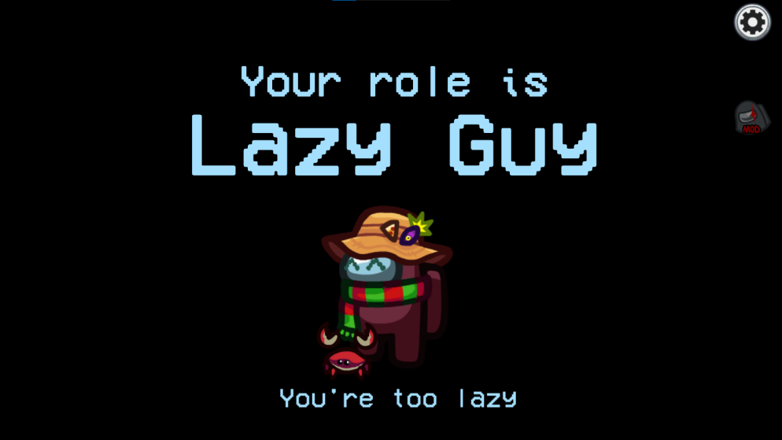

__Faction__: Crewmate (Basic) 
__Base__: Crewmate 
__Ability__: Control immunity 
__Indicator/Symbols__: None 
__Win Condition__: Eliminate all Impostors 
__Can Use Pet System__: No 

Origin: [Town of Host Edited](https://github.com/KARPED1EM/TownOfNext) 

#### Role Description
The Lazy Guy is a crewmate that has one short task and is immune to all controls except that from a [Witch](#Witch) 

> **Fun Fact!** 
> There is a modifier variant called [Lazy](#Lazy)!

------------------------------------------------------------------------------------------------------------------------------------------------------------------------------------------

## Lighter

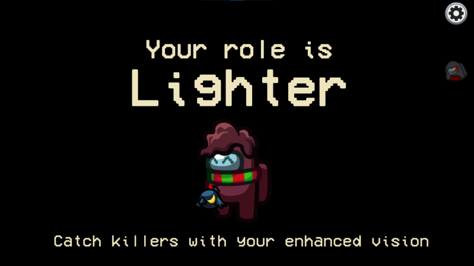

__Faction__: Crewmate (Support) 
__Base__: Crewmate/Engineer 
__Ability__: Enhanced vision 
__Indicator/Symbols__: None 
__Win Condition__: Eliminate all Impostors 
__Can Use Pet System__: Yes 

Origin: [Town of Host Re-Edited](https://github.com/Loonie-Toons/Re-Edited) 

#### Role Description
The Lighter is a crewmate role that can increase their vision. 
To increase your vision, use your vent/pet button. 

------------------------------------------------------------------------------------------------------------------------------------------------------------------------------------------

## Lookout

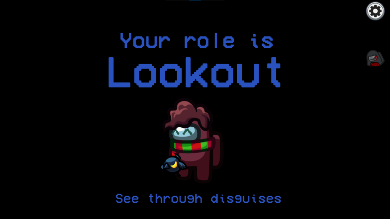

__Faction__: Crewmate (Power) 
__Base__: Crewmate 
__Ability__: Player IDs at all times 
__Indicator/Symbols__: None 
__Win Condition__: Eliminate all Impostors 
__Can Use Pet System__: No 

Origin: [Town of Host Re-Edited](https://github.com/Loonie-Toons/Re-Edited) 

#### Role Description
The Lookout is a crewmate with a very simple ability. 
They can see through disguises. 

As the Lookout, you are simply able to see through any disguise. 
Just keep track of the number and you'll catch the killer! 

------------------------------------------------------------------------------------------------------------------------------------------------------------------------------------------

## Luckey

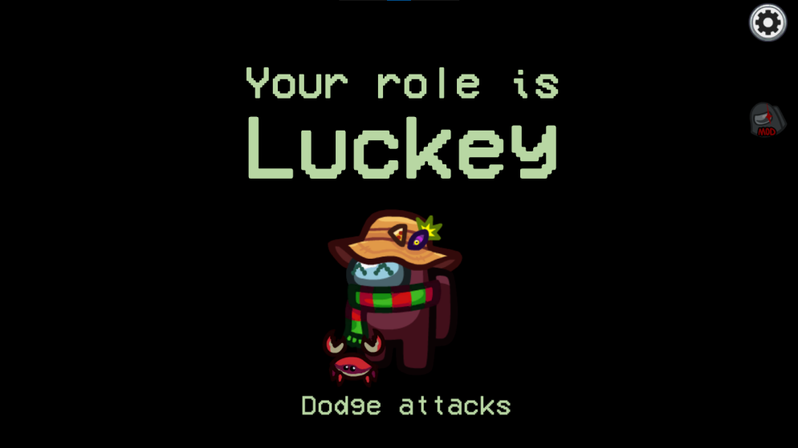

__Faction__: Crewmate (Basic) 
__Base__: Crewmate 
__Ability__: Dodge attacks 
__Indicator/Symbols__: None 
__Win Condition__: Eliminate all Impostors 
__Can Use Pet System__: No 

Origin: [Town of Host Edited](https://github.com/KARPED1EM/TownOfNext) 

#### Role Description
The Luckey is a crewmate that has a chance to dodge attacks. 

> **Fun Fact!** 
> There is a modifier variant called [Lucky](#Lucky)!

------------------------------------------------------------------------------------------------------------------------------------------------------------------------------------------

## Marshall

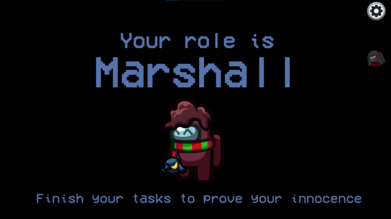

__Faction__: Crewmate (Power) 
__Base__: Crewmate 
__Ability__: Reveal yourself to all crewmates 
__Indicator/Symbols__: None 
__Win Condition__: Eliminate all Impostors 
__Can Use Pet System__: No 

Origin: [Town of Host Plus](https://github.com/Loonie-Toons/TownOfHostPlus) 

#### Role Description
The Marshall is a crewmate that can reveal themself to all crewmates. 
To reveal, finish your tasks. 

------------------------------------------------------------------------------------------------------------------------------------------------------------------------------------------

## Mayor

__Faction__: Crewmate (Power) 
__Base__: Crewmate/Engineer 
__Ability__: Extra votes 
__Indicator/Symbols__: None 
__Win Condition__: Eliminate all Impostors 
__Can Use Pet System__: Yes 

Origin: [Town of Host Plus](https://github.com/Loonie-Toons/TownOfHostPlus) 

#### Role Description
The Mayor is a crewmate with extra votes. 
Additionally, they may also have a mobile emergency button. 

> **Fun Fact!** 
> There is an Impostor variant called [Vindicator](#Vindicator)!

------------------------------------------------------------------------------------------------------------------------------------------------------------------------------------------

## Mechanic

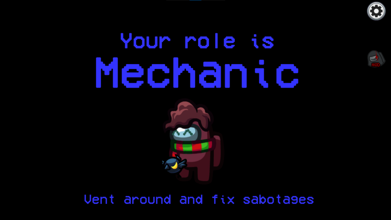

__Faction__: Crewmate (Support) 
__Base__: Engineer 
__Ability__: Fix sabotages faster 
__Indicator/Symbols__: None 
__Win Condition__: Eliminate all Impostors 
__Can Use Pet System__: Yes 

Origin: [Town of Host Edited](https://github.com/KARPED1EM/TownOfNext) 

#### Role Description
The Mechanic is a crewmate with the ability to vent and fix sabotages quickly. 

> **Fun Fact!** 
> There is a neutral variant called [Hacker](#Hacker) and a modifier variant called [Repairman](#Repairman)!

------------------------------------------------------------------------------------------------------------------------------------------------------------------------------------------

## Medic

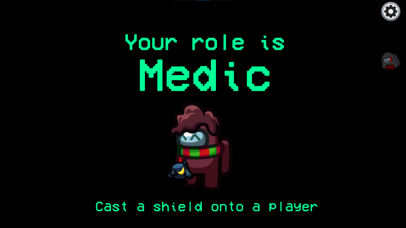

__Faction__: Crewmate (Support) 
__Base__: Impostor 
__Ability__: Protect a crewmate from all attacks 
__Indicator/Symbols__: None 
__Win Condition__: Eliminate all Impostors 
__Can Use Pet System__: No 

Origin: [Town of Us Reactivated](https://github.com/eDonnes124/Town-Of-Us-R) 

#### Role Description
The Medic is a crewmate that can protect one crewmate from all attacks. 
The Medic shield remains until the Medic dies. 

------------------------------------------------------------------------------------------------------------------------------------------------------------------------------------------

## Medium

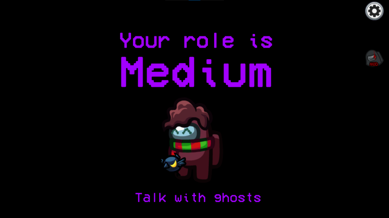

__Faction__: Crewmate (Support) 
__Base__: Crewmate 
__Ability__: Talk with ghosts 
__Indicator/Symbols__: None 
__Win Condition__: Eliminate all Impostors 
__Can Use Pet System__: No 

Origin: [Town of Host Edited](https://github.com/KARPED1EM/TownOfNext) 

#### Role Description
The Medium is a crewmate that can talk to ghosts. 
During a meeting, the ghost of the body that was reported can use `/ms yes` or `/ms no` to answer the Medium. 
Only one response can be sent per meeting. 

------------------------------------------------------------------------------------------------------------------------------------------------------------------------------------------

## Merchant

__Faction__: Crewmate (Support) 
__Base__: Crewmate 
__Ability__: Sell modifiers to other players 
__Indicator/Symbols__: None 
__Win Condition__: Eliminate all Impostors 
__Can Use Pet System__: No 

Origin: [Town of Host Re-Edited](https://github.com/Loonie-Toons/Re-Edited) 

#### Role Description
The Merchant is a crewmate that can give other players modifiers by finishing tasks. 
The Merchant receives money when doing this and when they have enough, can bribe a killer. 

------------------------------------------------------------------------------------------------------------------------------------------------------------------------------------------

## Mole

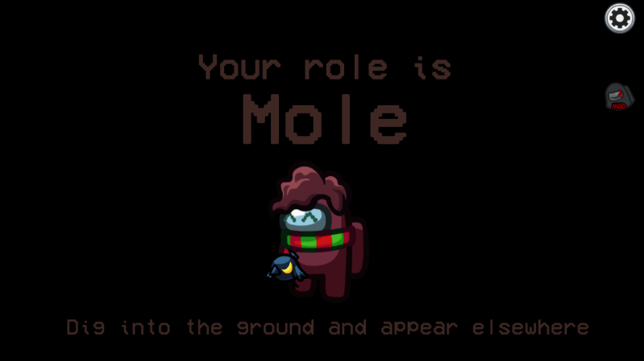

__Faction__: Crewmate (Support) 
__Base__: Engineer 
__Ability__: Teleport to random vents 
__Indicator/Symbols__: None 
__Win Condition__: Eliminate all Impostors 
__Can Use Pet System__: No 

Origin: [Town of Host Enhanced](https://github.com/0xDrMoe/TownofHost-Enhanced) 

#### Role Description
The Mole is a crewmate that can hop out of any random vent after using a vent. 

------------------------------------------------------------------------------------------------------------------------------------------------------------------------------------------

## Monarch

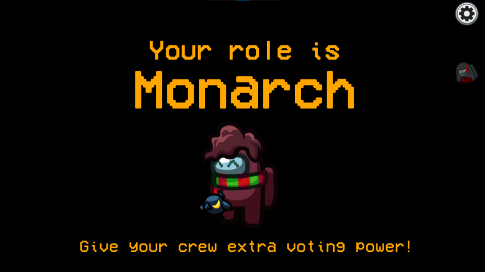

__Faction__: Crewmate (Power) 
__Base__: Impostor 
__Ability__: Knight other players with an extra vote 
__Indicator/Symbols__: None 
__Win Condition__: Eliminate all Impostors 
__Can Use Pet System__: No 

Origin: [Town of Host Re-Edited](https://github.com/Loonie-Toons/Re-Edited) 

#### Role Description
The Monarch is a crewmate that can knight other players, granting them an extra vote. 
Knighted votes are hidden. 

The Monarch cannot die by most means while a knighted player is alive. 

------------------------------------------------------------------------------------------------------------------------------------------------------------------------------------------

## Monitor

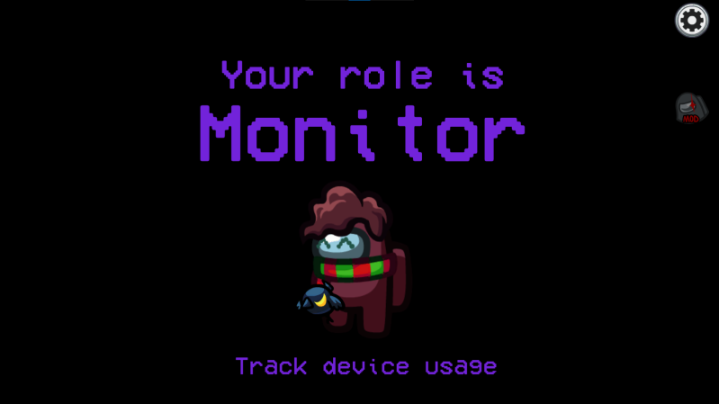

__Faction__: Crewmate (Power) 
__Base__: Crewmate/Engineer 
__Ability__: Know when players are near a device 
__Indicator/Symbols__: None 
__Win Condition__: Eliminate all Impostors 
__Can Use Pet System__: No 

Origin: [Town of Host Re-Edited](https://github.com/Loonie-Toons/Re-Edited) 

#### Role Description
The Monitor is a crewmate that is told when any player is near a device (e.g. cameras or admin). 
Optionally, the Monitor may also use the vents. 

> **Fun Fact** 
> There is an Impostor variant called [Disruptor](#Disruptor)! 

------------------------------------------------------------------------------------------------------------------------------------------------------------------------------------------

## Mortician

__Faction__: Crewmate (Support) 
__Base__: Crewmate 
__Ability__: Know who was last with the body they report 
__Indicator/Symbols__: None 
__Win Condition__: Eliminate all Impostors 
__Can Use Pet System__: No 

Origin: [Town of Host Re-Edited](https://github.com/Loonie-Toons/Re-Edited) 

#### Role Description
The Mortician is a crewmate that knows who was last with the body they reported. 
Usually this means the killer, but sometimes it may say nothing or someone else (such as a [Jester](#Jester)). 

Optionally, the Mortician may get arrows pointing to dead bodies. 

------------------------------------------------------------------------------------------------------------------------------------------------------------------------------------------

## Observer

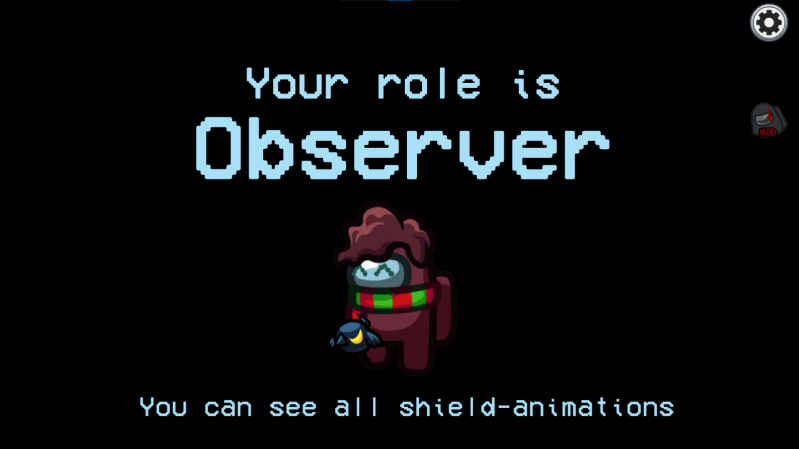

__Faction__: Crewmate (Support) 
__Base__: Crewmate 
__Ability__: See shield animations 
__Indicator/Symbols__: None 
__Win Condition__: Eliminate all Impostors 
__Can Use Pet System__: No 

Origin: [Town of Host Edited](https://github.com/KARPED1EM/TownOfNext) 

#### Role Description
The Observer is a crewmate that can see **ALL** shield animations, both good and bad ones. 

------------------------------------------------------------------------------------------------------------------------------------------------------------------------------------------

## Oracle

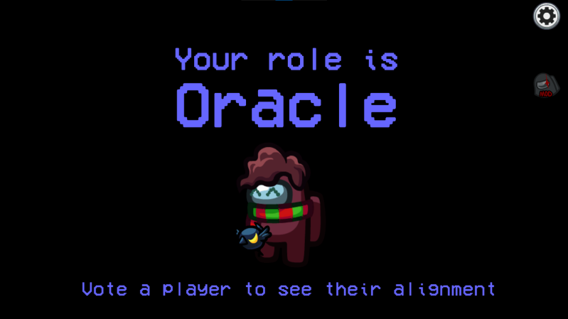

__Faction__: Crewmate (Support) 
__Base__: Crewmate 
__Ability__: See alignments during meetings 
__Indicator/Symbols__: None 
__Win Condition__: Eliminate all Impostors 
__Can Use Pet System__: No 

Origin: [Town of Host Re-Edited](https://github.com/Loonie-Toons/Re-Edited) 

#### Role Description
The Oracle is a crewmate that can see whether a player is a Crewmate, Impostor, or Neutral by voting for them. 
However, there's a chance the result the Oracle receives is incorrect. 

------------------------------------------------------------------------------------------------------------------------------------------------------------------------------------------

## Overseer

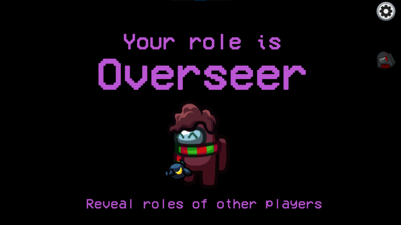

__Faction__: Crewmate (Power) 
__Base__: Impostor 
__Ability__: See exact roles of players 
__Indicator/Symbols__: None 
__Win Condition__: Eliminate all Impostors 
__Can Use Pet System__: No 

Origin: [Town of Host Re-Edited](https://github.com/Loonie-Toons/Re-Edited) 

#### Role Description
The Overseer is a crewmate that can see any player's exact role. 
To see their role, use your kill button and be next to them for a set time. 

------------------------------------------------------------------------------------------------------------------------------------------------------------------------------------------

## Pacifist

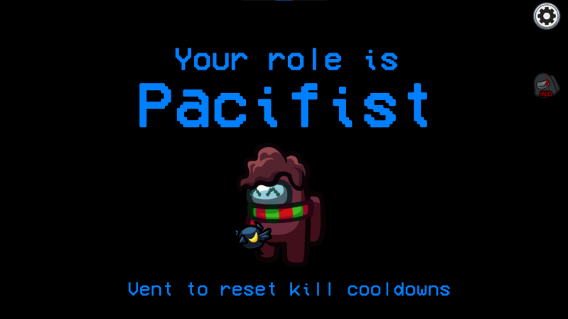

__Faction__: Crewmate (Support) 
__Base__: Crewmate/Engineer 
__Ability__: Reset all kill cooldowns 
__Indicator/Symbols__: None 
__Win Condition__: Eliminate all Impostors 
__Can Use Pet System__: Yes 

Origin: [Town of Host Re-Edited](https://github.com/Loonie-Toons/Re-Edited) 

#### Role Description
The Pacifist is a crewmate that can reset the kill cooldowns of all players. 
To do this, use your vent/pet button. 

------------------------------------------------------------------------------------------------------------------------------------------------------------------------------------------

## President

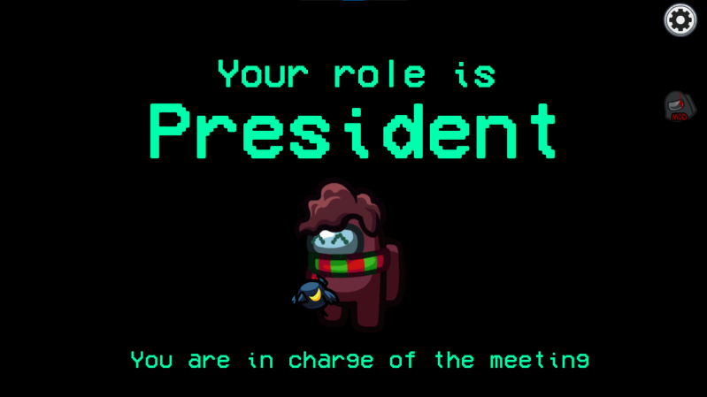

__Faction__: Crewmate (Power) 
__Base__: Crewmate 
__Ability__: Reveal yourself at any time, end meeting at will 
__Indicator/Symbols__: None 
__Win Condition__: Eliminate all Impostors 
__Can Use Pet System__: No 

Origin: [Town of Host Enhanced](https://github.com/0xDrMoe/TownofHost-Enhanced) 

#### Role Description
The President is a crewmate that can end a meeting at will using `/finish` and also reveal themself using `/reveal` in chat. 
Once revealed, all players know you are the President but anybody who kills you gets their kill cooldown greatly reduced for on their next kill. 

------------------------------------------------------------------------------------------------------------------------------------------------------------------------------------------

## Psychic

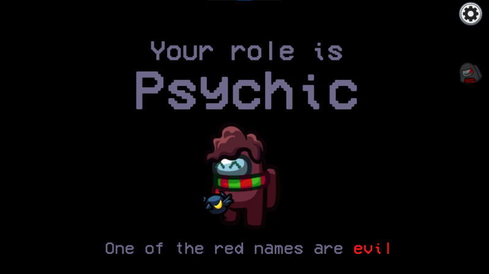

__Faction__: Crewmate (Power) 
__Base__: Crewmate 
__Ability__: See potential evils in meetings 
__Indicator/Symbols__: None 
__Win Condition__: Eliminate all Impostors 
__Can Use Pet System__: No 

Origin: [Town of Host Re-Edited](https://github.com/Loonie-Toons/Re-Edited) 

#### Role Description
The Psychic is a crewmate that will see red names during meetings, with at least one being an evildoer. 
The amount of red names is configurable and whether or not the red names change each meeting is optional. 

------------------------------------------------------------------------------------------------------------------------------------------------------------------------------------------

## Scientist

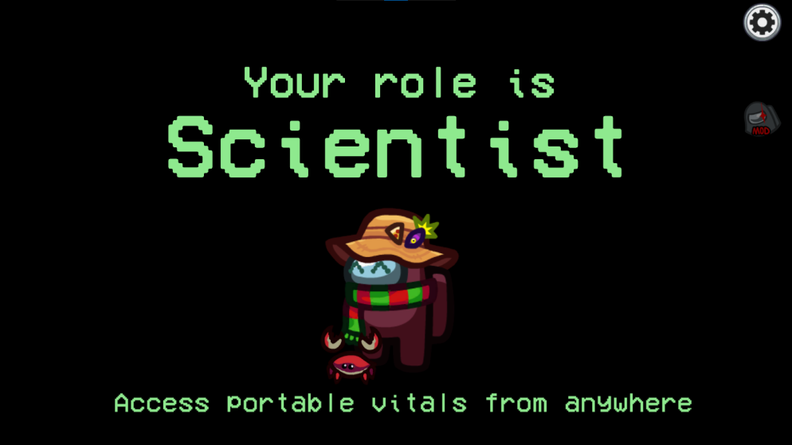

__Faction__: Crewmate (Vanilla) 
__Base__: Scientist 
__Ability__: Vitals anywhere 
__Indicator/Symbols__: None 
__Win Condition__: Eliminate all Impostors 
__Can Use Pet System__: No 

Origin: Vanilla Among Us 

#### Role Description
The Scientist is just a crewmate with the added ability of portable vitals 
These vitals have a limited battery though, and must be recharged by doing tasks. 
Your portable vitals cannot be accessed during a comms sabotage. 

------------------------------------------------------------------------------------------------------------------------------------------------------------------------------------------

## Seer

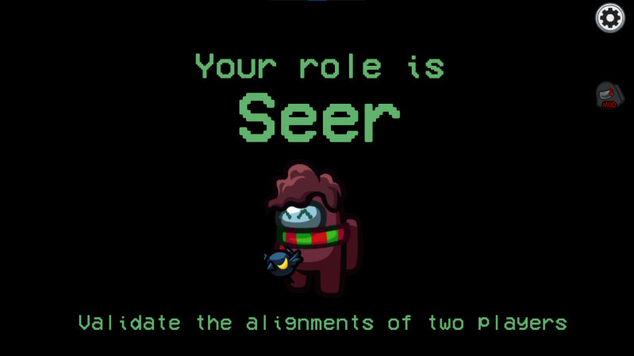

__Faction__: Crewmate (Support) 
__Base__: Crewmate 
__Ability__: Compare alignments 
__Indicator/Symbols__: None 
__Win Condition__: Eliminate all Impostors 
__Can Use Pet System__: No 

Origin: [Stellar Roles](https://github.com/Mr-Fluuff/StellarRolesAU) 

#### Role Description
The Seer is a crewmate that can compare alignments during meetings. 
To compare alignments, use the command `/cmp playerID-1 playerId-2`. 

Neutrals and converted players are considered to be on the same team. 
[Rascal](#Rascal) is considered as an Impostor. 

------------------------------------------------------------------------------------------------------------------------------------------------------------------------------------------

## Sentinel

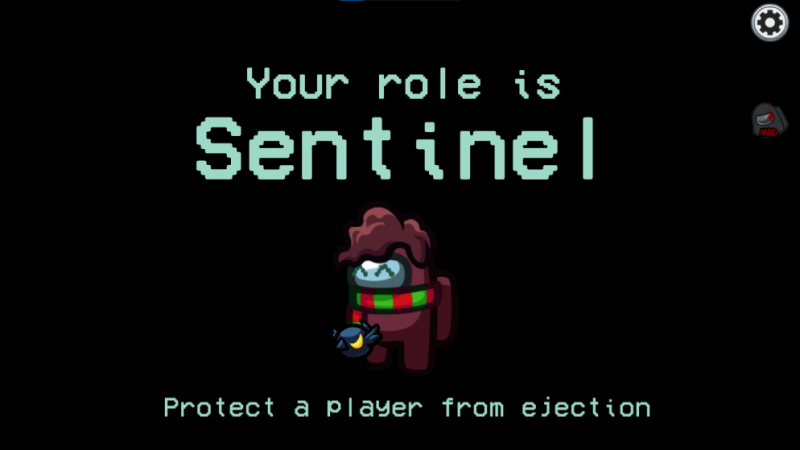

__Faction__: Crewmate (Support) 
__Base__: Crewmate 
__Ability__: Protect a player from being exiled 
__Indicator/Symbols__: None 
__Win Condition__: Eliminate all Impostors 
__Can Use Pet System__: No 

Origin: [Town of Host Enhanced](https://github.com/0xDrMoe/TownofHost-Enhanced) 

#### Role Description
The Sentinel is a crewmate that functions like an ejection [Medic](#Medic). 
Vote for a player, that player will not be able to be ejected that meeting. 

------------------------------------------------------------------------------------------------------------------------------------------------------------------------------------------

## Snitch

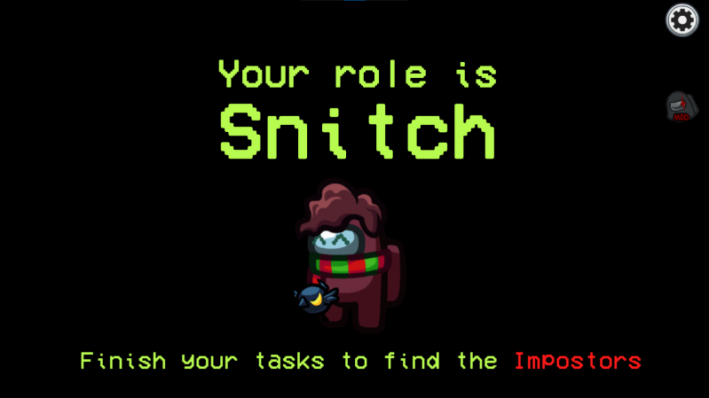

__Faction__: Crewmate (Support) 
__Base__: Crewmate 
__Ability__: See Impostors on task completion 
__Indicator/Symbols__: None 
__Win Condition__: Eliminate all Impostors 
__Can Use Pet System__: No 

Origin: [Town of Us Reactivated](https://github.com/eDonnes124/Town-Of-Us-R) 

#### Role Description
The Snitch is a crewmate that can see the Impostors (and optionally madmates and neutral killers) on task completion. 
When the Snitch finishes their tasks, they will see any role they can discover in the target role color (eg [Serial Killer](#Serial-Killer) shows as a shade of blue).
Optionally, the Snitch and/or the targets may receive arrows pointing towards the other. 

------------------------------------------------------------------------------------------------------------------------------------------------------------------------------------------

## Spiritualist

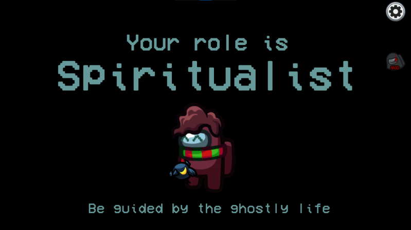

__Faction__: Crewmate (Support) 
__Base__: Crewmate 
__Ability__: Follow ghosts to potential evils 
__Indicator/Symbols__: None 
__Win Condition__: Eliminate all Impostors 
__Can Use Pet System__: No 

Origin: [Town of Host Re-Edited](https://github.com/Loonie-Toons/Re-Edited) 

#### Role Description
The Spiritualist is a crewmate that will get an arrow pointing to the ghost of the body that was reported in the previous meeting. 
The ghost is notified that the Spiritualist has an arrow pointing to them. 

If the ghost was good, they may lead the Spiritualist to an Impostor or Neutral Killer. 
If the ghost was bad, they may just end up leading you to a fellow crewmate. 

------------------------------------------------------------------------------------------------------------------------------------------------------------------------------------------

## Spy

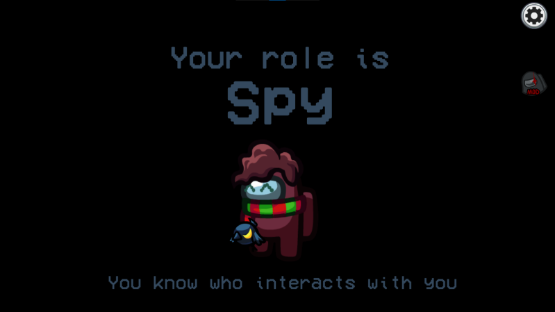

__Faction__: Crewmate (Support) 
__Base__: Crewmate 
__Ability__: Know who interacted with you 
__Indicator/Symbols__: None 
__Win Condition__: Eliminate all Impostors 
__Can Use Pet System__: No 

Origin: [Town of Host Enhanced](https://github.com/0xDrMoe/TownofHost-Enhanced) 

#### Role Description
The Spy is a crewmate that sees any player that interacts with them with an orange name, including crewmates! 
Optionally, the cooldown of the interaction may be reset. 

------------------------------------------------------------------------------------------------------------------------------------------------------------------------------------------

## Super Star

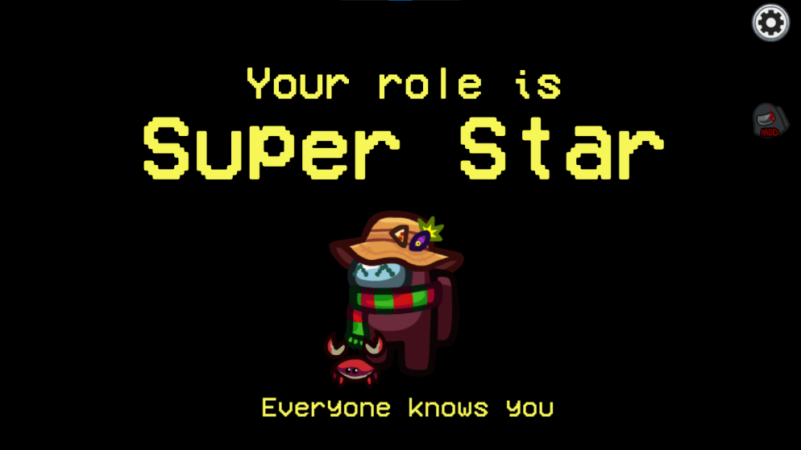

__Faction__: Crewmate (Basic) 
__Base__: Crewmate 
__Ability__: Unkillable when in a group 
__Indicator/Symbols__: None 
__Win Condition__: Eliminate all Impostors 
__Can Use Pet System__: No 

Origin: [Town of Host Edited](https://github.com/KARPED1EM/TownOfNext) 

#### Role Description
The Super Star is a crewmate that is known to everyone and can't die unless they're alone. 

> **Fun Fact!** 
> There is a modifier variant called [Cyber](#Cyber)!

------------------------------------------------------------------------------------------------------------------------------------------------------------------------------------------

## Swapper

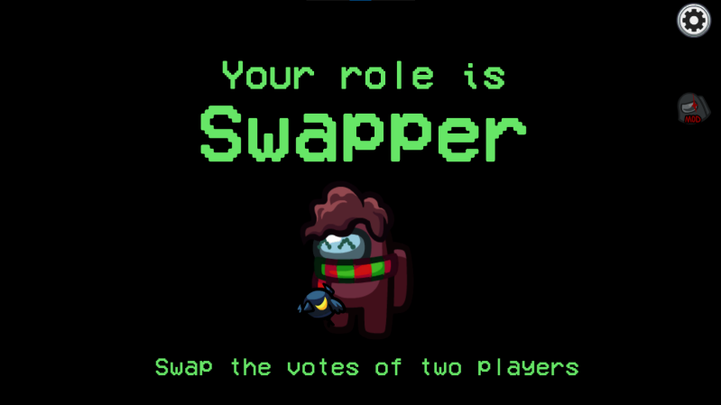

__Faction__: Crewmate (Power) 
__Base__: Crewmate 
__Ability__: Swap votes during meetings 
__Indicator/Symbols__: None 
__Win Condition__: Eliminate all Impostors 
__Can Use Pet System__: No 

Origin: [Town of Us Reactivated](https://github.com/eDonnes124/Town-Of-Us-R) 

#### Role Description
The Swapper is a crewmate that can swap the votes of two players. 
To swap, use the command `/sw playerID]` twice. 

Optionally, the Swapper may be able to swap their own votes. 

------------------------------------------------------------------------------------------------------------------------------------------------------------------------------------------

## Task Manager

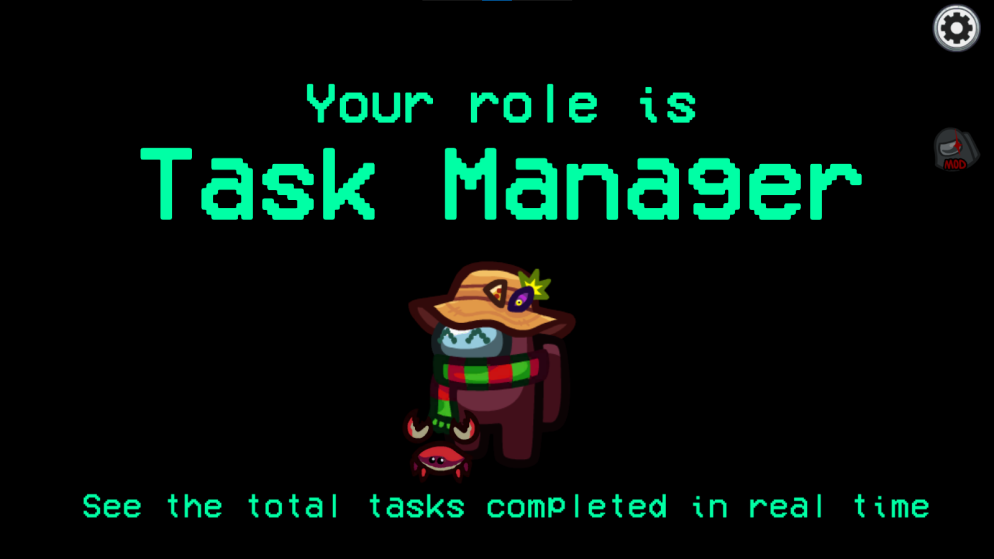

__Faction__: Crewmate (Basic) 
__Base__: Crewmate 
__Ability__: See total tasks completed in real time 
__Indicator/Symbols__: None 
__Win Condition__: Eliminate all Impostors 
__Can Use Pet System__: No 

Origin: [Town of Host Re-Edited](https://github.com/Loonie-Toons/Re-Edited) 

#### Role Description
The Task Manager is a crewmate that can see the total tasks completed of all crewmates. 

------------------------------------------------------------------------------------------------------------------------------------------------------------------------------------------

## Time Manager

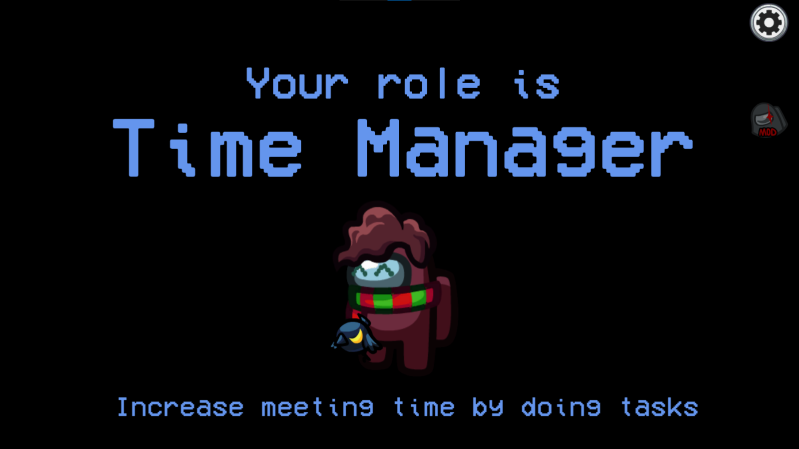

__Faction__: Crewmate (Support) 
__Base__: Crewmate 
__Ability__: Increase meeting time 
__Indicator/Symbols__: None 
__Win Condition__: Eliminate all Impostors 
__Can Use Pet System__: No 

Origin: [Town of Host Edited](https://github.com/KARPED1EM/TownOfNext) 

#### Role Description
The Time Manager is a crewmate that can increase meeting time by doing tasks. 
The extra meeting time is removed when the Time Manager dies. 

------------------------------------------------------------------------------------------------------------------------------------------------------------------------------------------

## Time Master

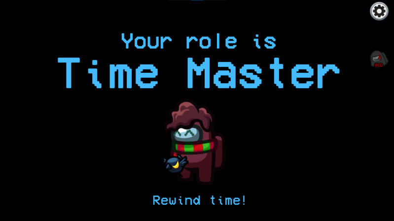

__Faction__: Crewmate (Support) 
__Base__: Crewmate/Engineer 
__Ability__: Rewind time (sorta) 
__Indicator/Symbols__: None 
__Win Condition__: Eliminate all Impostors 
__Can Use Pet System__: No 

Origin: [Town of Host Re-Edited](https://github.com/Loonie-Toons/Re-Edited) 

#### Role Description
The Time Master is a crewmate that can somewhat rewind time, resulting in the Time Master potentially saving someone. 
When the Time Master uses their vent/pet button, they use their ability. 

**Note: Rewinding time does not revive players.** 

------------------------------------------------------------------------------------------------------------------------------------------------------------------------------------------

## Tracefinder

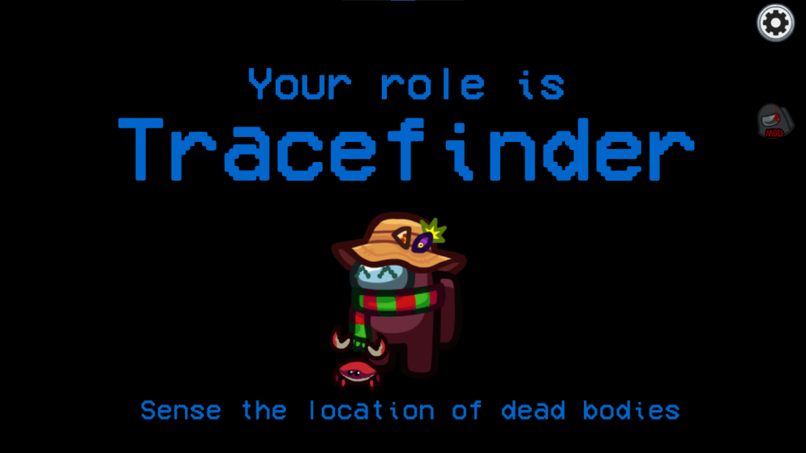

__Faction__: Crewmate (Basic) 
__Base__: Scientist 
__Ability__: Vitals and arrows pointing to bodies 
__Indicator/Symbols__: None 
__Win Condition__: Eliminate all Impostors 
__Can Use Pet System__: No 

Origin: [Town of Host Re-Edited](https://github.com/Loonie-Toons/Re-Edited) 

#### Role Description
The Tracefinder is a crewmate that has vitals and also gets arrows that point to dead bodies. 

------------------------------------------------------------------------------------------------------------------------------------------------------------------------------------------

## Tracker

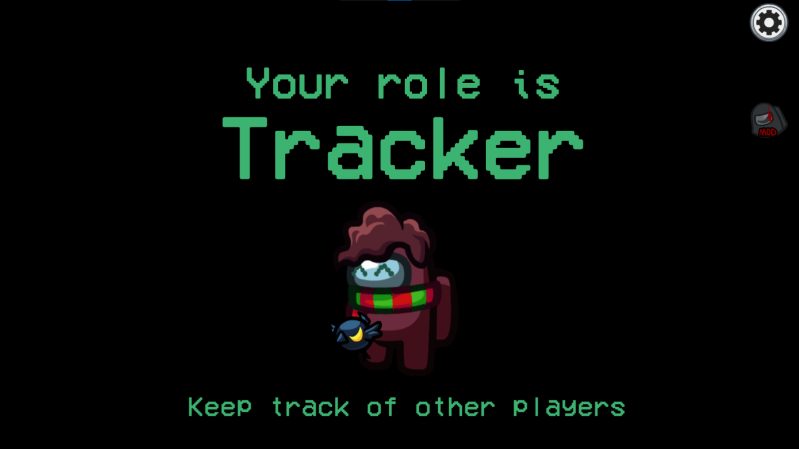

__Faction__: Crewmate (Support) 
__Base__: Crewmate 
__Ability__: Track other players 
__Indicator/Symbols__: None 
__Win Condition__: Eliminate all Impostors 
__Can Use Pet System__: No 

Origin: [Town of Us Reactivated](https://github.com/eDonnes124/Town-Of-Us-R) 

#### Role Description
The Tracker is a crewmate that can track the positions of other players. 
To track a player, vote for that player in a meeting. 

Optionally, you can see the last room your tracked players were in and whether the arrows are colored. 

------------------------------------------------------------------------------------------------------------------------------------------------------------------------------------------

## Transporter

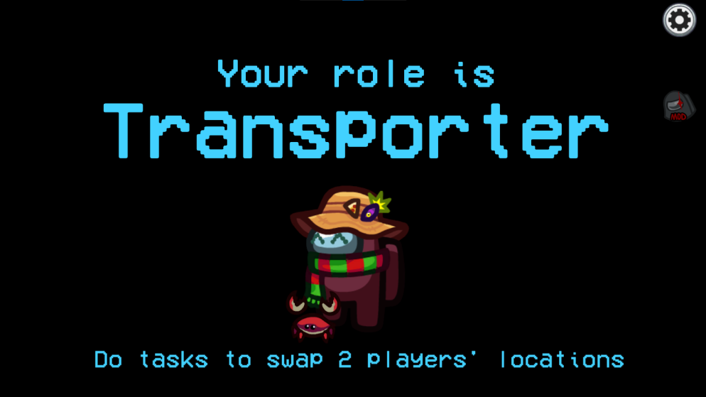

__Faction__: Crewmate (Basic) 
__Base__: Crewmate 
__Ability__: Swap the locations of two players 
__Indicator/Symbols__: None 
__Win Condition__: Eliminate all Impostors 
__Can Use Pet System__: No 

Origin: [Town of Us Reactivated](https://github.com/eDonnes124/Town-Of-Us-R) 

#### Role Description
The Transporter is a crewmate that can do tasks to swap the locations of two players. 

------------------------------------------------------------------------------------------------------------------------------------------------------------------------------------------

## Warper

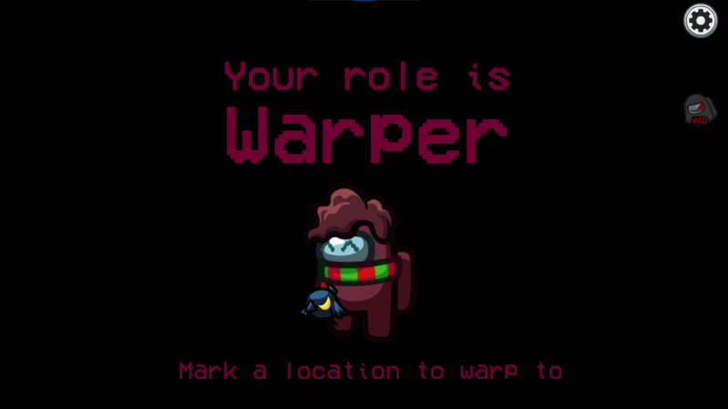

__Faction__: Crewmate (Support) 
__Base__: Crewmate 
__Ability__: Teleportation 
__Indicator/Symbols__: None 
__Win Condition__: Eliminate all Impostors 
__Can Use Pet System__: Yes (Required) 

Origin: [Project Lotus](https://github.com/ImaMapleTree/Lotus) 

#### Role Description
The Warper is a crewmate that can warp to a set position at will. 
To set a position, use your pet button. 
To warp back, use your pet button again. 

------------------------------------------------------------------------------------------------------------------------------------------------------------------------------------------

## Witness

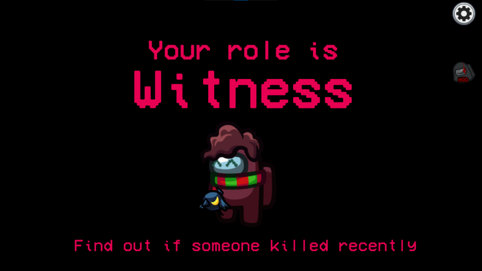

__Faction__: Crewmate (Support) 
__Base__: Impostor 
__Ability__: Know if a player killed recently 
__Indicator/Symbols__: None 
__Win Condition__: Eliminate all Impostors 
__Can Use Pet System__: No 

Origin: [Town of Us Reactivated](https://github.com/eDonnes124/Town-Of-Us-R) 

#### Role Description
The Witness is a crewmate that can check to see if a player has killed recently. 
To check a player, use your kill button. 

If a player did not kill recently, they'll show with a green checkmark. 
If they did kill, they'll show with a red "!!". 

------------------------------------------------------------------------------------------------------------------------------------------------------------------------------------------

# Crewmates Killing Roles

## Bastion

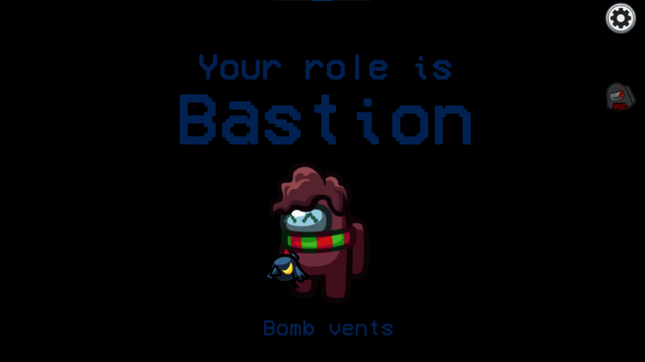

__Faction__: Crewmate (Killing) 
__Base__: Engineer 
__Ability__: Bomb vents 
__Indicator/Symbols__: None 
__Win Condition__: Eliminate all Impostors 
__Can Use Pet System__: No 

Origin: [Project Lotus](https://github.com/ImaMapleTree/Lotus/) 

#### Role Description
The Bastion is a crewmate that can plant bombs inside a vent. 
The next player to hop inside that vent will die. 
Additionally, if the Bastion were to try and bomb a vent that already contains a bomb, the Bastion sets the bomb off and kills themself. 

------------------------------------------------------------------------------------------------------------------------------------------------------------------------------------------

## Bodyguard

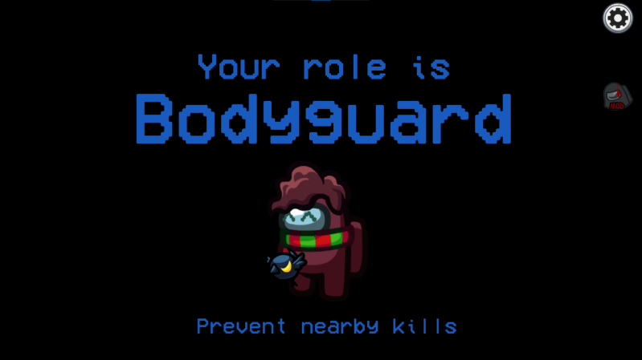

__Faction__: Crewmate (Killing) 
__Base__: Crewmate 
__Ability__: Protect anyone from one killer at the cost of your own life 
__Indicator/Symbols__: None 
__Win Condition__: Eliminate all Impostors 
__Can Use Pet System__: No 

Origin: [Town of Host Edited](https://github.com/KARPED1EM/TownOfNext) 

#### Role Description
The Bodyguard is a crewmate that can save someone's life at the cost of their own. 
If a kill were to occur with a Bodyguard nearby, the Bodyguard and killer will end up killing each other, saving the victim's life. 

------------------------------------------------------------------------------------------------------------------------------------------------------------------------------------------

## Crusader

__Faction__: Crewmate (Killing) 
__Base__: Impostor 
__Ability__: Protect a set player from an attack 
__Indicator/Symbols__: None 
__Win Condition__: Eliminate all Impostors 
__Can Use Pet System__: No 

Origin: [Project Lotus](https://github.com/ImaMapleTree/Lotus/) 

#### Role Description
The Crusader is a crewmate that can select a player to protect from one attack. 
Unlike the [Bodyguard](#Bodyguard), who has to just be in range of any attack, the Crusader has to choose a specific player to protect. 
The Crusader can be anywhere on the map and will still kill the attacker. 

------------------------------------------------------------------------------------------------------------------------------------------------------------------------------------------

## Deceiver

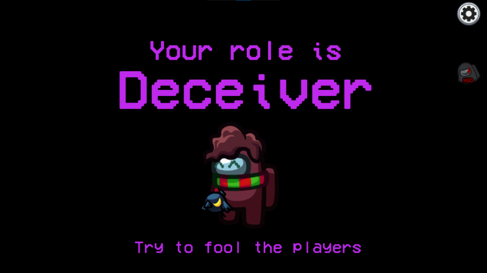

__Faction__: Crewmate (Killing) 
__Base__: Impostor 
__Ability__: Cause killers to misfire 
__Indicator/Symbols__: None 
__Win Condition__: Eliminate all Impostors 
__Can Use Pet System__: No 

Origin: [Town of Host Edited](https://github.com/KARPED1EM/TownOfNext) 

#### Role Description
The Deceiver is a crewmate that can make killers misfire. 
By using the kill button, the Deceiver can choose a player. 
If the player does not have a kill button, they'll misfire after the next meeting. 
If the player does have a kill button, they'll misfire upon using the kill button. 

------------------------------------------------------------------------------------------------------------------------------------------------------------------------------------------

## Drainer

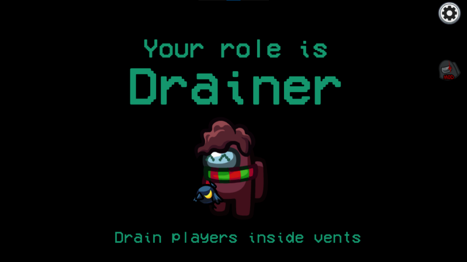

__Faction__: Crewmate (Killing) 
__Base__: Engineer 
__Ability__: Kill all players in connected vents 
__Indicator/Symbols__: None 
__Win Condition__: Eliminate all Impostors 
__Can Use Pet System__: No 

Origin: [TOHE+](https://github.com/Gurge44/TOHE_PLUS) 

#### Role Description
The Drainer is a crewmate that can use their vent button on a vent to kill all players inside the vent system. 
When the Drainer enters a vent, all players in that vent and connected vents will die. 

For example, if the Drainer uses the Electrical vent on the Skeld, all players in the Electrical, MedBay, and Security vents will die. 

------------------------------------------------------------------------------------------------------------------------------------------------------------------------------------------

## Jailor

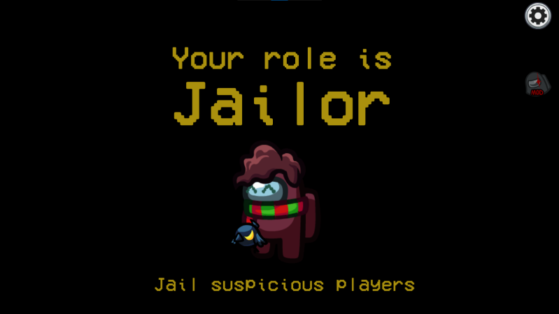

__Faction__: Crewmate (Killing) 
__Base__: Impostor 
__Ability__: Jail suspicious players 
__Indicator/Symbols__: None 
__Win Condition__: Eliminate all Impostors 
__Can Use Pet System__: No 

Origin: Town of Salem 

#### Role Description
The Jailor is a crewmate that can jail players. 
During meetings, the Jailor can execute the jailee, killing them. 
If the target was crew, the Jailor loses the ability to execute for the rest of the game, but can still jail people. 

The jailee is limited while in prison. 
They cannot be killed during the meeting, but also cannot use various meeting abilities. 
The only thing they can do is guess the Jailor (if they can guess). 

------------------------------------------------------------------------------------------------------------------------------------------------------------------------------------------

## Judge

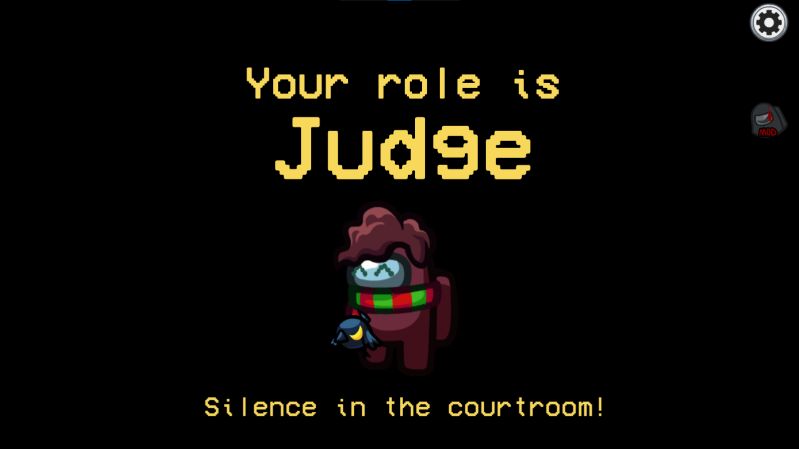

__Faction__: Crewmate (Killing) 
__Base__: Crewmate 
__Ability__: Trial suspicious players 
__Indicator/Symbols__: None 
__Win Condition__: Eliminate all Impostors 
__Can Use Pet System__: No 

Origin: [Town of Host Edited](https://github.com/KARPED1EM/TownOfNext) 

#### Role Description
The Judge is a crewmate that can kill anyone during a meeting without knowing their exact role, unlike a [Vigilante](#Vigilante). 
However, they can only do it a certain amount of times and dies if they trial someone they aren't allowed to trial.  

------------------------------------------------------------------------------------------------------------------------------------------------------------------------------------------

## Knight

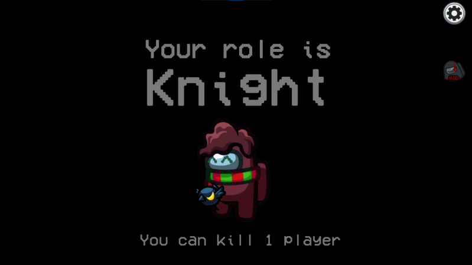

__Faction__: Crewmate (Killing) 
__Base__: Impostor 
__Ability__: Can kill one player 
__Indicator/Symbols__: None 
__Win Condition__: Eliminate all Impostors 
__Can Use Pet System__: No 

Origin: [Town of Host Edited](https://github.com/KARPED1EM/TownOfNext) 

#### Role Description
The Knight is a crewmate that can kill anyone, but they can only do it once per game. 
Optionally, the Knight may vent. 

------------------------------------------------------------------------------------------------------------------------------------------------------------------------------------------

## Retributionist

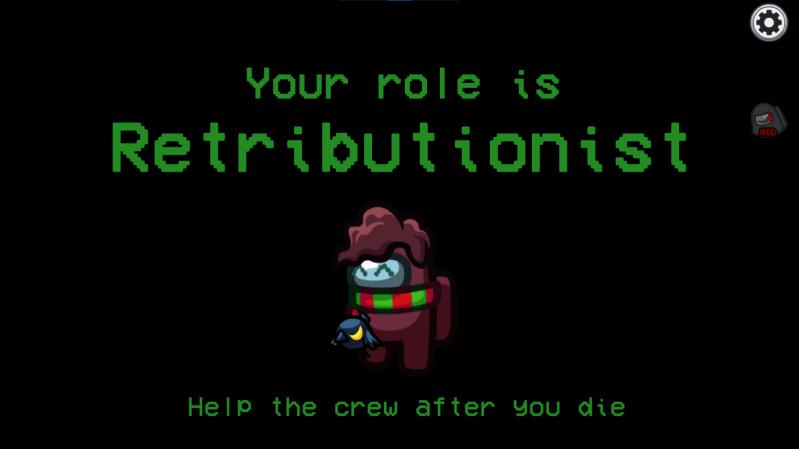

__Faction__: Crewmate (Killing) 
__Base__: Crewmate 
__Ability__: Can kill after dying 
__Indicator/Symbols__: None 
__Win Condition__: Eliminate all Impostors 
__Can Use Pet System__: No 

Origin: [Town of Host Re-Edited](https://github.com/Loonie-Toons/Re-Edited) 

#### Role Description
The Retributionist is a crewmate that can kill anyone after dying, but primarily is used to eliminate Impostors and Neutrals. 
There are conditions to being able to use the retribution the Retributionist has. 
Those being the fact that if too many have died, retribution may not occur. Another being that the Retributionist may need to finish their tasks to use retribution. 

------------------------------------------------------------------------------------------------------------------------------------------------------------------------------------------

## Reverie

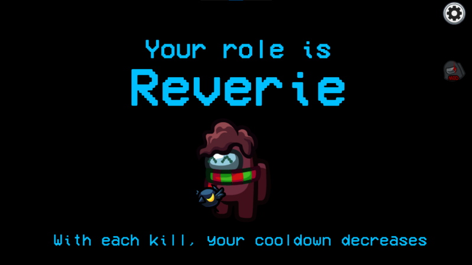

__Faction__: Crewmate (Killing) 
__Base__: Impostor 
__Ability__: Become stronger if killing a baddie, or weaker if killing a crewmate 
__Indicator/Symbols__: None 
__Win Condition__: Eliminate all Impostors 
__Can Use Pet System__: No 

Origin: [Town of Host Re-Edited](https://github.com/Loonie-Toons/Re-Edited) 

#### Role Description
The Reverie is a crewmate that can kill anyone. 
If the Reverie kills an evildoer, their cooldown decreases. 
If the Reverie kills a cremwate, their cooldown increases. 
If the cooldown gets too high, the Reverie may die. 

------------------------------------------------------------------------------------------------------------------------------------------------------------------------------------------

## Sheriff

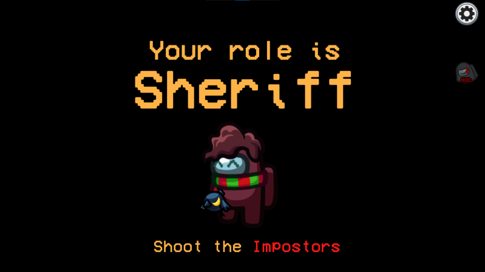

__Faction__: Crewmate (Killing) 
__Base__: Impostor 
__Ability__: Kill evildoers or misfire 
__Indicator/Symbols__: None 
__Win Condition__: Eliminate all Impostors 
__Can Use Pet System__: No 

Origin: Various 

#### Role Description
The Sheriff is a crewmate that can kill anyone. 
If they try to kill a crewmate or neutral they cannot kill, the Sheriff will misfire. 

------------------------------------------------------------------------------------------------------------------------------------------------------------------------------------------

## Trickster

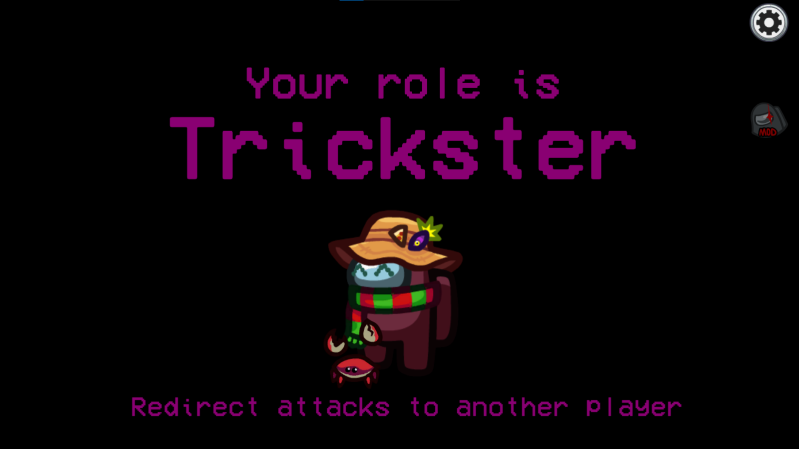

__Faction__: Crewmate (Killing) 
__Base__: Impostor 
__Ability__: Redirect an attack to another player 
__Indicator/Symbols__: None 
__Win Condition__: Eliminate all Impostors 
__Can Use Pet System__: No 

Origin: Town of Host Refined 

#### Role Description
The Trickster is a crewmate that can trick killers into killing another player. 
When the Trickster uses their kill button on a player, that player gets marked. 
When someone goes to attack the Trickster after the Trickster marks a player, that someone will instead attack the marked player. 

------------------------------------------------------------------------------------------------------------------------------------------------------------------------------------------

## Veteran

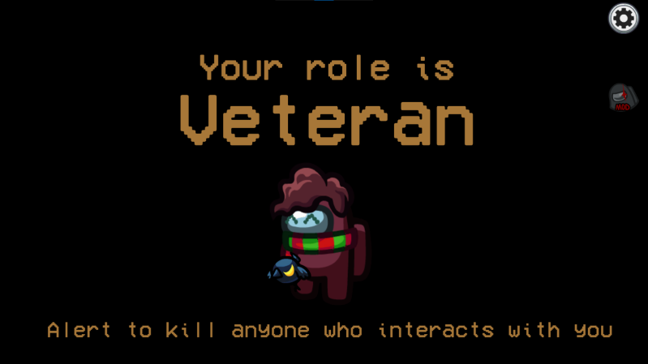

__Faction__: Crewmate (Killing) 
__Base__: Crewmate/Engineer 
__Ability__: Kill anyone who interacts with you 
__Indicator/Symbols__: None 
__Win Condition__: Eliminate all Impostors 
__Can Use Pet System__: Yes 

Origin: [Town of Us Reactivated](https://github.com/eDonnes124/Town-Of-Us-R) 

#### Role Description
The Veteran is a crewmate that can use their vent/pet button to go on alert. 
While on alert, the Veteran will kill anyone that interacts with them. 

------------------------------------------------------------------------------------------------------------------------------------------------------------------------------------------

## Vigilante

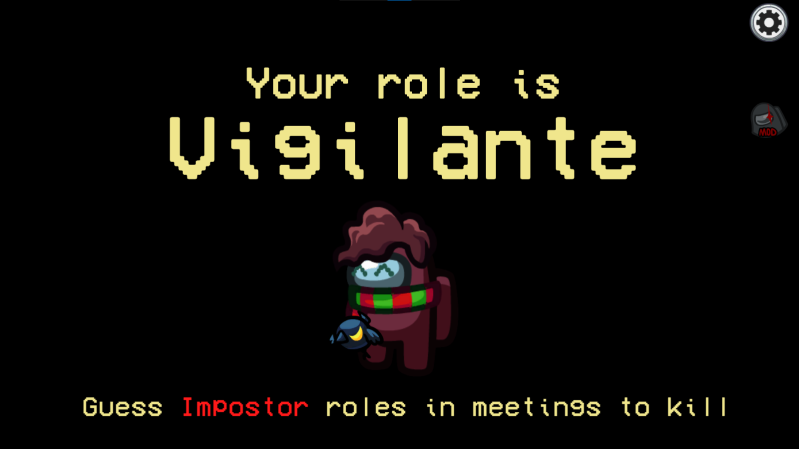

__Faction__: Crewmate (Killing) 
__Base__: Crewmate 
__Ability__: Guess evil roles in meetings 
__Indicator/Symbols__: None 
__Win Condition__: Eliminate all Impostors 
__Can Use Pet System__: No 

Origin: [Town of Us Reactivated](https://github.com/eDonnes124/Town-Of-Us-R) 

#### Role Description
The Vigilante is a regular crewmate with one added bonus: Guessing! 
Guessing is a mechanic where you guess a player's role to kill them. 
Guessing wrong kills you instead. 
To guess, use the command `/bt [playerId] role` or use the UI if you have the mod installed. 
Player IDs are displayed next to player names during meetings. 

> **Fun Fact!** 
> There is an Impostor variant called [Assassin](#Assassin) and a neutral variant called [Doomsayer](#Doomsayer)!

------------------------------------------------------------------------------------------------------------------------------------------------------------------------------------------

## Warrior

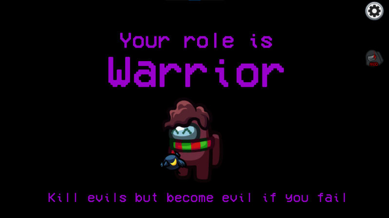

__Faction__: Crewmate (Killing) 
__Base__: Impostor 
__Ability__: Kill evildoers or become one 
__Indicator/Symbols__: None 
__Win Condition__: Eliminate all Impostors 
__Can Use Pet System__: No 

Origin: [Town of Host Enhanced](https://github.com/0xDrMoe/TownofHost-Enhanced) 

#### Role Description
The Warrior is a crewmate that can kill anyone. 
If the Warrior kills an Impostor or Neutral, nothing special occurs. 
However, if the Warrior kills a crewmate, the Warrior becomes a [Madmate](#Madmate).

------------------------------------------------------------------------------------------------------------------------------------------------------------------------------------------

# Neutral Benign Roles

## Amnesiac

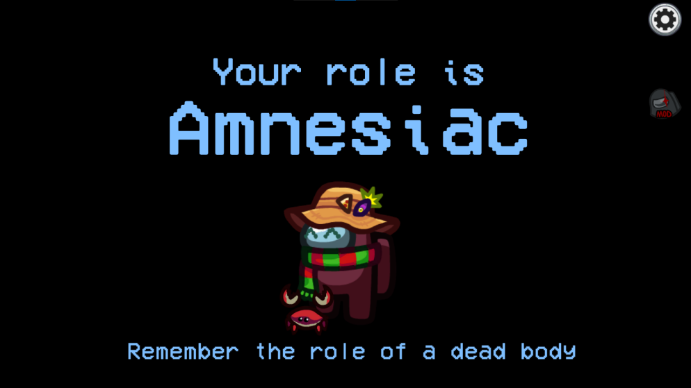

__Faction__: Neutral (Benign) 
__Base__: Impostor 
__Ability__: Remember the role of a dead body 
__Indicator/Symbols__: None 
__Win Condition__: None 
__Can Use Pet System__: No 

Origin: [Town of Us Reactivated](https://github.com/eDonnes124/Town-Of-Us-R) 

#### Role Description
The Amnesiac has no win condition. Instead, you must find a dead body and hit the report button. 
You will become either the target role (if compatible, otherwise [Engineer](#Engineer)), a Refugee, or a neutral defined in the settings. 

------------------------------------------------------------------------------------------------------------------------------------------------------------------------------------------

## Follower

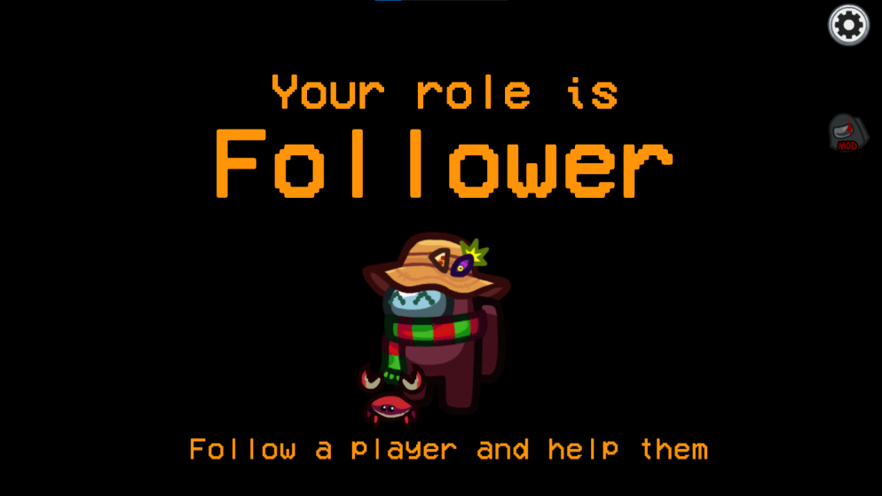

__Faction__: Neutral (Benign) 
__Base__: Impostor 
__Ability__: Choose a player to win with 
__Indicator/Symbols__: None 
__Win Condition__: With with the target you choose 
__Can Use Pet System__: No 

Origin: [Town of Host Edited](https://github.com/KARPED1EM/TownOfNext) 

#### Role Description
The Follower can choose a target with their kill button. 
If the target wins, the Follower also wins. 
The Follower may change their target as long as they have not died yet. 

------------------------------------------------------------------------------------------------------------------------------------------------------------------------------------------

## Hater

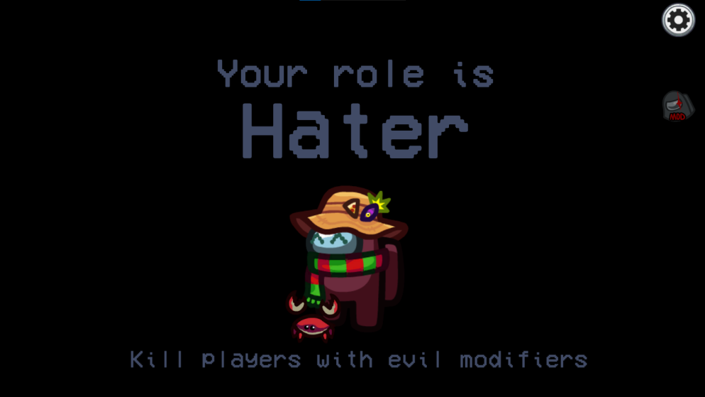

__Faction__: Neutral (Benign) 
__Base__: Impostor 
__Ability__: Can kill evil modifiers 
__Indicator/Symbols__: None 
__Win Condition__: Kill evil modifiers and win with winning team 
__Can Use Pet System__: No 

Origin: [Town of Host Edited](https://github.com/KARPED1EM/TownOfNext) 

#### Role Description
The Hater can kill evil modifiers. 
If they do so, they win with the winning team. 

------------------------------------------------------------------------------------------------------------------------------------------------------------------------------------------

## Lawyer

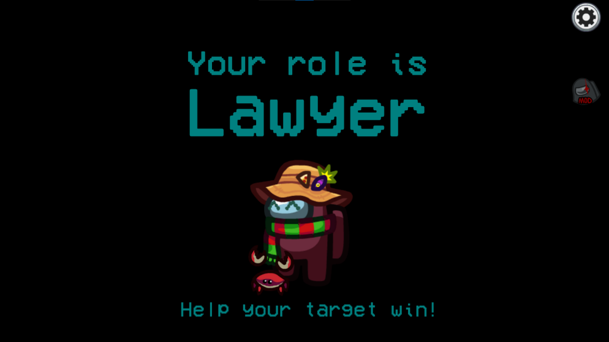

__Faction__: Neutral (Benign) 
__Base__: Crewmate 
__Ability__: Help target 
__Indicator/Symbols__: Teal diamond next to player name 
__Win Condition__: Win with target if target wins 
__Can Use Pet System__: No 

Origin: Lifeboat 

#### Role Description
The Lawyer has an assigned target, much like an [Executioner](#Executioner). 
The target is indicated with a teal diamond symbol. 
If the target wins, you win as well. 
If the target dies, the Lawyer will turn into either a Crewmate, [Jester](#Jester), [Opportunist](#Opportunist), or [Convict](#Convict).
**Beware, if your target is voted off, your role does NOT change!**

------------------------------------------------------------------------------------------------------------------------------------------------------------------------------------------

## Maverick

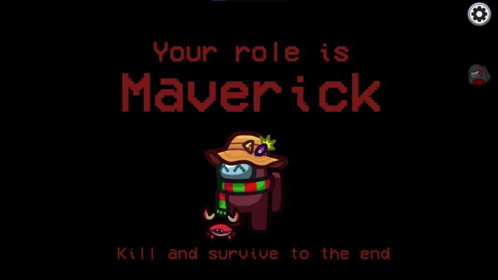

__Faction__: Neutral (Benign) 
__Base__: Impostor 
__Ability__: None 
__Indicator/Symbols__: None 
__Win Condition__: Win with winning team if alive 
__Can Use Pet System__: No 

Origin: [Town of Host Re-Edited](https://github.com/Loonie-Toons/Re-Edited) 

#### Role Description
The Maverick must survive to the end of the game to win with the winning team, much like an [Opportunist](#Opportunist) 
The key difference here is that the Maverick may also kill and vent. 
If the Maverick dies, it cannot win. 

------------------------------------------------------------------------------------------------------------------------------------------------------------------------------------------

## Opportunist

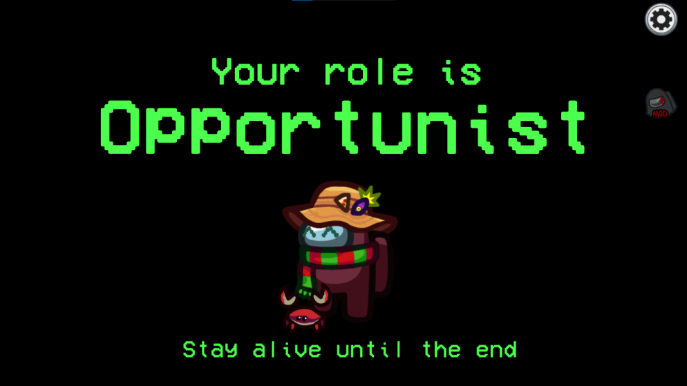

__Faction__: Neutral (Benign) 
__Base__: Crewmate 
__Ability__: None 
__Indicator/Symbols__: None 
__Win Condition__: Win with winning team if alive 
__Can Use Pet System__: No 

Origin: [Town of Host](https://github.com/tukasa0001/TownOfHost)

#### Role Description
The Opportunist must survive to the end of the game to win with the winning team 
If the Opportunist dies, it cannot win. 

------------------------------------------------------------------------------------------------------------------------------------------------------------------------------------------

## Pursuer

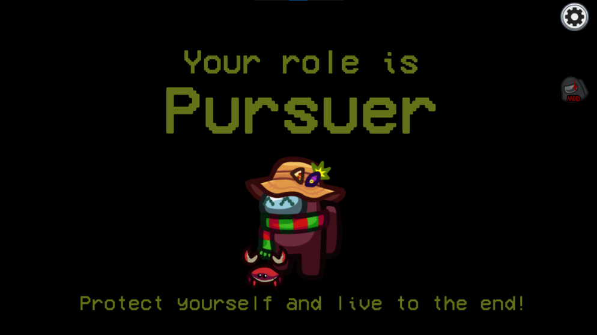

__Faction__: Neutral (Benign) 
__Base__: Impostor 
__Ability__: Cause killers to misfire 
__Indicator/Symbols__: None 
__Win Condition__: Win with winning team if alive 
__Can Use Pet System__: No 

Origin: [Town of Host Re-Edited](https://github.com/Loonie-Toons/Re-Edited) 

#### Role Description
The Pursuer must survive to the end of the game to win with the winning team. much like an [Opportunist](#Opportunist) 
The Pursuer can use their kill button on any player. 
If that player were to use their kill button, they'll misfire. 
If the Pursuer dies, it cannot win. 

------------------------------------------------------------------------------------------------------------------------------------------------------------------------------------------

## Romantic

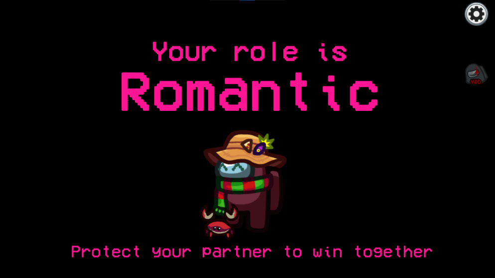

__Faction__: Neutral (Benign) 
__Base__: Impostor 
__Ability__: Pick a partner to win with and protect 
__Indicator/Symbols__: Magenta heart 
__Win Condition__: Win with your partner 
__Can Use Pet System__: No 

Origin: [Stellar Roles](https://github.com/Mr-Fluuff/StellarRolesAU) 

#### Role Description
The Romantic can choose a partner using their kill button. 
After choosing a partner, they can use their kill button to temporarily shield their partner. 
The Romantic will win with their partner. 
If the partner dies, the Romantic's role will change accordingly. 
The possible roles are: 
- Refugee (from Impostors)
- Ruthless Romantic (from Neutral Killers)
- Vengeful Romantic (from Crewmates, Neutral Evil, Neutral Benign)

------------------------------------------------------------------------------------------------------------------------------------------------------------------------------------------

## Shaman

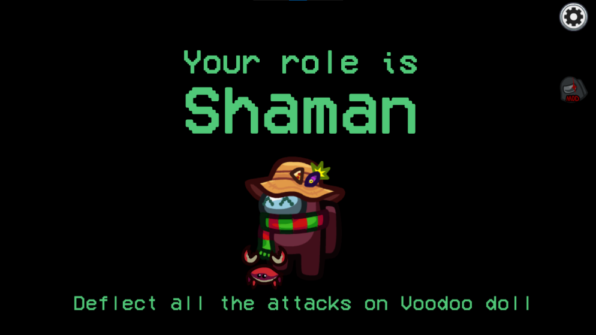

__Faction__: Neutral (Benign) 
__Base__: Impostor 
__Ability__: Reflect attacks onto another player 
__Indicator/Symbols__: None 
__Win Condition__: Win with winning team if alive 
__Can Use Pet System__: No 

Origin: [Town of Host Re-Edited](https://github.com/Loonie-Toons/Re-Edited) 

#### Role Description
The Shaman can select a player using their kill button to make them their voodoo doll. 
All attacks done on the Shaman will be redirected to the voodoo doll. 
Effects made by the [Witch](#Witch) will still work on the Shaman. 

------------------------------------------------------------------------------------------------------------------------------------------------------------------------------------------

## Unabomber

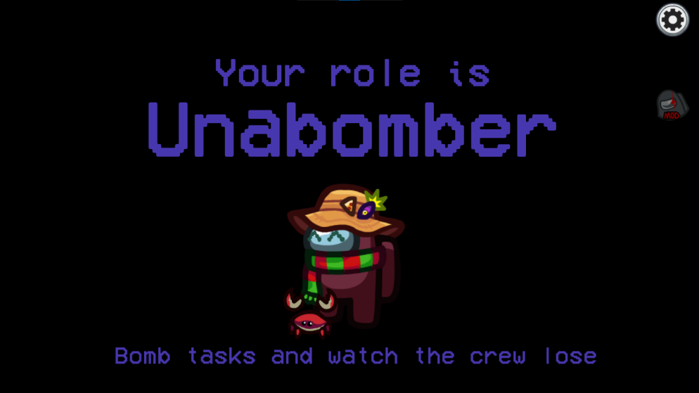

__Faction__: Neutral (Benign) 
__Base__: Engineer 
__Ability__: Bomb tasks 
__Indicator/Symbols__: None 
__Win Condition__: Survive to the end to see the crew lose 
__Can Use Pet System__: No 

Origin: [Town of Host Enhanced](https://github.com/0xDrMoe/TownofHost-Enhanced) 

#### Role Description
The Unabomber can do tasks to bomb them. 
The next player to complete the bombed task dies, regardless of protection. 
If the Unabomber is alive and crew does not win, Unabomber wins! 

------------------------------------------------------------------------------------------------------------------------------------------------------------------------------------------
## Witch

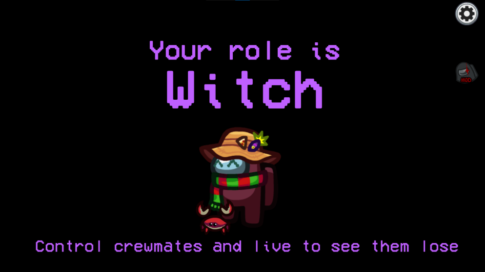

__Faction__: Neutral (Benign) 
__Base__: Impostor 
__Ability__: Make players kill 
__Indicator/Symbols__: Purple angled square 
__Win Condition__: Survive to the end of the game to see the crew lose 
__Can Use Pet System__: No 

Origin: Town of Salem 

#### Role Description
The Witch can use their kill button to control players, which will cause them to kill the next player they go near. 
If the Witch is alive and crew does not win, Witch wins! 

------------------------------------------------------------------------------------------------------------------------------------------------------------------------------------------

# Neutral Evil Roles

## Advocate

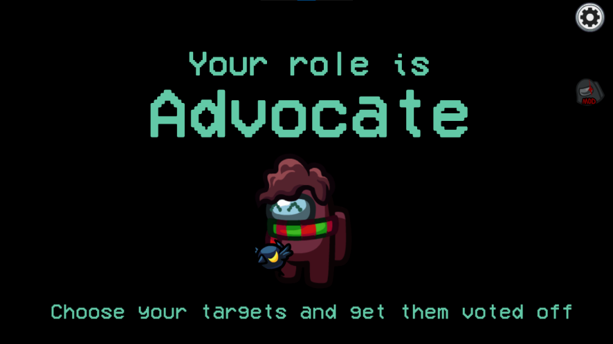

__Faction__: Neutral (Evil) 
__Base__: Impostor 
__Ability__: Choose targets 
__Indicator/Symbols__: None 
__Win Condition__: Get enough points 
__Can Use Pet System__: No 

Origin: Town of Host Refined 

#### Role Description
The Advocate is a neutral role that can choose three targets. 
If one is exiled, the Advocate gets a point. 
When the Advocate gets the required amount of points, they win! 

Optionally, the Advocate may suicide if they don't get one exiled. 

------------------------------------------------------------------------------------------------------------------------------------------------------------------------------------------

## Carnivore

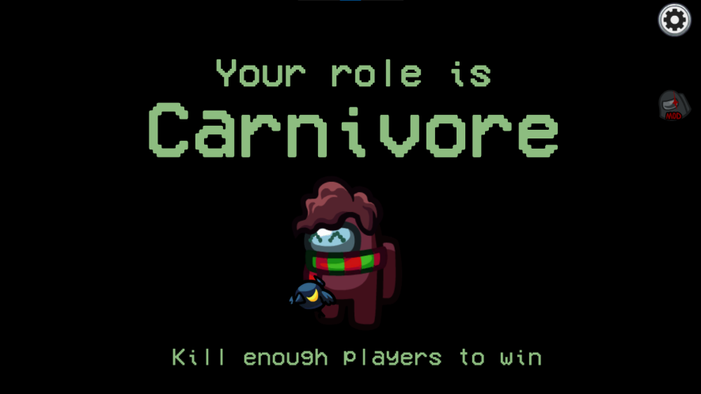

__Faction__: Neutral (Evil) 
__Base__: Impostor 
__Ability__: None 
__Indicator/Symbols__: None 
__Win Condition__: Kill x players 
__Can Use Pet System__: No 

Origin: Town of Host Refined 

#### Role Description
The Carnivore is a neutral that can kill. 
If the Carnivore kills enough players, they win! 

------------------------------------------------------------------------------------------------------------------------------------------------------------------------------------------

## Collector

__Faction__: Neutral (Evil) 
__Base__: Crewmate 
__Ability__: None 
__Indicator/Symbols__: None 
__Win Condition__: Collect enough votes 
__Can Use Pet System__: No 

Origin: [Town of Host Edited](https://github.com/KARPED1EM/TownOfNext) 

#### Role Description
The Collector is a neutral that collects votes during meetings. 
When the Collector votes someone, any votes on that player will be collected. 
When the Collector collects enough total votes, they win! 

------------------------------------------------------------------------------------------------------------------------------------------------------------------------------------------

## Cultist

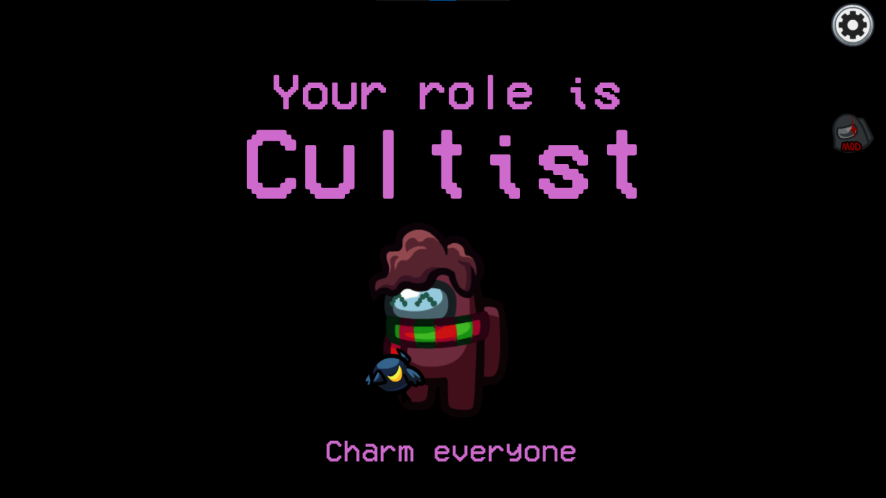

__Faction__: Neutral (Evil) 
__Base__: Impostor 
__Ability__: Charm others 
__Indicator/Symbols__: None 
__Win Condition__: Have majority over crewmates 
__Can Use Pet System__: No 

Origin: [Town of Host Edited](https://github.com/KARPED1EM/TownOfNext) 

#### Role Description
The Cultist is a neutral that wins similarly to neutral killers. 
The Cultist can charm other players, converting them to the Cultist team. 
If the Cultist has majority over the crew and no other teams are alive, the Cultist wins! 

------------------------------------------------------------------------------------------------------------------------------------------------------------------------------------------

## Cursed Soul

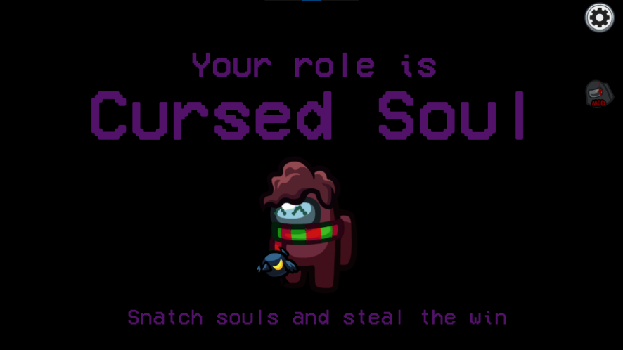

__Faction__: Neutral (Evil) 
__Base__: Impostor 
__Ability__: Make players count as dead 
__Indicator/Symbols__: None 
__Win Condition__: Steal the win if alive at the end 
__Can Use Pet System__: No 

Origin: [Town of Host Re-Edited](https://github.com/Loonie-Toons/Re-Edited) 

#### Role Description
The Cursed Soul is a neutral that can give players the Soulless modifier, which makes them considered dead. 
If the Cursed Soul is alive at the end of the game, the Cursed Soul wins. 

The Cursed Soul can see soulless players, but not the other way around. 
Souless players can win with the Cursed Soul as well as their original team.  

------------------------------------------------------------------------------------------------------------------------------------------------------------------------------------------

## Doomsayer

__Faction__: Neutral (Evil) 
__Base__: Crewmate 
__Ability__: Guess players in meetings 
__Indicator/Symbols__: None 
__Win Condition__: Guess enough players to win 
__Can Use Pet System__: No 

Origin: [Town of Us Reactivated](https://github.com/eDonnes124/Town-Of-Us-R) 

#### Role Description
The Doomsayer is a neutral that has to guess enough players to win. 

Guessing is a mechanic where you guess a player's role to kill them. 
Guessing wrong may kill you, depending on the settings. 
To guess, use the command `/bt [playerId] role` or use the UI if you have the mod installed. 
Player IDs are displayed next to player names during meetings. 

> **Fun Fact!** 
> There is a crewmate variant called [Vigilante](#Vigilante) and an Impostor variant called [Assassin](#Assassin)!

------------------------------------------------------------------------------------------------------------------------------------------------------------------------------------------

## Executioner

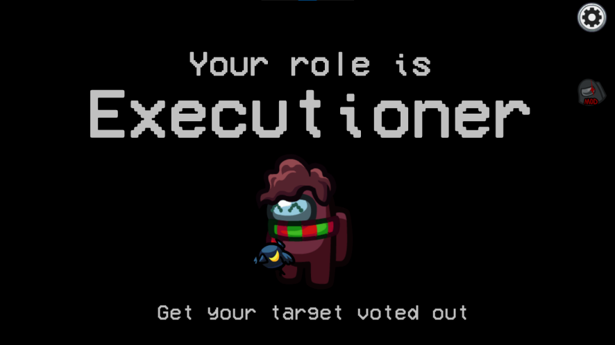

__Faction__: Neutral (Evil) 
__Base__: Crewmate 
__Ability__: None 
__Indicator/Symbols__: None 
__Win Condition__: Get target voted out 
__Can Use Pet System__: No 

Origin: Various 

#### Role Description
The Executioner is a neutral with a target. 
If the target is voted out, the Executioner wins! 
If the target dies, the Executioner will turn into either a Crewmate, [Jester](#Jester), [Opportunist](#Opportunist), or [Convict](#Convict).

------------------------------------------------------------------------------------------------------------------------------------------------------------------------------------------

## Hacker

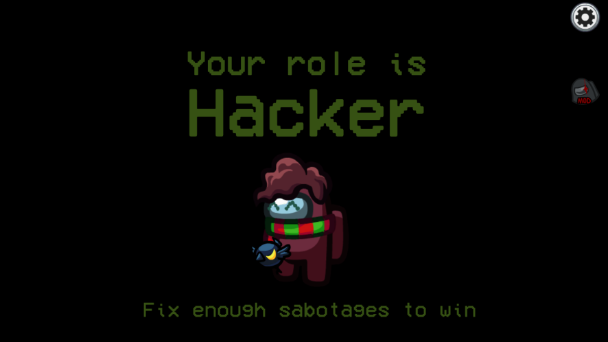

__Faction__: Neutral (Evil) 
__Base__: Crewmate/Engineer 
__Ability__: Fix sabotages faster 
__Indicator/Symbols__: None 
__Win Condition__: Get enough points from fixing sabotages 
__Can Use Pet System__: No 

Origin: [Project Lotus](https://https://github.com/ImaMapleTree/Lotus) 

#### Role Description
The Hacker is a neutral that has the same abilities as the [Mechanic](#Mechanic) role. 
To win, the Hacker must gain enough points from fixing sabotages. 
Each sabotage can give different amounts of points. 

Optionally, the Hacker may use vents. 

------------------------------------------------------------------------------------------------------------------------------------------------------------------------------------------

## Innocent

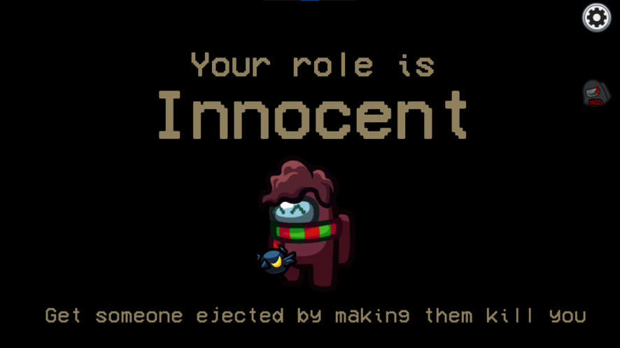

__Faction__: Neutral (Evil) 
__Base__: Impostor 
__Ability__: Frame a player for your murder 
__Indicator/Symbols__: None 
__Win Condition__: Get framed player voted out 
__Can Use Pet System__: No 

Origin: [Town of Host Edited](https://https://github.com/KARPED1EM/TownOfNext) 

#### Role Description
The Innocent is a neutral with a simple task: Frame a player for your murder and get them voted out. 
To frame a player, use your kill button on them. This will make them kill you. 
If the framed player dies, the Innocent cannot win. 

------------------------------------------------------------------------------------------------------------------------------------------------------------------------------------------

## Jester

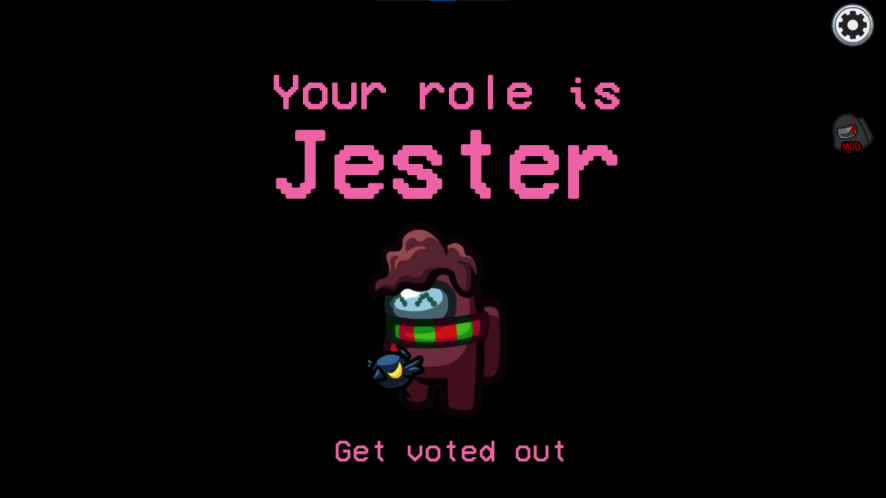

__Faction__: Neutral (Evil) 
__Base__: Crewmate/Engineer 
__Ability__: None 
__Indicator/Symbols__: None 
__Win Condition__: Get voted out 
__Can Use Pet System__: No 

Origin: Various 

#### Role Description
The Jester is a neutral with one goal: Get voted out. 
If the Jester dies by any other means, they lose. 

------------------------------------------------------------------------------------------------------------------------------------------------------------------------------------------

## Masochist

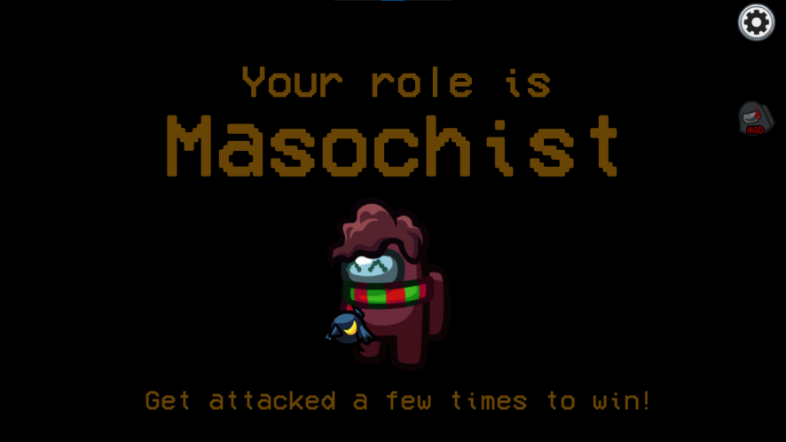

__Faction__: Neutral (Evil) 
__Base__: Crewmate 
__Ability__: Basically immortal 
__Indicator/Symbols__: None 
__Win Condition__: Get attacked a lot 
__Can Use Pet System__: No 

Origin: [Town of Host Plus](https://github.com/Loonie-Toons/TownOfHostPlus) 

#### Role Description
The Masochist is a neutral that practically cannot die. 
Why? Their win condition is to be attacked a set amount of times to win. 

**Note: Guessing the Masochist counts as an attack!**

------------------------------------------------------------------------------------------------------------------------------------------------------------------------------------------

## Phantom

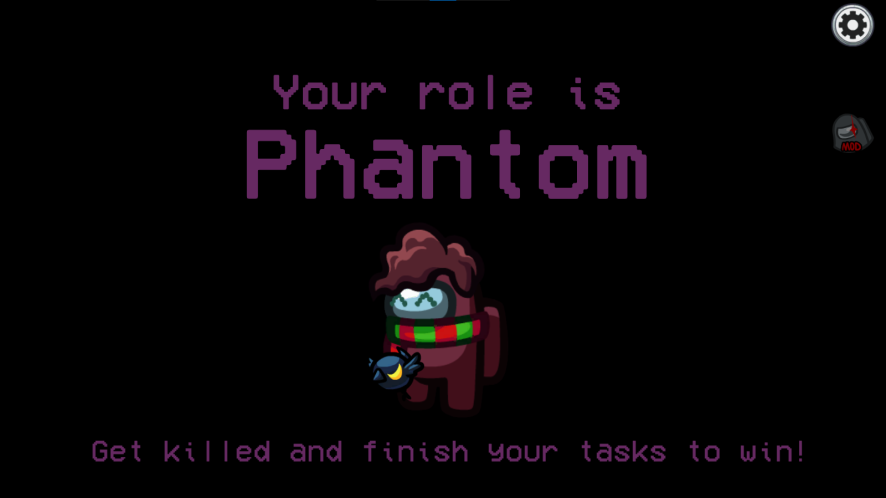

__Faction__: Neutral (Evil) 
__Base__: Crewmate/Engineer 
__Ability__: Basically immortal 
__Indicator/Symbols__: None 
__Win Condition__: Be dead at the end of the game with tasks done 
__Can Use Pet System__: No 

Origin: [Town of Host Re-Edited](https://github.com/Loonie-Toons/Re-Edited) 

#### Role Description
The Phantom is a neutral with the goal of dying and completing their tasks. 
If the Phantom has their tasks done and is dead, they'll win. 
If the Phantom is alive, they'll lose. 

The Phantom will win with the winning team or snatch the win, depending on the settings. 

------------------------------------------------------------------------------------------------------------------------------------------------------------------------------------------

## Pirate

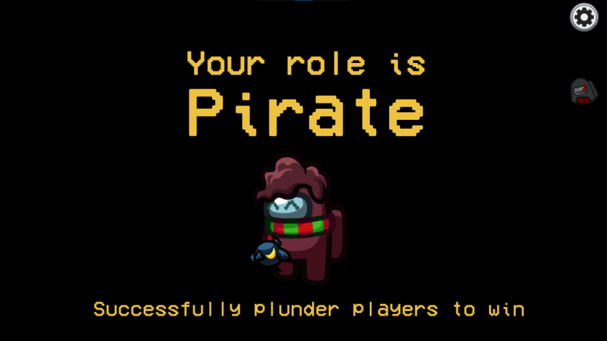

__Faction__: Neutral (Evil) 
__Base__: Impostor 
__Ability__: Dueling 
__Indicator/Symbols__: None 
__Win Condition__: Win enough duels 
__Can Use Pet System__: No 

Origin: [Town of Host Re-Edited](https://github.com/Loonie-Toons/Re-Edited) 

#### Role Description
The Pirate is a neutral that can duel other players. 
To choose a player to duel, use your kill button on them. 

In the meeting, you and the target are to use `/duel 0/1/2` to select an option. 
If the numbers match, the Pirate wins the duel and kills the target. 
If the numbers don't match, the target wins and survives. 

Once the Pirate wins enough duels, they win! 

------------------------------------------------------------------------------------------------------------------------------------------------------------------------------------------

## Provocateur

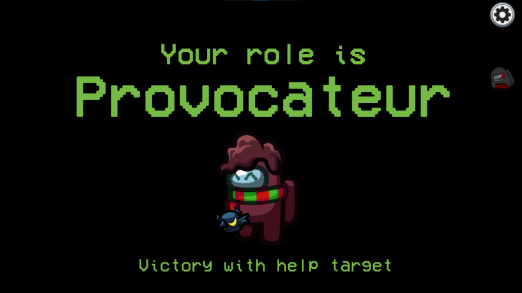

__Faction__: Neutral (Evil) 
__Base__: Impostor 
__Ability__: None 
__Indicator/Symbols__: None 
__Win Condition__: Have target lose 
__Can Use Pet System__: No 

Origin: [Town of Host Edited](https://github.com/KARPED1EM/TownOfNext) 

#### Role Description
The Provocateur is a neutral that can kill one player. 
If that player loses, the Provocateur wins. 

------------------------------------------------------------------------------------------------------------------------------------------------------------------------------------------

## Revolutionist

__Faction__: Neutral (Evil) 
__Base__: Impostor 
__Ability__: Recruit others 
__Indicator/Symbols__: None 
__Win Condition__: Recruit enough then vent 
__Can Use Pet System__: No 

Origin: [Town of Host Edited](https://github.com/KARPED1EM/TownOfNext) 

#### Role Description
The Revolutionist is a neutral who must recruit enough players to vent. 
If the Revolutionist recruits enough and vents, they win! 

Recruited players win with the Revolutionist, alive or dead. 

------------------------------------------------------------------------------------------------------------------------------------------------------------------------------------------

## Seeker

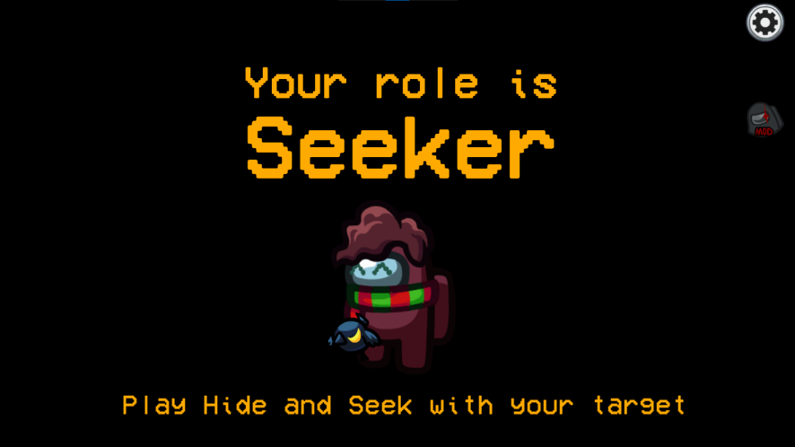

__Faction__: Neutral (Evil) 
__Base__: Impostor 
__Ability__: Seek others 
__Indicator/Symbols__: None 
__Win Condition__: Get enough seek points 
__Can Use Pet System__: No 

Origin: [Town of Host Re-Edited](https://github.com/Loonie-Toons/Re-Edited) 

#### Role Description
The Seeker is a neutral who plays hide and seek! 
The Seeker is given a target, and they must find them to get a point. 
However, catching another player will deduct a point. 
**Points can go into the negatives, be careful!** 

If the Seeker gets enough points, they win! 

------------------------------------------------------------------------------------------------------------------------------------------------------------------------------------------

## Soul Collector

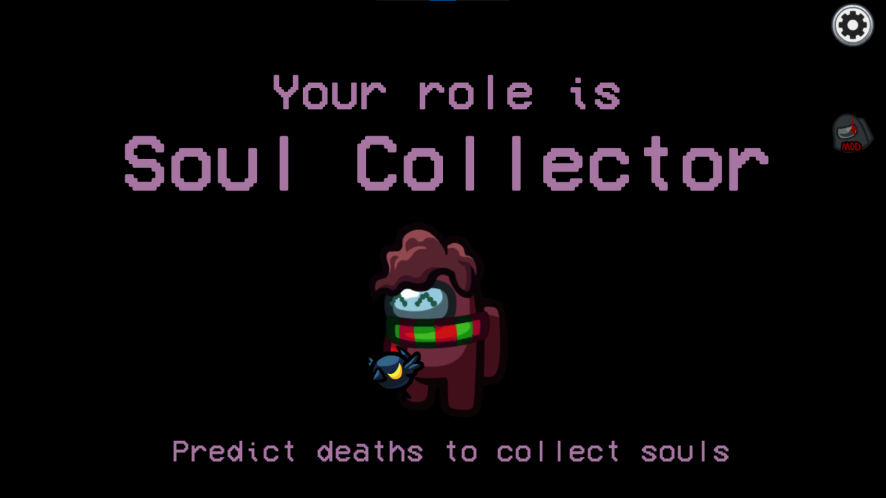

__Faction__: Neutral (Evil) 
__Base__: Crewmate 
__Ability__: None 
__Indicator/Symbols__: None 
__Win Condition__: Get enough points 
__Can Use Pet System__: No 

Origin: [Town of Host Re-Edited](https://github.com/Loonie-Toons/Re-Edited) 

#### Role Description
The Soul Collector is a neutral who can predict deaths to get points. 
During a meeting, the Soul Collector can vote a player, predicting their death. 
If the prediction was correct, the Soul Collector gets a point. 
Predict enough deaths to win! 

Optionally, the Soul Collector can predict their own death. 

------------------------------------------------------------------------------------------------------------------------------------------------------------------------------------------

## Terrorist

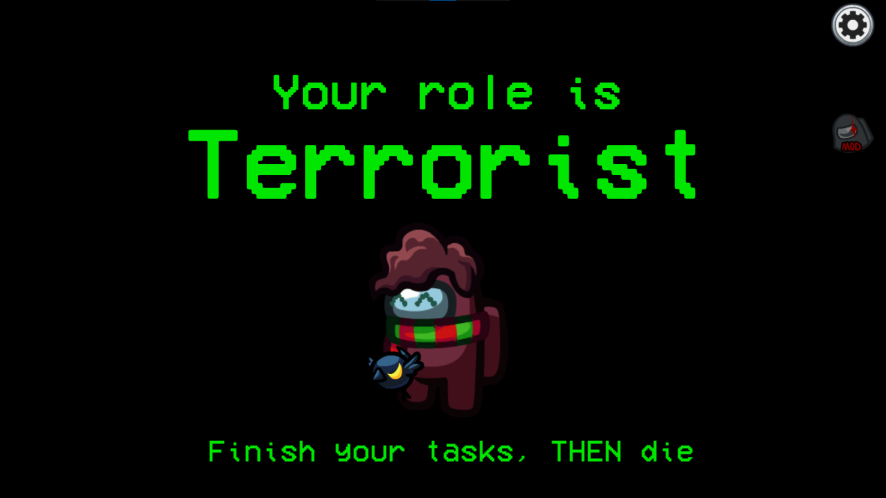

__Faction__: Neutral (Evil) 
__Base__: Engineer 
__Ability__: None 
__Indicator/Symbols__: None 
__Win Condition__: Finish tasks, then die 
__Can Use Pet System__: No 

Origin: [Town of Host](https://github.com/tukasa0001/TownOfHost) 

#### Role Description
The Terrorist is a neutral with tasks. 
If the Terrorist finishes those tasks then dies, they win! 

Whether or not suicide and exile count as valid deaths are dependent on the settings. 

------------------------------------------------------------------------------------------------------------------------------------------------------------------------------------------

## Vector

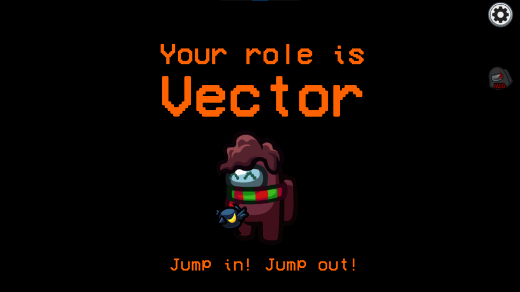

__Faction__: Neutral (Evil) 
__Base__: Engineer 
__Ability__: None 
__Indicator/Symbols__: None 
__Win Condition__: Finish tasks, then die 
__Can Use Pet System__: No 

Origin: [Town of Host Edited](https://github.com/KARPED1EM/TownOfNext) 

#### Role Description
The Vector is a neutral with a simple goal: Vent enough times. 
If the Vector vents enough times without dying, it wins! 

------------------------------------------------------------------------------------------------------------------------------------------------------------------------------------------

## Vulture

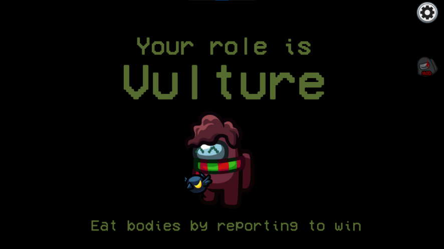

__Faction__: Neutral (Evil) 
__Base__: Crewmate/Engineer 
__Ability__: Eat bodies 
__Indicator/Symbols__: None 
__Win Condition__: Eat enough bodies 
__Can Use Pet System__: No 

Origin: [TheOtherRoles](https://github.com/TheOtherRolesAU/TheOtherRoles) 

#### Role Description
The Vulture is a neutral that can use their report button to eat bodies. 
Eating has a cooldown, which means the Vulture can't spam eat. Trying to will result in the Vulture reporting the body. 
When the Vulture has eaten enough bodies, it wins! 

Eaten bodies cannot be reported. 

------------------------------------------------------------------------------------------------------------------------------------------------------------------------------------------

## Workaholic

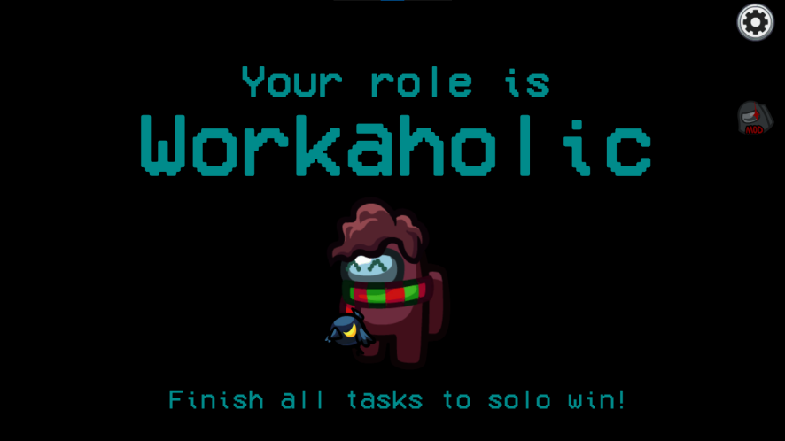

__Faction__: Neutral (Evil) 
__Base__: Crewmate/Engineer 
__Ability__: None 
__Indicator/Symbols__: None 
__Win Condition__: Finish all tasks 
__Can Use Pet System__: No 

Origin: [Town of Host Edited](https://github.com/KARPED1EM/TownOfNext) 

#### Role Description
The Workaholic is a neutral who wins if they finish their tasks. 
The following can be customized:
- Workaholic may be known to all
- Workaholic can win while dead

------------------------------------------------------------------------------------------------------------------------------------------------------------------------------------------

# Neutral Evil Roles

## Agitator

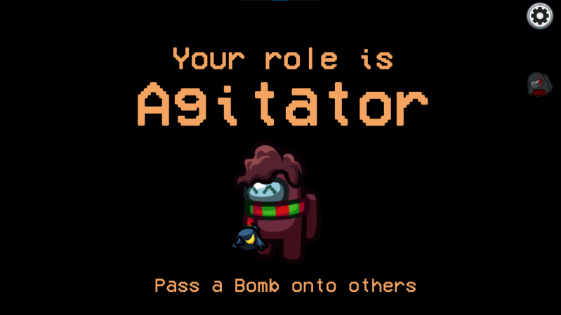

__Faction__: Neutral (Killing) 
__Base__: Impostor 
__Ability__: Timed bombs 
__Indicator/Symbols__: None 
__Win Condition__: Be the last man standing 
__Can Use Pet System__: No 

Origin: [Project Lotus](https://github.com/ImaMapleTree/Lotus) 

#### Role Description
The Agitator is a neutral that has a bomb they must pass. 
Once the bomb is passed, a timer starts. 
Players can pass the bomb by going near another player. 
When the timer expires, the bomb holder dies. 
If a meeting is called, the bomb holder will also die. 

Optionally, the Agitator may be able to receive the bomb. 

------------------------------------------------------------------------------------------------------------------------------------------------------------------------------------------

## Arsonist

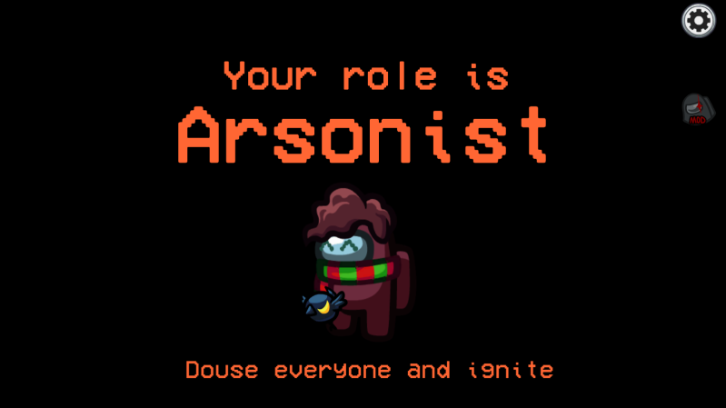

__Faction__: Neutral (Killing) 
__Base__: Impostor 
__Ability__: Dousing 
__Indicator/Symbols__: None 
__Win Condition__: Be the last man standing 
__Can Use Pet System__: Yes 

Origin: [Town of Us Reactivated](https://github.com/eDonnes124/Town-Of-Us-R) 

#### Role Description
The Arsonist is a neutral that can use their kill button to douse a player. 
The Arsonist can kill all doused players by igniting using their vent/pet button. 

Optionally, the Arsonist can be changed to its classic counterpart where it is considered a [Neutral Evil](#Neutral-Evil-Roles) role and has to douse everyone to ignite. 

------------------------------------------------------------------------------------------------------------------------------------------------------------------------------------------

## Bandit

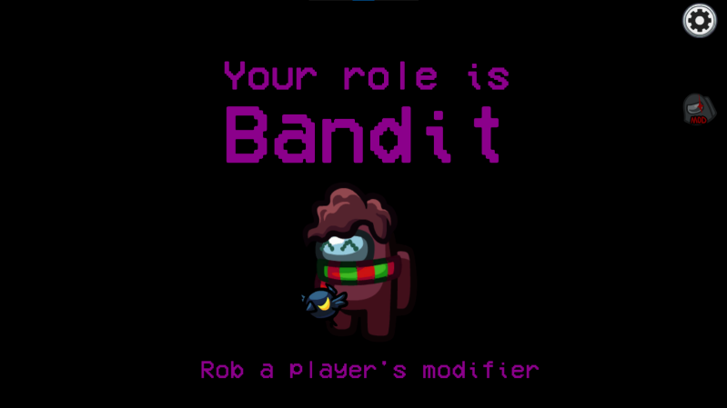

__Faction__: Neutral (Killing) 
__Base__: Impostor 
__Ability__: Steal modifiers 
__Indicator/Symbols__: None 
__Win Condition__: Be the last man standing 
__Can Use Pet System__: No 

Origin: [Town of Host Re-Edited](https://github.com/Loonie-Toons/Re-Edited) 

#### Role Description
The Bandit is a neutral that can steal modifiers from other players. 
To steal a modifier, use the kill button on a player. 
If the player has no stealable modifier, then the Bandit will simply kill the player. 

The Bandit cannot steal [Last Impostor](#Last-Impostor). 

------------------------------------------------------------------------------------------------------------------------------------------------------------------------------------------

## Blood Knight

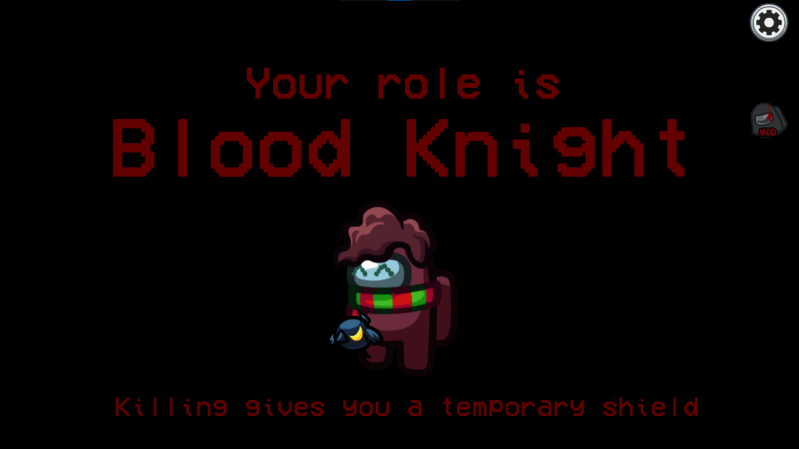

__Faction__: Neutral (Killing) 
__Base__: Impostor 
__Ability__: Temporal shield 
__Indicator/Symbols__: None 
__Win Condition__: Be the last man standing 
__Can Use Pet System__: No 

Origin: [Project Lotus](https://github.com/ImaMapleTree/Lotus) 

#### Role Description
The Blood Knight is a neutral that gains a temporary shield when it kills. 
When attacked with the temporary shield active, the Blood Knight is notified. 

------------------------------------------------------------------------------------------------------------------------------------------------------------------------------------------

## Demon

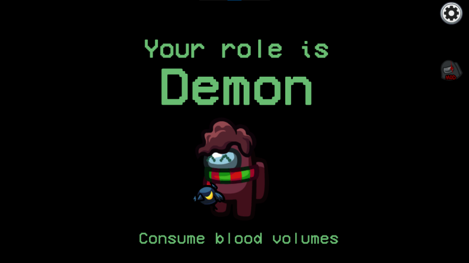

__Faction__: Neutral (Killing) 
__Base__: Impostor 
__Ability__: Drain health 
__Indicator/Symbols__: None 
__Win Condition__: Be the last man standing 
__Can Use Pet System__: No 

Origin: [Town of Host Edited](https://github.com/KARPED1EM/TownOfNext) 

#### Role Description
The Demon is a neutral with a health system. 
When the Demon attacks a player, their health is reduced. 
The same occurs vice versa. 
Players attacking the Demon will be notified that they attacked a Demon. 

------------------------------------------------------------------------------------------------------------------------------------------------------------------------------------------

## Glitch

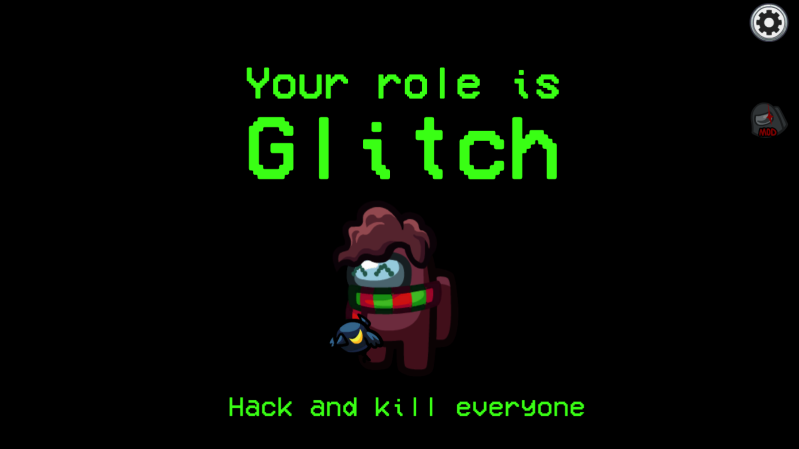

__Faction__: Neutral (Killing) 
__Base__: Impostor 
__Ability__: Mimic, Hack 
__Indicator/Symbols__: None 
__Win Condition__: Be the last man standing 
__Can Use Pet System__: Yes 

Origin: [Town of Us Reactivated](https://github.com/eDonnes124/Town-Of-Us-R) 

#### Role Description
The Glitch is a neutral that can kill, hack, and mimic. 
Killing is what you'd expect. 
Hacking is the equivalent to a roleblock. 
Mimicking causes the Glitch to transform into a random living player. 
You can mimic by either using the Sabotage menu or by using the Pet button. 

The kill button is always at a cooldown of 1 second as killing and hacking are both mapped to the same button. 
The kill cooldown and hack cooldown are visualized so you know what's on cooldown. 

------------------------------------------------------------------------------------------------------------------------------------------------------------------------------------------

## Harbinger

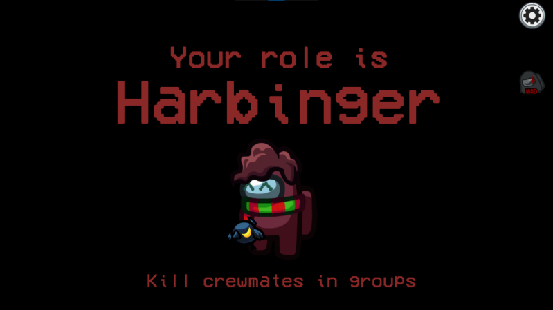

__Faction__: Neutral (Killing) 
__Base__: Impostor 
__Ability__: Kill nearby players on kill 
__Indicator/Symbols__: None 
__Win Condition__: Be the last man standing 
__Can Use Pet System__: No 

Origin: [Town of Host Re-Edited](https://github.com/Loonie-Toons/Re-Edited) 

#### Role Description
The Harbinger is a neutral that, when it kills, also kills nearby players with the kill reason "Obliterated".

------------------------------------------------------------------------------------------------------------------------------------------------------------------------------------------

## Huntsman

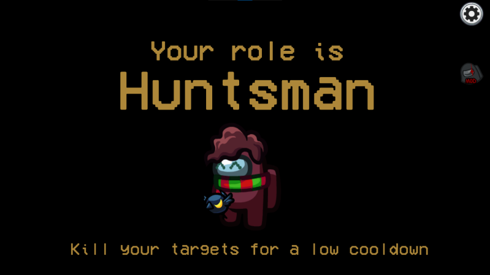

__Faction__: Neutral (Killing) 
__Base__: Impostor 
__Ability__: Reduce kill cooldown when killing a target 
__Indicator/Symbols__: None 
__Win Condition__: Be the last man standing 
__Can Use Pet System__: No 

Origin: [TOHE+](https://github.com/Gurge44/TOHE_PLUS) 

#### Role Description
The Huntsman is a neutral with targets. 
If the Huntsman kills one, their kill cooldown is decreased. 
If the Huntsman kills anyone else, their kill cooldown is increased. 

------------------------------------------------------------------------------------------------------------------------------------------------------------------------------------------

## Illusioner

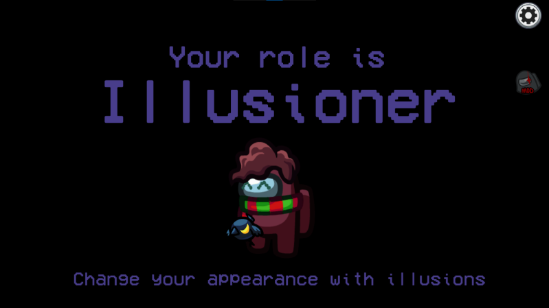

__Faction__: Neutral (Killing) 
__Base__: Impostor 
__Ability__: Transform into another player 
__Indicator/Symbols__: None 
__Win Condition__: Be the last man standing 
__Can Use Pet System__: No 

Origin: Town of Host Refined 

#### Role Description
The Illusioner is a neutral that can change their appearance. 
To mirror the appearance of a living player, use your kill button once on them. 
You'll become them after a second or two. 

To kill normally, click the kill button once. 

------------------------------------------------------------------------------------------------------------------------------------------------------------------------------------------

## Infectious

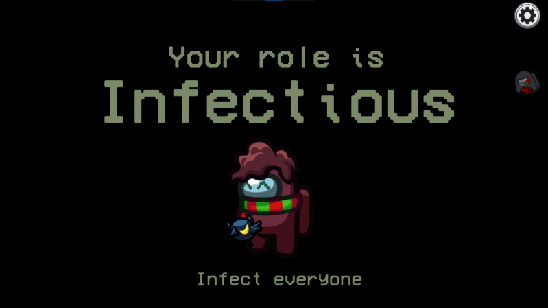

__Faction__: Neutral (Killing) 
__Base__: Impostor 
__Ability__: Infect others onto your team 
__Indicator/Symbols__: None 
__Win Condition__: Be the last man standing 
__Can Use Pet System__: No 

Origin: [Town of Host Re-Edited](https://github.com/Loonie-Toons/Re-Edited) 

#### Role Description
The Infectious is a neutral that can infect players. 
Infected players are on the Infectious team. 

If the Infectious infects all the remaining killers, the Infectious just has to outnumber the crew to win. 

If the Infectious dies, all infected players will die after the next meeting. 
If the infected players complete the Infectious win condition before then, the Infectious team can still win. 

------------------------------------------------------------------------------------------------------------------------------------------------------------------------------------------

## Jackal

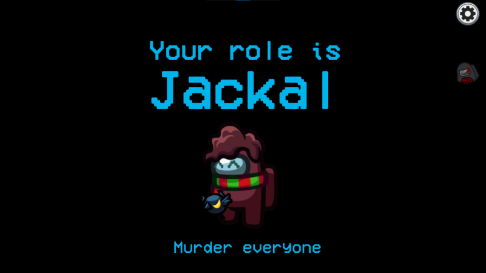

__Faction__: Neutral (Killing) 
__Base__: Impostor 
__Ability__: Recruit a Sidekick 
__Indicator/Symbols__: None 
__Win Condition__: Be the last man standing 
__Can Use Pet System__: No 

Origin: [TheOtherRoles](https://github.com/TheOtherRolesAU/TheOtherRoles) 

#### Role Description
The Jackal is a neutral that can recruit a Sidekick to help them win. 
Sidekicks are on the Jackal's team. 

The Jackal and Sidekick can optionally sabotage like an Impostor, and can optionally win by sabotage if all the Impostors are dead. 

------------------------------------------------------------------------------------------------------------------------------------------------------------------------------------------

## Jinx

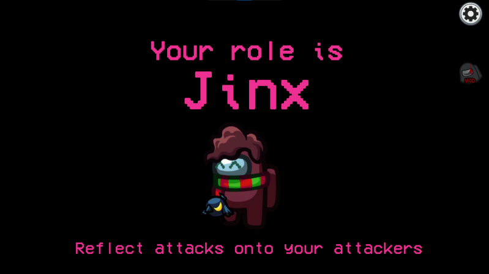

__Faction__: Neutral (Killing) 
__Base__: Impostor 
__Ability__: Infect others onto your team 
__Indicator/Symbols__: None 
__Win Condition__: Be the last man standing 
__Can Use Pet System__: No 

Origin: [Town of Host Re-Edited](https://github.com/Loonie-Toons/Re-Edited) 

#### Role Description
The Jinx is an Impostor that, when attacked, reflects nearly any attack onto the source. 
The attack type will either appear as a misfire or a [Veteran](#Veteran) kill, depending on the settings.

------------------------------------------------------------------------------------------------------------------------------------------------------------------------------------------

## Juggernaut

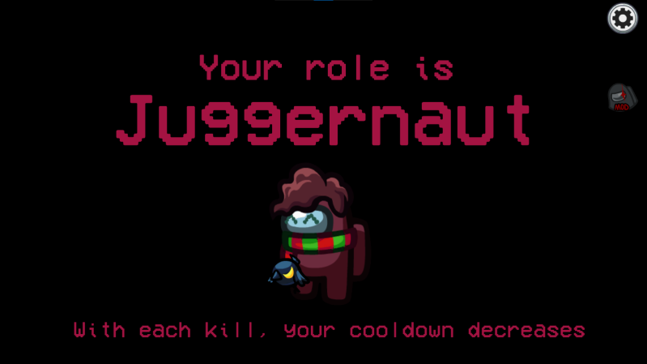

__Faction__: Neutral (Killing) 
__Base__: Impostor 
__Ability__: Decreasing kill cooldown 
__Indicator/Symbols__: None 
__Win Condition__: Be the last man standing 
__Can Use Pet System__: No 

Origin: [Town of Us Reactivated](https://github.com/eDonnes124/Town-Of-Us-R) 

#### Role Description
The Juggernaut is a neutral that reduces their kill cooldown when it kills. 

------------------------------------------------------------------------------------------------------------------------------------------------------------------------------------------

## Medusa

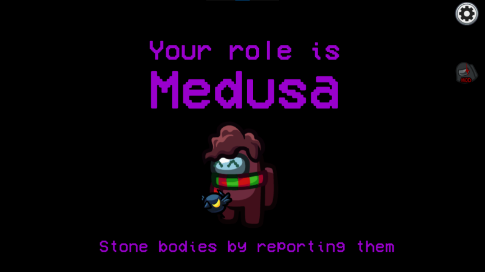

__Faction__: Neutral (Killing) 
__Base__: Impostor 
__Ability__: Make bodies unreportable 
__Indicator/Symbols__: None 
__Win Condition__: Be the last man standing 
__Can Use Pet System__: No 

Origin: [Town of Host Re-Edited](https://github.com/Loonie-Toons/Re-Edited) 

#### Role Description
The Medusa is an Impostor that can stone bodies, making the unreportable. 
If the Medusa's kill cooldown is up, their report button will be their stone button. 
If the kill cooldown is not up, the report button functions as a report button. 

Stoning a body resets the kill cooldown. 

> **Fun Fact!** 
> There is an Impostor variant called [Janitor](#Janitor)! 

------------------------------------------------------------------------------------------------------------------------------------------------------------------------------------------

## Necromancer

__Faction__: Neutral (Killing) 
__Base__: Impostor 
__Ability__: Defy death 
__Indicator/Symbols__: None 
__Win Condition__: Be the last man standing 
__Can Use Pet System__: No 

Origin: [Project Lotus](https://github.com/ImaMapleTree/Lotus) 

#### Role Description
The Necromancer is a neutral that, when attacked, gets another chance at life. 
The Necromancer then enters a necromancy, where the Necromancer has to go and kill the attacker. 
During a necromancy, venting is disabled to prevent hiding inside a vent. 

If the timer runs out for the necromancy, the Necromancer dies. 

------------------------------------------------------------------------------------------------------------------------------------------------------------------------------------------

## Pelican

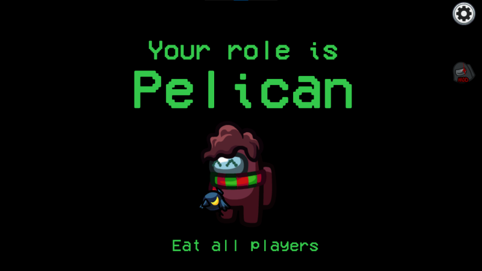

__Faction__: Neutral (Killing) 
__Base__: Impostor 
__Ability__: Eat players alive 
__Indicator/Symbols__: None 
__Win Condition__: Be the last man standing 
__Can Use Pet System__: No 

Origin: [Town of Host Edited](https://github.com/KARPED1EM/TownOfNext) 

#### Role Description
The Pelican is a neutral that eats players rather than immediately killing them. 
When a player is eaten by the Pelican, they are teleported outside the map out of view for the remainder of the round. 
If the Pelican dies, all eaten players are teleported to the position of the Pelican. 
If a meeting is called, all eaten players die. 

------------------------------------------------------------------------------------------------------------------------------------------------------------------------------------------

## Pickpocket

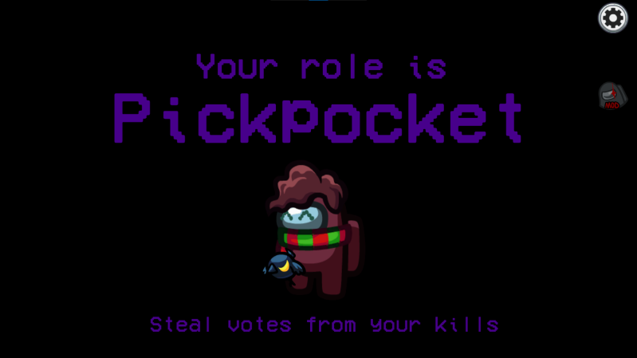

__Faction__: Neutral (Killing) 
__Base__: Impostor 
__Ability__: Gain votes by killing 
__Indicator/Symbols__: None 
__Win Condition__: Be the last man standing 
__Can Use Pet System__: No 

Origin: [Project Lotus](https://github.com/ImaMapleTree/Lotus) 

#### Role Description
The Pickpocket is a neutral with the same ability as the [Stealer](#Stealer) modifier. 
When the Pickpocket kills, they gain votes. 

------------------------------------------------------------------------------------------------------------------------------------------------------------------------------------------

## Poisoner

__Faction__: Neutral (Killing) 
__Base__: Impostor 
__Ability__: Delayed kills 
__Indicator/Symbols__: None 
__Win Condition__: Be the last man standing 
__Can Use Pet System__: No 

Origin: [Town of Host Plus](https://github.com/Loonie-Toons/TownOfHostPlus) 

#### Role Description
The Poisoner is a neutral that has delayed kills. 
The kill button is the poison button, which will cause the victim to die after a set amount of time. 

> **Fun Fact!** 
> There is an Impostor variant called [Vampire](#Vampire)!

------------------------------------------------------------------------------------------------------------------------------------------------------------------------------------------

## Plaguebearer

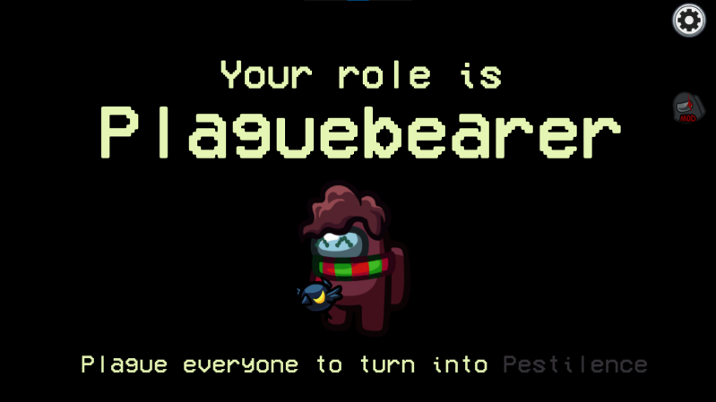

__Faction__: Neutral (Killing) 
__Base__: Impostor 
__Ability__: Spread the plague 
__Indicator/Symbols__: None 
__Win Condition__: Turn into Pestilence and be the last man standing 
__Can Use Pet System__: No 

Origin: [Town of Us Reactivated](https://github.com/eDonnes124/Town-Of-Us-R) 

#### Role Description
The Plaguebearer is a neutral that can use their kill button to spread the plague among the crew. 
Once every living player is infected, the Plaguebearer becomes Pestilence. 

As Pestilence, you are virtually invincible, killing anyone who tries to kill you. 
Once you outnumber the crew, you win. 

Pestilence cannot be guessed, attempting to do so causes the source of the guess to die. 

------------------------------------------------------------------------------------------------------------------------------------------------------------------------------------------

## Potion Master

__Faction__: Neutral (Killing) 
__Base__: Impostor 
__Ability__: Reveal roles to self 
__Indicator/Symbols__: None 
__Win Condition__: Be the last man standing 
__Can Use Pet System__: No 

Origin: [Town of Host Re-Edited](https://github.com/Loonie-Toons/Re-Edited) 

#### Role Description
The Potion Master is a neutral that can reveal the roles of other players to themself. 
To reveal, use the kill button once. 
To kill, click it twice. 

The Potion Master can also sabotage like an Impostor, but cannot win by sabotage. 

------------------------------------------------------------------------------------------------------------------------------------------------------------------------------------------

## Pyromaniac

__Faction__: Neutral (Killing) 
__Base__: Impostor 
__Ability__: Dousing 
__Indicator/Symbols__: None 
__Win Condition__: Be the last man standing 
__Can Use Pet System__: No 

Origin: [Stellar Roles](https://github.com/Mr-Fluuff/StellarRolesAU) 

#### Role Description
The Pyromaniac is a neutral that can both kill players, as well as douse them. 
To douse, click the kill button once. 
To kill, click it twice. 

If the Pyromaniac kills a doused player, they will receive a reduced kill cooldown for their next kill. 

------------------------------------------------------------------------------------------------------------------------------------------------------------------------------------------

## Serial Killer

__Faction__: Neutral (Killing) 
__Base__: Impostor 
__Ability__: None 
__Indicator/Symbols__: None 
__Win Condition__: Be the last man standing 
__Can Use Pet System__: No 

Origin: [Town of Host Re-Edited](https://github.com/Loonie-Toons/Re-Edited) 

#### Role Description
The Serial Killer is a neutral with no unique ability. 
It's a basic killer with its goal being for everyone to die. 

Optionally, the Serial Killer can have a teammate. 
**This second Serial Killer can replace any role that spawns, including an Impostor!**

------------------------------------------------------------------------------------------------------------------------------------------------------------------------------------------

## Shroud

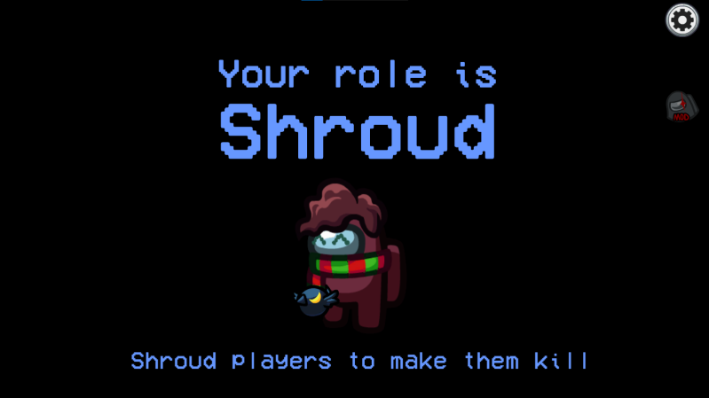

__Faction__: Neutral (Killing) 
__Base__: Impostor 
__Ability__: Make others kill 
__Indicator/Symbols__: None 
__Win Condition__: Be the last man standing 
__Can Use Pet System__: No 

Origin: [Town of Host Re-Edited](https://github.com/Loonie-Toons/Re-Edited) 

#### Role Description
The Shroud is a neutral that functions identically to the [Witch](#Witch). 
Shrouded players kill the next player they go near, but die if they don't. 

The Shroud cannot kill directly. 

------------------------------------------------------------------------------------------------------------------------------------------------------------------------------------------

## Stalker

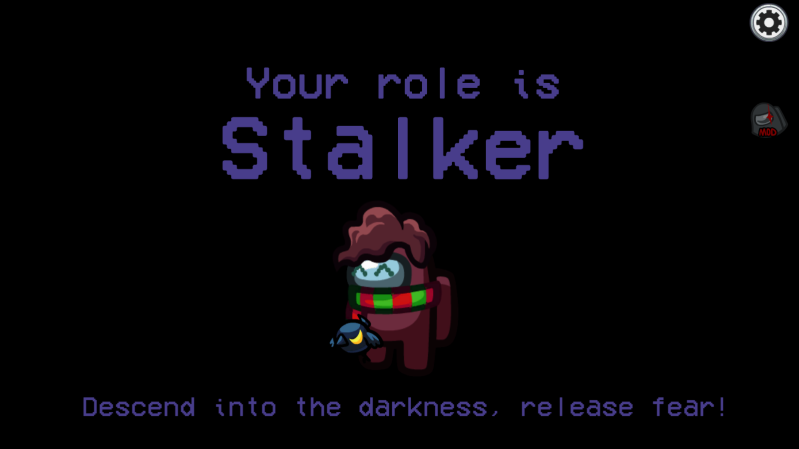

__Faction__: Neutral (Killing) 
__Base__: Impostor 
__Ability__: Call lights on kill 
__Indicator/Symbols__: None 
__Win Condition__: Be the last man standing 
__Can Use Pet System__: No 

Origin: [Town of Host Edited](https://github.com/KARPED1EM/TownOfNext) 

#### Role Description
The Stalker is a neutral that calls lights when it kills. 
If win snatching is enabled, it'll win if crewmates or impostors win while the Stalker is alive. 

**Note: Stalker cannot spawn on the Fungle due to the lack of a lights sabotage.**

------------------------------------------------------------------------------------------------------------------------------------------------------------------------------------------

## Traitor

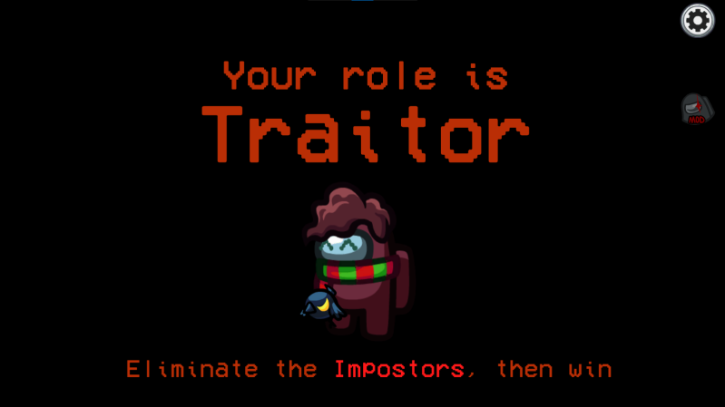

__Faction__: Neutral (Killing) 
__Base__: Impostor 
__Ability__: See Impostors 
__Indicator/Symbols__: None 
__Win Condition__: Be the last man standing 
__Can Use Pet System__: No 

Origin: [Town of Host Re-Edited](https://github.com/Loonie-Toons/Re-Edited) 

#### Role Description
The Traitor is a neutral that functions as a former Impostor. 
They play exactly like a regular Impostor would, and can even see the other Impostors. 
However, the Traitor cannot kill the Impostors. 
The Traitor must eliminate the Impostors by any other means. 

------------------------------------------------------------------------------------------------------------------------------------------------------------------------------------------

## Virus

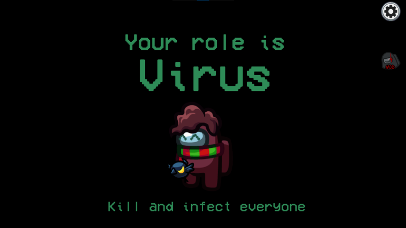

__Faction__: Neutral (Killing) 
__Base__: Impostor 
__Ability__: Infect others 
__Indicator/Symbols__: None 
__Win Condition__: Be the last man standing 
__Can Use Pet System__: No 

Origin: [Town of Host Re-Edited](https://github.com/Loonie-Toons/Re-Edited) 

#### Role Description
The Virus is a neutral that spreads an infection onto its kills. 
When someone reports an infected body, they'll either join the Virus team or die if the Virus is not exiled, depending on the settings. 

------------------------------------------------------------------------------------------------------------------------------------------------------------------------------------------

## Werewolf

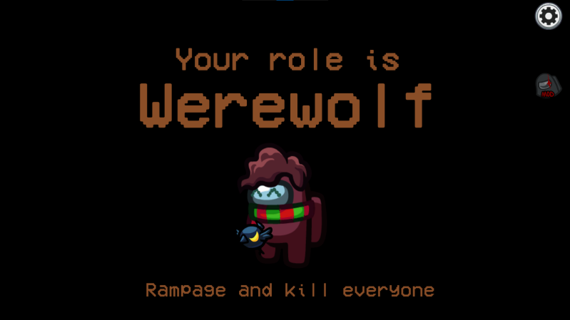

__Faction__: Neutral (Killing) 
__Base__: Impostor 
__Ability__: Rampage 
__Indicator/Symbols__: None 
__Win Condition__: Be the last man standing 
__Can Use Pet System__: Yes (Required) 

Origin: [Town of Us Reactivated](https://github.com/eDonnes124/Town-Of-Us-R) 

#### Role Description
The Werewolf is a neutral that can only kill while on rampage. 
To start a rampage, pet your pet. 

While on rampage, the Werewolf has a low kill cooldown. 
Rampaging has a duration so use it wisely! 

------------------------------------------------------------------------------------------------------------------------------------------------------------------------------------------

## Wraith

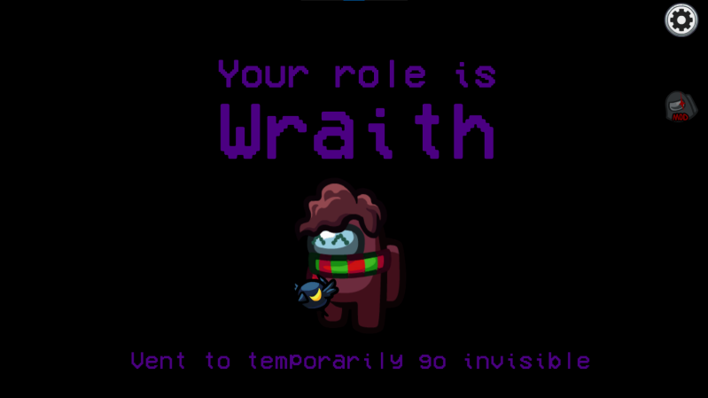

__Faction__: Neutral (Killing) 
__Base__: Impostor 
__Ability__: Temporaril go invisible 
__Indicator/Symbols__: None 
__Win Condition__: Be the last man standing 
__Can Use Pet System__: No 

Origin: [Town of Host Re-Edited](https://github.com/Loonie-Toons/Re-Edited) 

#### Role Description
The Wraith is an Impostor that can temporarily turn invisible by venting. 
While invisible, you can kill in plain sight without being seen. 
If you vent while invisible, you'll stop being invisible prematurely. 

> **Fun Fact!** 
> There is a crewmate variant called [Chameleon](#Chameleon) and an Impostor variant called [Swooper](#Swooper)! 

------------------------------------------------------------------------------------------------------------------------------------------------------------------------------------------

# Madmate Roles

## Convict

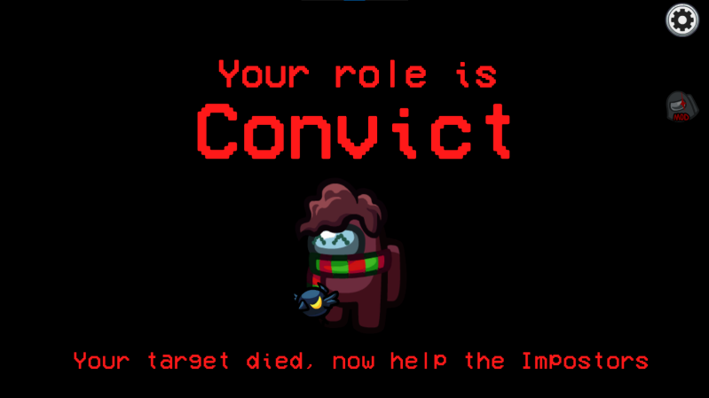

__Faction__: Madmate 
__Base__: Crewmate 
__Ability__: None 
__Indicator/Symbols__: None 
__Win Condition__: Wins with Impostors 
__Can Use Pet System__: No 

Origin: [Town of Host Re-Edited](https://github.com/Loonie-Toons/Re-Edited) 

#### Role Description
The Convict is a madmate that can spawn when an [Executioner](#Executioner)'s target or a [Lawyer](#Lawyer)'s target dies. 

**Note: Convict cannot spawn at the start of the game.** 

------------------------------------------------------------------------------------------------------------------------------------------------------------------------------------------

## Crewpostor

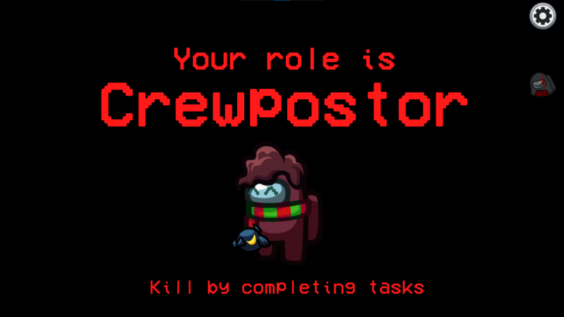

__Faction__: Madmate 
__Base__: Engineer 
__Ability__: None 
__Indicator/Symbols__: None 
__Win Condition__: Wins with Impostors 
__Can Use Pet System__: No 

Origin: [Town of Host Re-Edited](https://github.com/Loonie-Toons/Re-Edited) 

#### Role Description
The Crewpostor is a madmate that kills the closest player to them when they complete a task. 

Optionally, the Crewpostor may know the other Impostors and vice versa. 
Additionally, you may be able to kill the Impostors accidentally. 

------------------------------------------------------------------------------------------------------------------------------------------------------------------------------------------

## Parasite

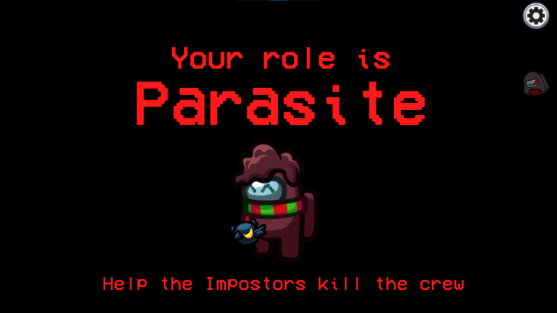

__Faction__: Madmate 
__Base__: Impostor 
__Ability__: None 
__Indicator/Symbols__: None 
__Win Condition__: Wins with Impostors 
__Can Use Pet System__: No 

Origin: [Town of Host Plus](https://github.com/Loonie-Toons/TownOfHostPlus) 

#### Role Description
The Parasite is a madmate that plays identically to an Impostor, with the only difference being that both the Parasite and the Impostors do not know each other. 

------------------------------------------------------------------------------------------------------------------------------------------------------------------------------------------

## Refugee

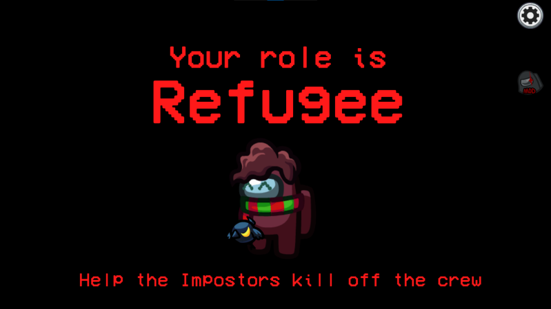

__Faction__: Madmate 
__Base__: Impostor 
__Ability__: None 
__Indicator/Symbols__: None 
__Win Condition__: Wins with Impostors 
__Can Use Pet System__: No 

Origin: [Town of Host Re-Edited](https://github.com/Loonie-Toons/Re-Edited) 

#### Role Description
The Refugee is a madmate that functions identically to an Impostor. 

For a Refugee to spawn, an [Amnesiac](#Amnesiac) would have to find an Impostor's body **OR** you'd have to have killed the [Godfather](#Godfather)'s target. 

**Note: Refugee cannot spawn at the start of the game.** 

------------------------------------------------------------------------------------------------------------------------------------------------------------------------------------------

# Modifiers

## Antidote

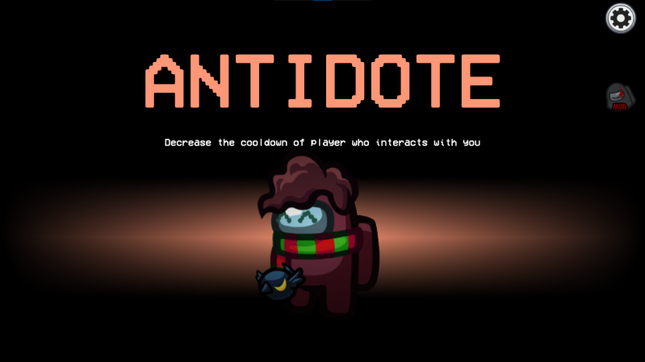

__Type__: Mixed (Global) 
__Ability__: Decrease cooldown of interaction source 

Origin: [Town of Host Re-Edited](https://github.com/Loonie-Toons/Re-Edited) 

#### Modifier Description
Antidote is a modifier that reduces the cooldown of the interaction target.

> For the opposite, see [Diseased](#Diseased).

------------------------------------------------------------------------------------------------------------------------------------------------------------------------------------------

## Autopsy

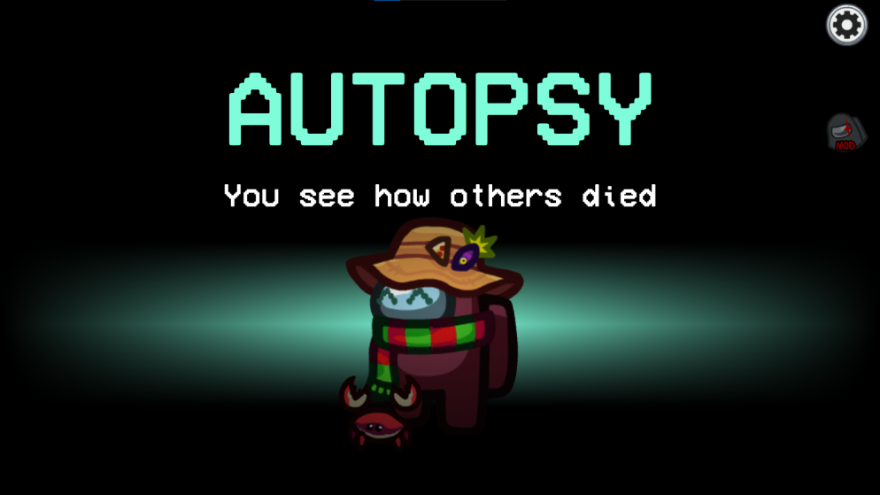

__Type__: Helpful (Global) 
__Ability__: See how others had died 

Origin: [TOHY](https://github.com/Yumenopai/TownOfHost_Y) 

#### Modifier Description
Autopsy is a helpful modifier that allows the player to see how people had died. 

> Fun Fact! 
> Autopsy is [Doctor](#Doctor) as a modifier.

------------------------------------------------------------------------------------------------------------------------------------------------------------------------------------------

## Avenger

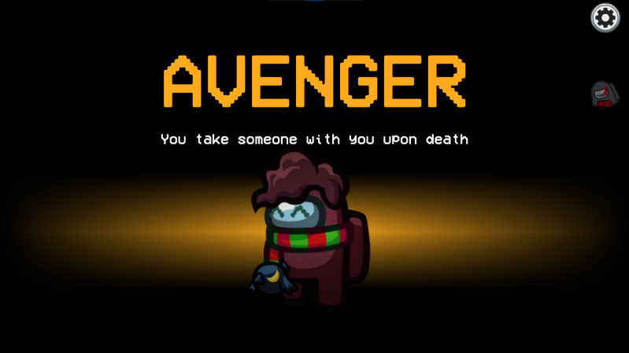

__Type__: Mixed (Global) 
__Ability__: Take one player down with you 

Origin: [Town of Host Edited](https://github.com/KARPED1EM/TownOfNext) 

#### Modifier Description
Avenger is a modifier that kills a random alive player when you die.

------------------------------------------------------------------------------------------------------------------------------------------------------------------------------------------

## Aware

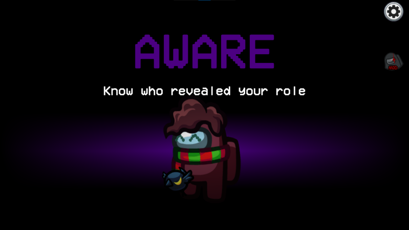

__Type__: Mixed (Global) 
__Ability__: Know if your role is revealed 

Origin: [Town of Host Re-Edited](https://github.com/Loonie-Toons/Re-Edited) 

#### Modifier Description
Aware is a modifier that tells you if your role gets revealed to someone

------------------------------------------------------------------------------------------------------------------------------------------------------------------------------------------

## Bait

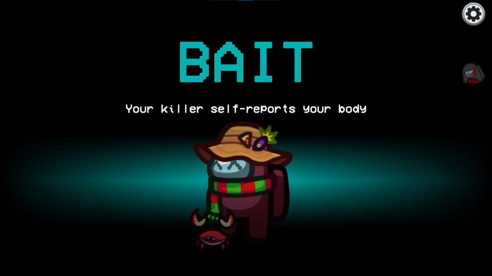

__Type__: Helpful (Global) 
__Ability__: Force self report on your body 

Origin: [Town of Us Reactivated](https://github.com/eDonnes124/Town-Of-Us-R) 

#### Modifier Description
Bait is a helpful modifier that causes the killer to automatically self report. 

------------------------------------------------------------------------------------------------------------------------------------------------------------------------------------------

## Beartrap

__Type__: Helpful (Global) 
__Ability__: Freeze killer in place 

Origin: [Town of Host](https://github.com/tukasa0001/TownOfHost)

#### Modifier Description
Beartrap is a helpful modifier that sticks the player in place for a set amount of time. 
Trying to report bodies in this state will delay the report until after the effect wears off. 

------------------------------------------------------------------------------------------------------------------------------------------------------------------------------------------

## Bewilder

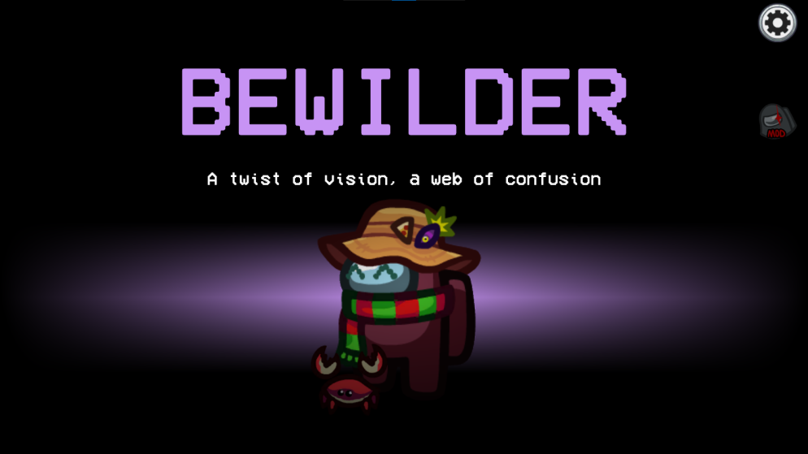

__Type__: Helpful (Global) 
__Ability__: Cursed vision 

Origin: [Project Lotus](https://github.com/ImaMapleTree/Lotus/) 

#### Modifier Description
Bewilder is a helpful modifier that gives the player modified vision (generally lower). 
When the Bewilder is killed, the vision is transferred over to the killer. 

------------------------------------------------------------------------------------------------------------------------------------------------------------------------------------------

## Bloodlust

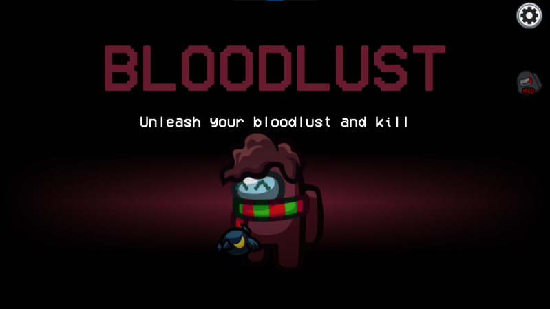

__Type__: Mixed (Crew Only) 
__Ability__: Kill the next player you go near after doing a task 

Origin: [Town of Host Re-Edited](https://github.com/Loonie-Toons/Re-Edited) 

#### Modifier Description
Bloodlust is a modifier that allows the player to kill the next player they go near after completing a task. 
Effect does not stack and does not clear after a meeting. 

------------------------------------------------------------------------------------------------------------------------------------------------------------------------------------------

## Bloody

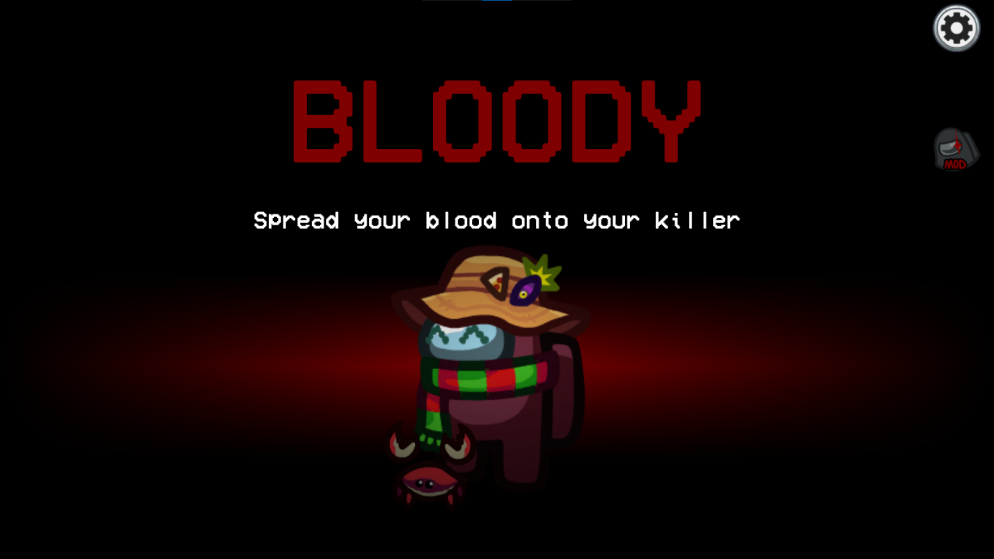

__Type__: Helpful (Global) 
__Ability__: Turn killer's name red temporarily 

Origin: [TheOtherRoles](https://github.com/TheOtherRolesAU/TheOtherRoles) 

#### Modifier Description
Bloody is a helpful modifier that, when killed, causes the killer's name to turn a dark red. 

------------------------------------------------------------------------------------------------------------------------------------------------------------------------------------------

## Burst

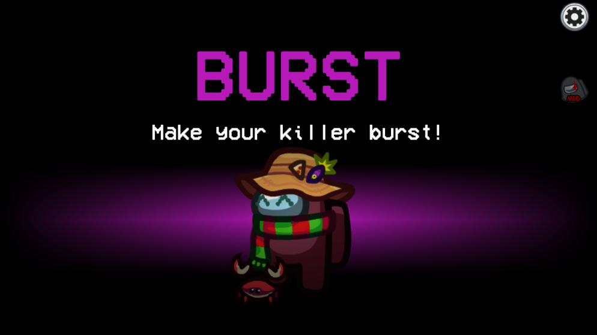

__Type__: Helpful (Global) 
__Ability__: Make killer explode after a set time 

Origin: [Town of Host Plus](https://github.com/Loonie-Toons/TownOfHostPlus) 

#### Modifier Description
Burst is a helpful modifier that, when killed, causes their killer to explode if they aren't inside a vent when the time expires. 

------------------------------------------------------------------------------------------------------------------------------------------------------------------------------------------

## Circumvent

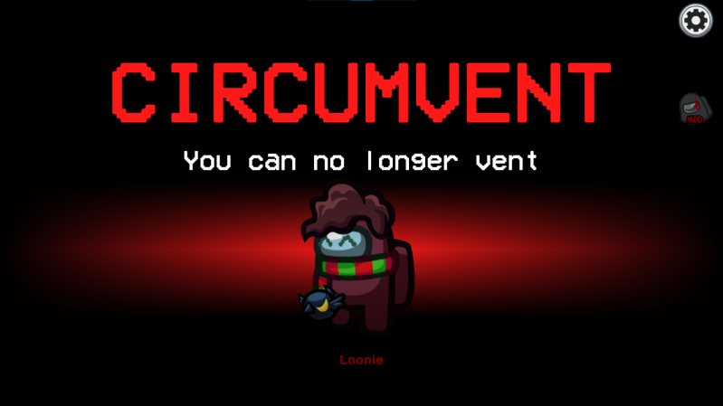

__Type__: Impostor (Limited) 
__Ability__: Remove vent ability 

Origin: [Town of Host Re-Edited](https://github.com/Loonie-Toons/Re-Edited) 

#### Modifier Description
Circumvent is an Impostor modifier that removes the vent ability. 

------------------------------------------------------------------------------------------------------------------------------------------------------------------------------------------

## Clumsy

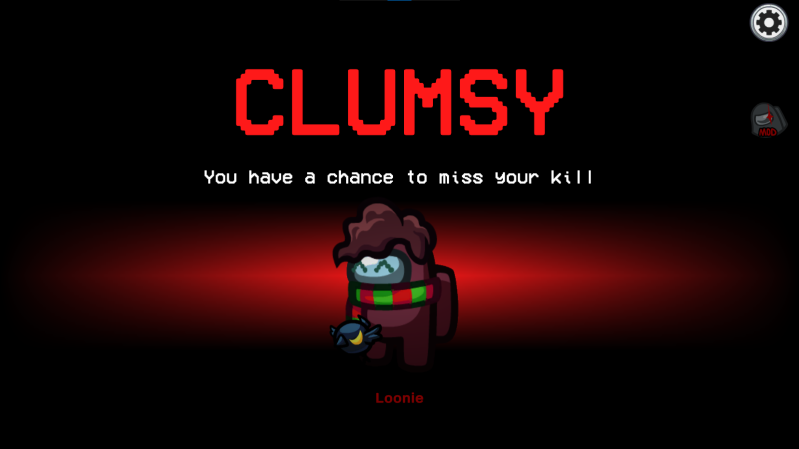

__Type__: Impostor (Limited) 
__Ability__: Chance to miss kill 

Origin: [Town of Host Re-Edited](https://github.com/Loonie-Toons/Re-Edited) 

#### Modifier Description
Clumsy is an Impostor modifier that gives the given Impostor a chance to miss their kill. 

------------------------------------------------------------------------------------------------------------------------------------------------------------------------------------------

## Consenses

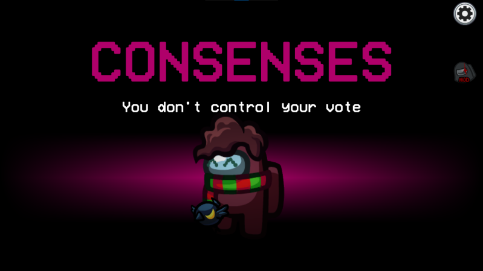

__Type__: Harmful (Global) 
__Ability__: Can't control vote 

Origin: Town of Host Refined 

#### Modifier Description
Consenses is a modifier that doesn't allow you to control your vote. 

------------------------------------------------------------------------------------------------------------------------------------------------------------------------------------------

## Cyber

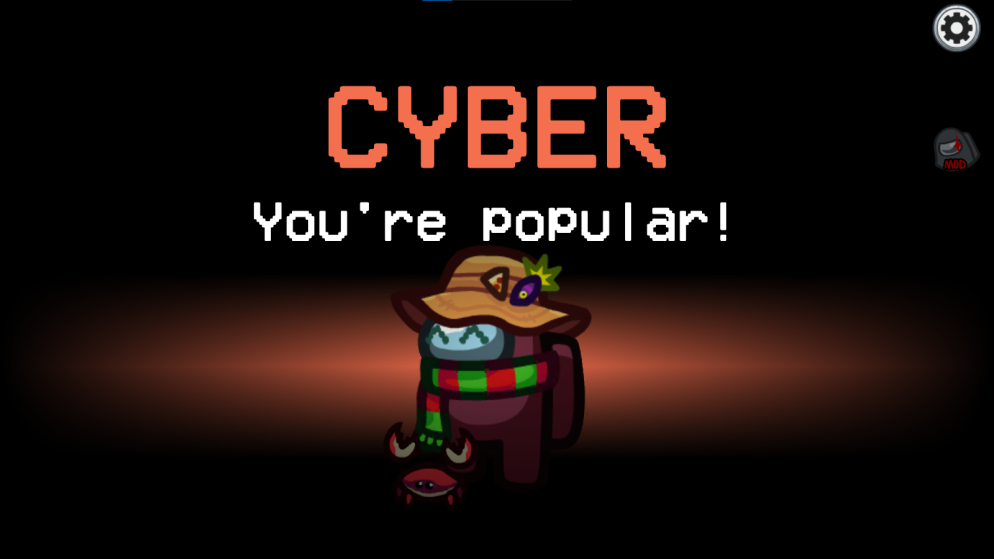

__Type__: Helpful (Global) 
__Ability__: Visible to all and can't be killed in a group 

Origin: [Town of Host Re-Edited](https://github.com/Loonie-Toons/Re-Edited) 

#### Modifier Description
Cyber is a helpful modifier that, when killed, notifies any eligible factions of their death. 
If the Cyber is with more than one person, they cannot be directly attacked. 
Additionally, the Cyber may or may not be known to all. 

> **Fun Fact!** 
> Cyber is [Celebrity](#Celebrity) and [Super Star](#Super-Star) merged together into a modifier. 

------------------------------------------------------------------------------------------------------------------------------------------------------------------------------------------

## Democrat

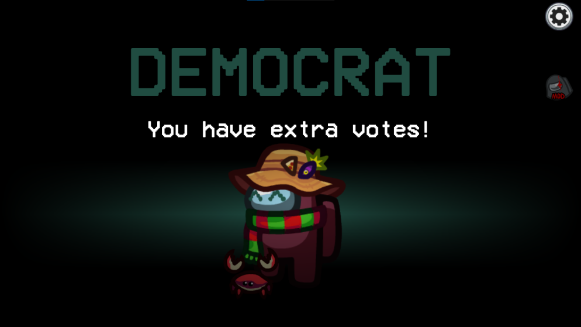

__Type__: Helpful (Global) 
__Ability__: Extra vote(s) 

Origin: Town of Host Refined 

#### Modifier Description
Democrat is a helpful modifier that gives the user extra votes.

> **Fun Fact!** 
> Democrat is [Mayor](#Mayor) as a modifier.

------------------------------------------------------------------------------------------------------------------------------------------------------------------------------------------

## Diseased

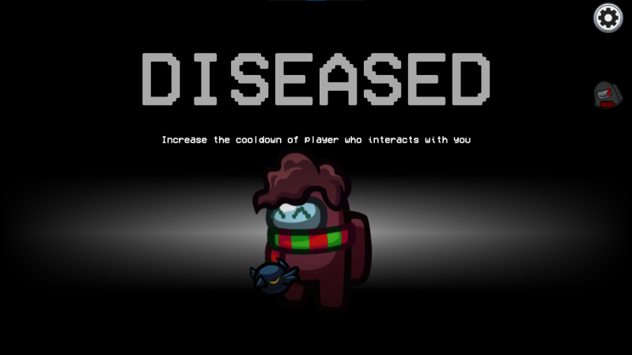

__Type__: Mixed (Global) 
__Ability__: Increase cooldown of interaction source 

Origin: [Town of Us Reactivated](https://github.com/eDonnes124/Town-Of-Us-R) 

#### Modifier Description
Diseased is a modifier that increases the cooldown of the interaction target.

> For the opposite, see [Antidote](#Antidote).

------------------------------------------------------------------------------------------------------------------------------------------------------------------------------------------

## Disregarded

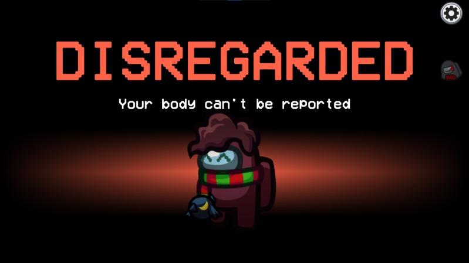

__Type__: Harmful (Global) 
__Ability__: Block body report 

Origin: [Town of Host Re-Edited](https://github.com/Loonie-Toons/Re-Edited) 

#### Modifier Description
Disregarded is a modifier that makes your body unreportable. 

> **Not what you were looking for?** 
> Maybe [Oblivious](#Oblivious) is what you were looking for! 

------------------------------------------------------------------------------------------------------------------------------------------------------------------------------------------

## Double Shot

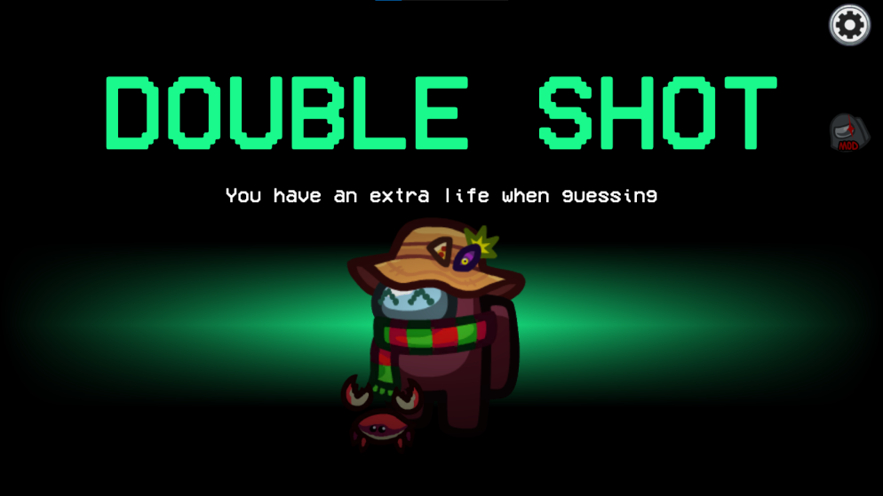

__Type__: Helpful (Limited) 
__Ability__: Second chance at guessing 

Origin: [Town of Us Reactivated](https://github.com/eDonnes124/Town-Of-Us-R) 

#### Modifier Description
Double Shot is a helpful modifier that gives the assigned player a second chance when guessing. 
When guessing [Rebound](#Rebound), you'll die regardless. 

------------------------------------------------------------------------------------------------------------------------------------------------------------------------------------------

## Egoist

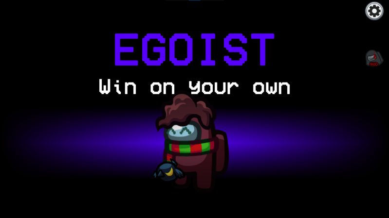

__Type__: Misc. (Limited) 
__Ability__: Win alone 

Origin: [Town of Host Re-Edited](https://github.com/Loonie-Toons/Re-Edited) 

#### Modifier Description
Egoist is a modifier that causes you to win alone if your team wins with you alive. 
You win with your original team if you're dead. 

Other Egoists on the same faction (Crewmate/Impostor) also win with you. 

------------------------------------------------------------------------------------------------------------------------------------------------------------------------------------------

## Fragile

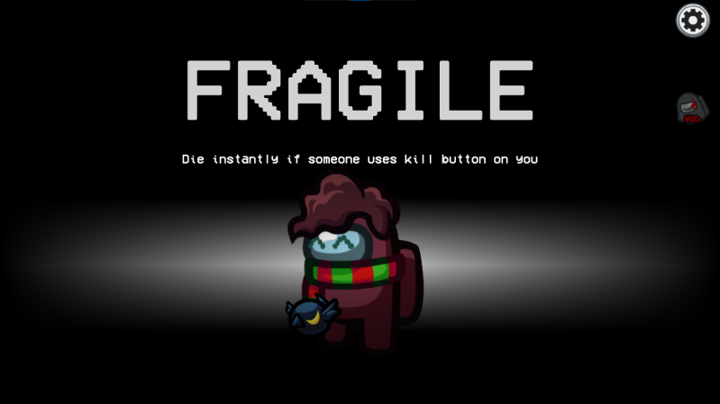

__Type__: Harmful (Global) 
__Ability__: Die on any interaction 

Origin: [Town of Host Re-Edited](https://github.com/Loonie-Toons/Re-Edited) 

#### Modifier Description
Fragile is a modifier that causes the player to die when interacted with. 

------------------------------------------------------------------------------------------------------------------------------------------------------------------------------------------

## Flash

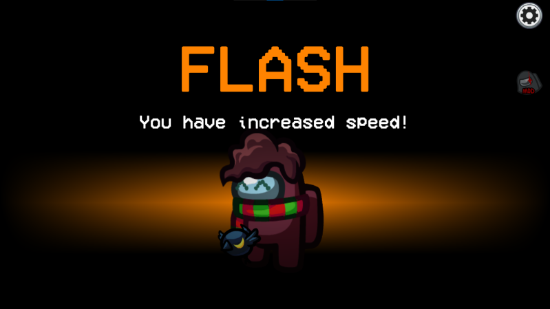

__Type__: Helpful (Global) 
__Ability__: Multiplied speed 

Origin: [Town of Us Reactivated](https://github.com/eDonnes124/Town-Of-Us-R) 

#### Modifier Description
Flash is a modifier that multiples the player's base speed. 

------------------------------------------------------------------------------------------------------------------------------------------------------------------------------------------

## Ghoul

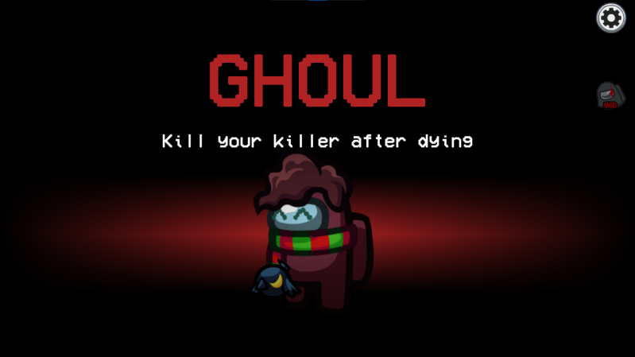

__Type__: Mixed (Crew Only) 
__Ability__: Kill your killer after dying 

Origin: [Town of Host Re-Edited](https://github.com/Loonie-Toons/Re-Edited) 

#### Modifier Description
Ghoul is a modifier that makes the player kill their killer when they finish their tasks. 
However, if the Ghoul finishes their tasks, they'll suicide. 

**Note: Task win is prioritized over a majority win (Impostor Win, Neutral Killer Win) if the Ghoul were to finish tasks while alive.**

------------------------------------------------------------------------------------------------------------------------------------------------------------------------------------------

## Gravestone

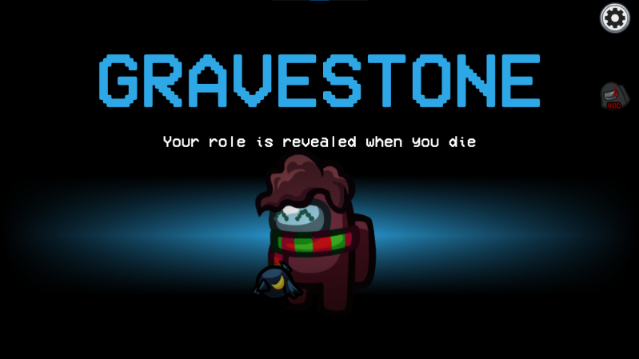

__Type__: Mixed (Global) 
__Ability__: Reveal your role after dying 

Origin: [Town of Host Re-Edited](https://github.com/Loonie-Toons/Re-Edited) 

#### Modifier Description
Gravestone is a modifier that reveals your role to everyone when you die. 

------------------------------------------------------------------------------------------------------------------------------------------------------------------------------------------

## Guesser

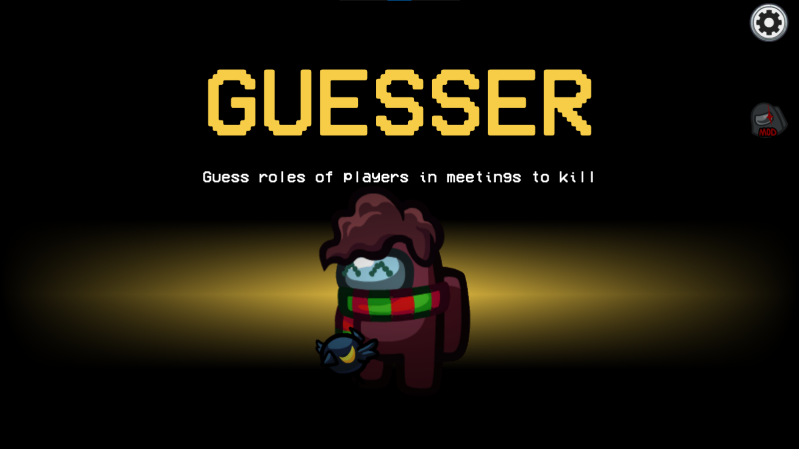

__Type__: Mixed (Global) 
__Ability__: Guess roles in meetings to kill 

Origin: [Town of Host Re-Edited](https://github.com/Loonie-Toons/Re-Edited) 

#### Modifier Description
Guesser is a modifier that grants the ability to guess, much like an [Assassin](#Assassin) or [Vigilante](#Vigilante). 

Guessing is a mechanic where you guess a player's role to kill them. 
Guessing wrong kills you instead. 
To guess, use the command `/bt [playerId] role`. 
Player IDs are displayed next to player names during meetings. 

------------------------------------------------------------------------------------------------------------------------------------------------------------------------------------------

## Last Impostor

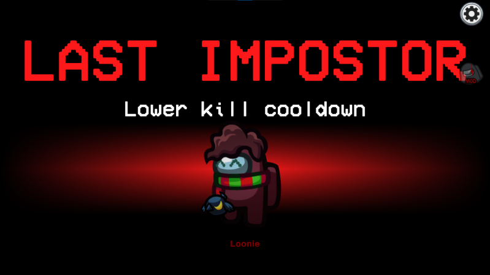

__Type__: Impostor (Global) 
__Ability__: Lower kill cooldown 

Origin: [Town of Host](https://github.com/tukasa0001/TownOfHost) 

#### Modifier Description
Last Impostor is a modifier assigned to the last Impostor alive. 
It grants a lower kill cooldown. 

Not assigned if the last Impostor has the [Overclocked](#Overclocked) modifier. 

------------------------------------------------------------------------------------------------------------------------------------------------------------------------------------------

## Lazy

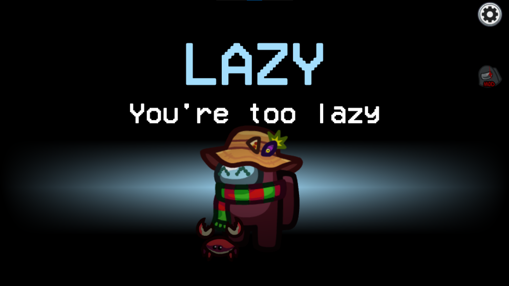

__Type__: Helpful (Crew Only) 
__Ability__: Control immunity 

Origin: [Town of Host Re-Edited](https://github.com/Loonie-Toons/Re-Edited) 

#### Modifier Description
Lazy is a helpful modifier that gives the player one short task and makes them immune to all immunity except [Witch](#Witch).

> **Fun Fact!** 
> Lazy is [Lazy Guy](#Lazy-Guy) as a modifier.

------------------------------------------------------------------------------------------------------------------------------------------------------------------------------------------

## Lovers

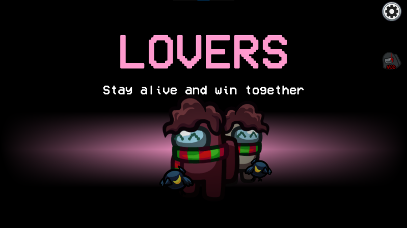

__Type__: Misc. (Global) 
__Ability__: Win together if alive at game end 

Origin: [Town of Host](https://github.com/tukasa0001/TownOfHost) 

#### Modifier Description
Lovers is a modifier that spawns twice, for a pair of two players, being lovers. 
If one dies, the other does as well. 
If the game ends and they are both alive, they win solo. 

Lovers can also win together via other means. 

------------------------------------------------------------------------------------------------------------------------------------------------------------------------------------------

## Loyal

__Type__: Helpful (Limited) 
__Ability__: Immune to team changes 

Origin: [Town of Host Re-Edited](https://github.com/Loonie-Toons/Re-Edited) 

#### Modifier Description
Loyal is a helpful modifier that prevents any and all alignment changes on the player. 
Can not be assigned to Neutrals. 

------------------------------------------------------------------------------------------------------------------------------------------------------------------------------------------

## Lucky

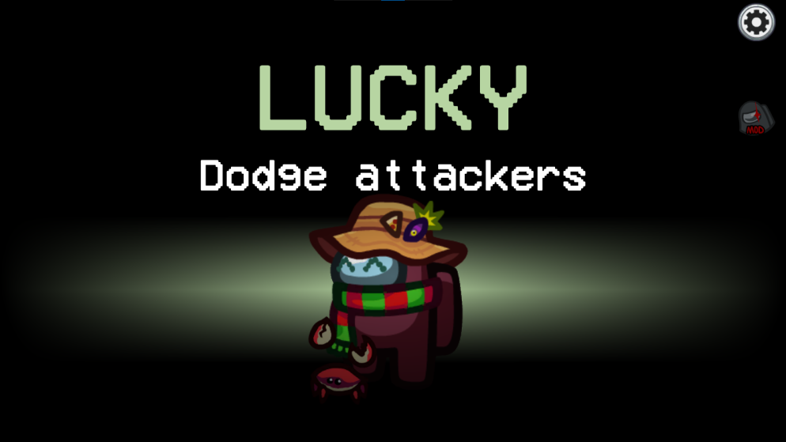

__Type__: Helpful (Global) 
__Ability__: Able to dodge attacks 

Origin: [Town of Host Re-Edited](https://github.com/Loonie-Toons/Re-Edited) 

#### Modifier Description
Lucky is a helpful modifier that allows the player to dodge attacks on a percentage. 
This can also prevent certain other abilities to be dodged, as long as they're executed by the kill button. 

------------------------------------------------------------------------------------------------------------------------------------------------------------------------------------------

## Madmate

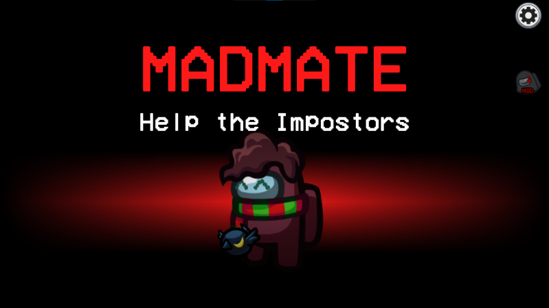

__Type__: Impostor (Crew Only) 
__Ability__: Change alignment to Impostor 

Origin: [Town of Host Edited](https://github.com/KARPED1EM/TownOfNext) 

#### Modifier Description
Madmate is a modifier that makes the assigned crewmate on the Impostor team. 

Madmate can be assigned to neutrals via [Gangster](#Gangster).

------------------------------------------------------------------------------------------------------------------------------------------------------------------------------------------

## Mare

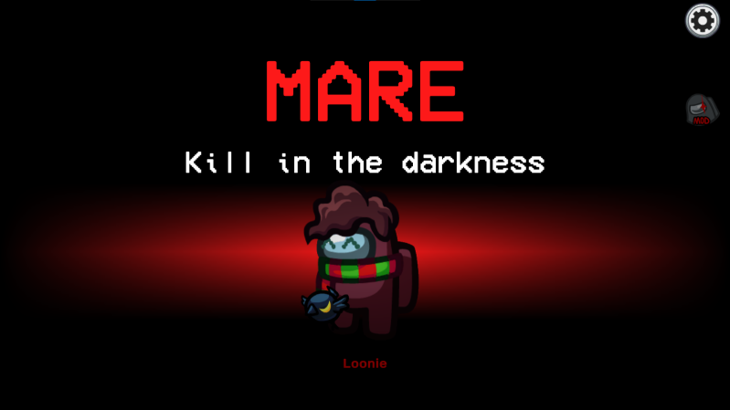

__Type__: Impostor (Limited) 
__Ability__: Only kill during lights, speed boost during lights 

Origin: [Town of Host Re-Edited](https://github.com/Loonie-Toons/Re-Edited) 

#### Modifier Description
Mare is an Impostor modifier that makes it so the assigned Impostor can only ever kill during lights. 
Additionally, they gain a speed boost during lights. 
Beware, your name also turns red during lights! 

**Note: Mare cannot spawn on the Fungle due to the lack of a lights sabotage.**

------------------------------------------------------------------------------------------------------------------------------------------------------------------------------------------

## Mimic

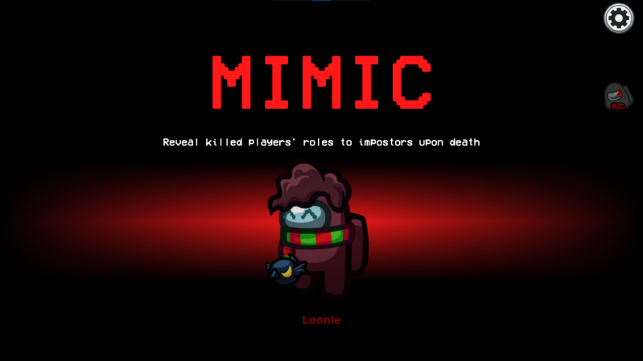

__Type__: Impostor (Global) 
__Ability__: Reveal dead roles to yourself, reveal what you killed to teammates 

Origin: [Town of Host Edited](https://github.com/KARPED1EM/TownOfNext) 

#### Modifier Description
Mimic is an Impostor modifier that keeps track of what roles you killed, and tells them to the rest of your team once you die. 

Optionally, you can see all dead roles. 

------------------------------------------------------------------------------------------------------------------------------------------------------------------------------------------

## Mystic

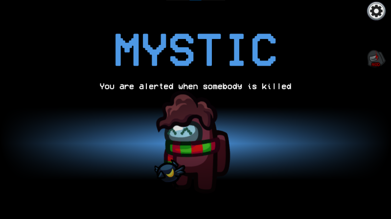

__Type__: Helpful (Global) 
__Ability__: Know when people die 

Origin: [Town of Us Reactivated](https://github.com/eDonnes124/Town-Of-Us-R) 

#### Modifier Description
Mystic is a helpful modifier that alerts the player of any deaths that occur. 
This is indicated by a kill flash. 

------------------------------------------------------------------------------------------------------------------------------------------------------------------------------------------

## Necroview

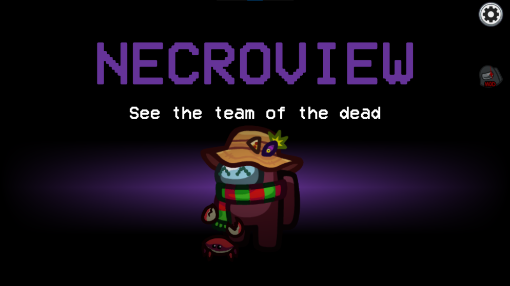

__Type__: Helpful (Global) 
__Ability__: See the factions of the dead 

Origin: [Town of Host Plus](https://github.com/Loonie-Toons/TownOfHostPlus) 

#### Modifier Description
Necroview is a helpful modifier that allows seeing the alignments of dead players. 
- Red means Impostor or Madmate
- Cyan means Crewmate
- Gray means Neutral

------------------------------------------------------------------------------------------------------------------------------------------------------------------------------------------

## Nimble

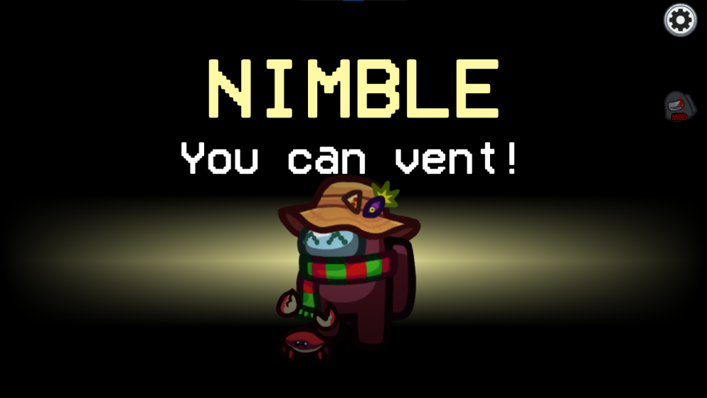

__Type__: Helpful (Limited) 
__Ability__: Unlock vent ability 

Origin: [Project Lotus](https://github.com/ImaMapleTree/Lotus/) 

#### Modifier Description
Nimble is a helpful modifier that grants the ability to vent. 
Only ever assigned to crewmates that do not have completable tasks. 

------------------------------------------------------------------------------------------------------------------------------------------------------------------------------------------

## Oblivious

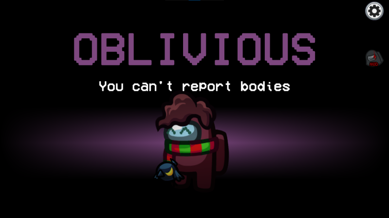

__Type__: Harmful (Global) 
__Ability__: Block reporting bodies 

Origin: [Project Lotus](https://github.com/ImaMapleTree/Lotus) 

#### Modifier Description
Oblivious is a modifier that disables the use of the report button. 

> **Not what you were looking for?** 
> Maybe [Disregarded](#Disregarded) is what you were looking for! 

------------------------------------------------------------------------------------------------------------------------------------------------------------------------------------------

## Overclocked

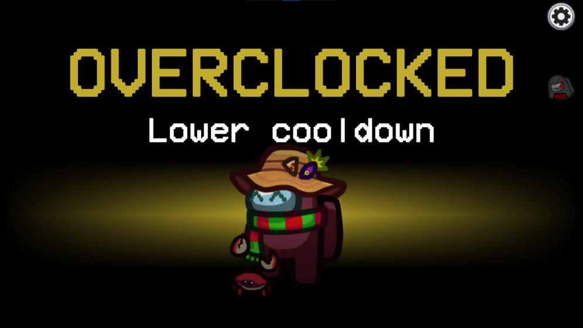

__Type__: Helpful (Limited) 
__Ability__: Reduced cooldown 

Origin: [Town of Host Plus](https://github.com/Loonie-Toons/TownOfHostPlus) 

#### Modifier Description
Overclocked is a helpful modifier that reduces the cooldown of whatever the kill button is by a set percentage. 
Only assigned to roles with a kill button and is not [Glitch](#Glitch) or [Amnesiac](#Amnesiac). 
Removed from Impostors if that Impostor is assigned [Last Impostor](#Last-Impostor).

------------------------------------------------------------------------------------------------------------------------------------------------------------------------------------------

## Repairman

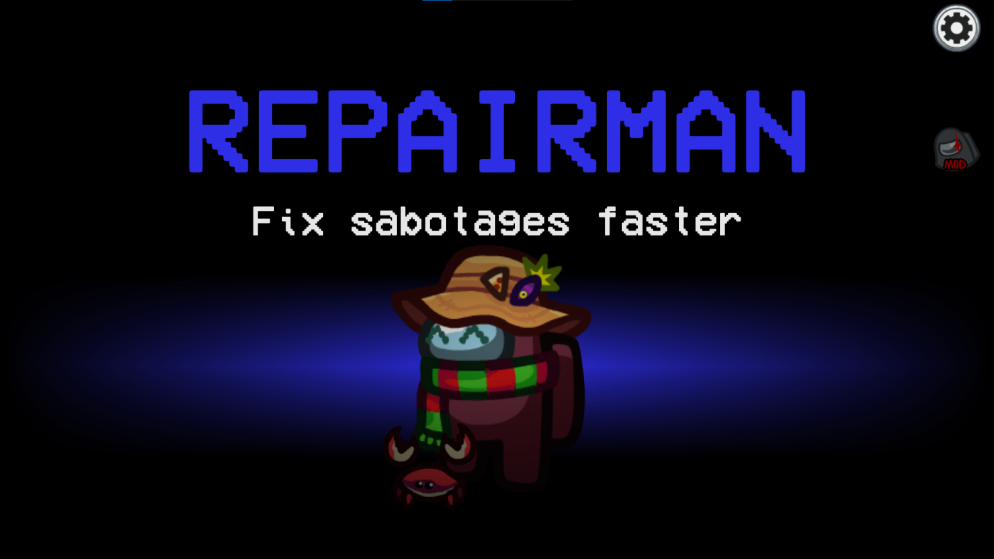

__Type__: Helpful (Global) 
__Ability__: Repair many sabotages alone and quickly 

Origin: [Town of Host Re-Edited](https://github.com/Loonie-Toons/Re-Edited) 

#### Modifier Description
Repairman is a helpful modifier that allows fixing sabotages very quickly. 

> **Fun Fact!** 
> Repairman is [Mechanic](#Mechanic) as a modifier. 

------------------------------------------------------------------------------------------------------------------------------------------------------------------------------------------

## Sleuth

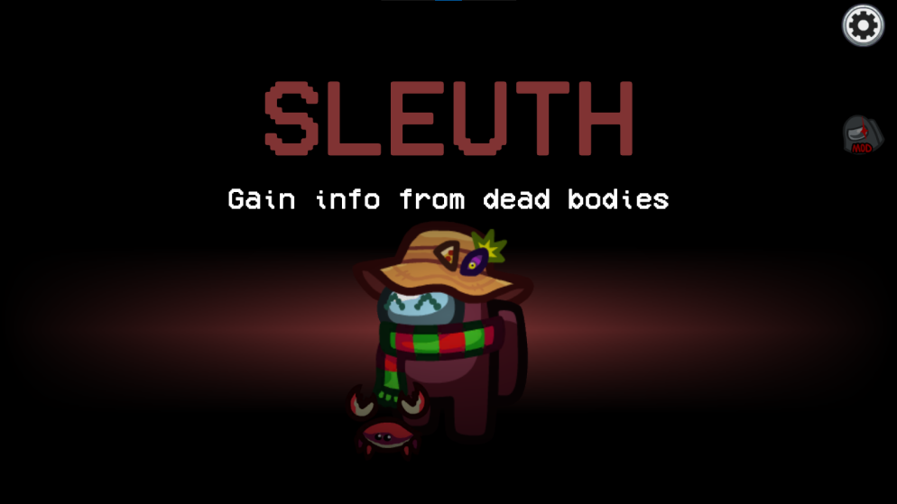

__Type__: Helpful (Global) 
__Ability__: Role details on your reports 

Origin: [Town of Us Reactivated](https://github.com/eDonnes124/Town-Of-Us-R) 

#### Modifier Description
Sleuth is a helpful modifier that gives your body reports extra info. 
The info includes the role of the body, and optionally the role of the killer. 

------------------------------------------------------------------------------------------------------------------------------------------------------------------------------------------

## Snail

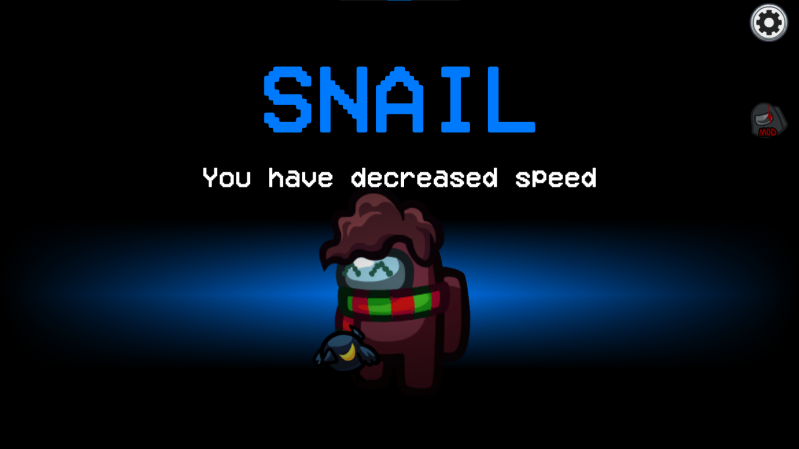

__Type__: Harmful (Global) 
__Ability__: Slow speed 

Origin: Town of Host Refined 

#### Modifier Description
Snail is a modifier that decreases your speed. 

------------------------------------------------------------------------------------------------------------------------------------------------------------------------------------------

## Stealer

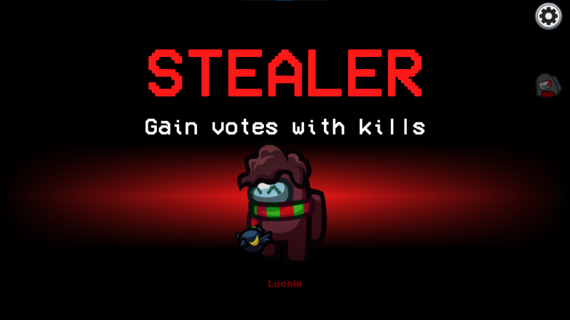

__Type__: Impostor (Global) 
__Ability__: Gain votes from kills 

Origin: [Town of Host Edited](https://github.com/KARPED1EM/TownOfNext) 

#### Modifier Description
Stealer is an Impostor modifier that gives the Impostor votes in exchange for kills. 

------------------------------------------------------------------------------------------------------------------------------------------------------------------------------------------

## Stubborn

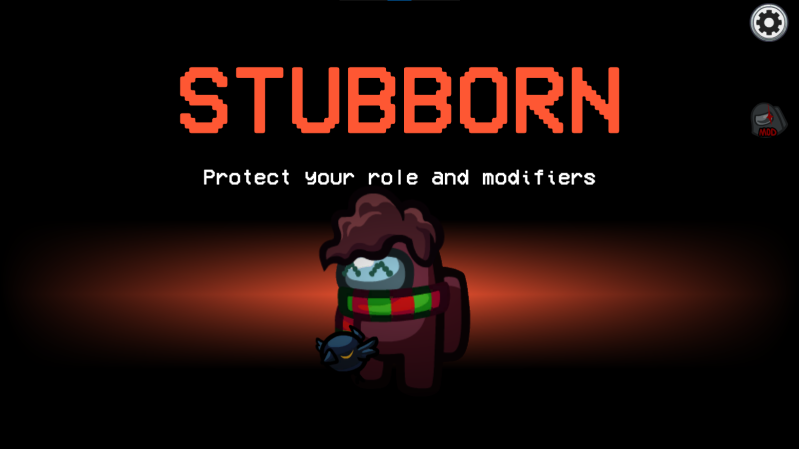

__Type__: Mixed (Global) 
__Ability__: Block changes to your role and modifiers 

Origin: [Town of Host Re-Edited](https://github.com/Loonie-Toons/Re-Edited) 

#### Modifier Description
Stubborn is a modifier that makes it so [Eraser](#Eraser) cannot erase your role, [Bandit](#Bandit) cannot steal from you, and [Monarch](#Monarch) cannot knight you. 
Additionally, you cannot be sold modifiers by the [Merchant](#Merchant).

------------------------------------------------------------------------------------------------------------------------------------------------------------------------------------------

## Swift

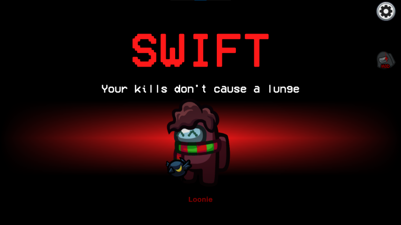

__Type__: Impostor (Limited) 
__Ability__: No lunge when killing 

Origin: [Town of Host Re-Edited](https://github.com/Loonie-Toons/Re-Edited) 

#### Modifier Description
Swift is an Impostor modifier that makes it so you don't lunge when killing. 

------------------------------------------------------------------------------------------------------------------------------------------------------------------------------------------

## Tiebreaker

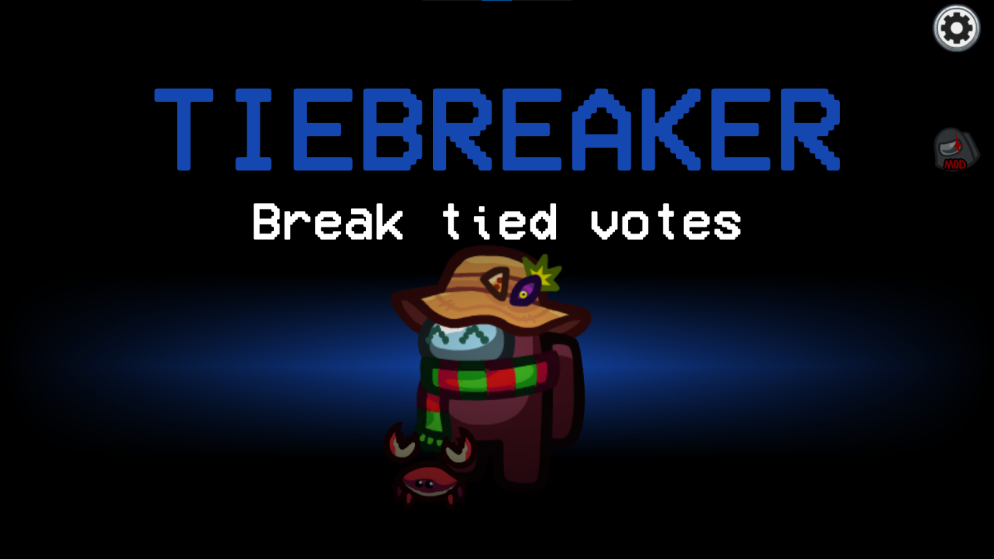

__Type__: Helpful (Global) 
__Ability__: Break tied votes 

Origin: [Town of Us Reactivated](https://github.com/eDonnes124/Town-Of-Us-R) 

#### Modifier Description
Tiebreaker is a helpful modifier that prioritizes your vote if your vote is involved in a tie. 
If there are multiple Tiebreakers in a tie, the Tiebreaker does not go into effect. 

------------------------------------------------------------------------------------------------------------------------------------------------------------------------------------------

## Torch

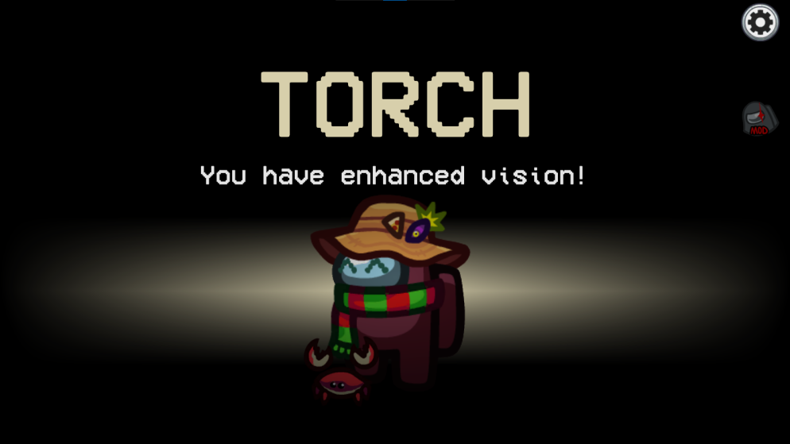

__Type__: Helpful (Crew Only) 
__Ability__: Better vision 

Origin: [Town of Us Reactivated](https://github.com/eDonnes124/Town-Of-Us-R) 

#### Modifier Description
Torch is a helpful modifier that enhances the player's vision. 
May be affected by the lights sabotage, depending on the settings. 

------------------------------------------------------------------------------------------------------------------------------------------------------------------------------------------

## Unlucky

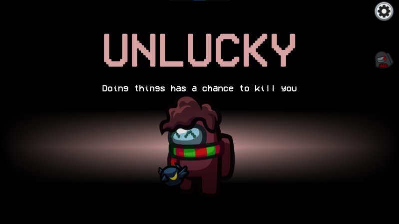

__Type__: Harmful (Global) 
__Ability__: Chance to suicide when doing actions 

Origin: [Town of Host Re-Edited](https://github.com/Loonie-Toons/Re-Edited) 

#### Modifier Description
Unlucky is a modifier that causes you to have a configurable chance to die from the following:
- Completing tasks
- Killing others
- Using vents
- Reporting bodies
- Opening doors

------------------------------------------------------------------------------------------------------------------------------------------------------------------------------------------

## VIP

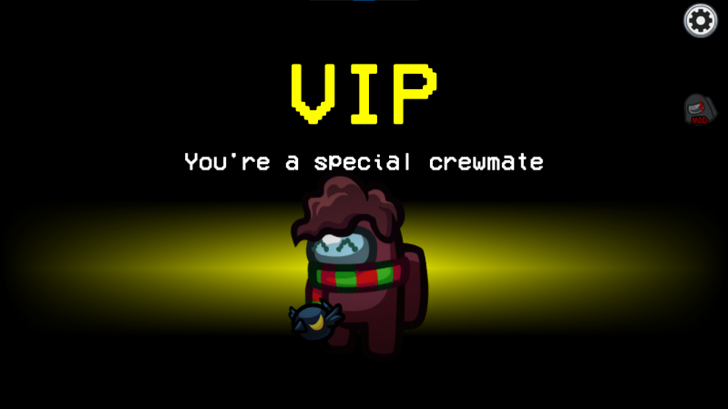

__Type__: Misc. (Crew Only) 
__Ability__: Kill all crewmates if you die 

Origin: Town of Host Refined 

#### Modifier Description
VIP is a modifier that's both helpful to the crew but also quite dangerous. 
All crewmates know who the VIP is, but will all die if the VIP dies. 

------------------------------------------------------------------------------------------------------------------------------------------------------------------------------------------

## Void Ballot

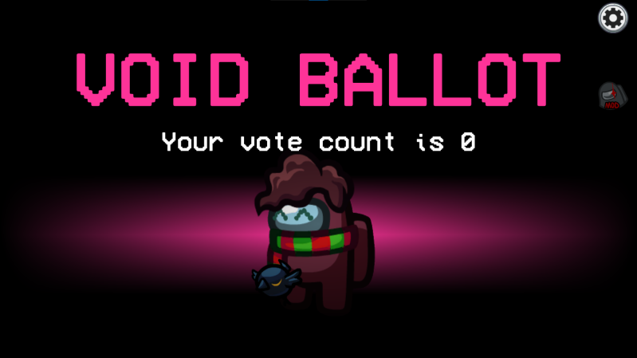

__Type__: Hamrful (Global) 
__Ability__: Kill all crewmates if you die 

Origin: [Town of Host Re-Edited](https://github.com/Loonie-Toons/Re-Edited) 

#### Modifier Description
Void Ballot is a modifier that makes the player have no votes at all. 

------------------------------------------------------------------------------------------------------------------------------------------------------------------------------------------

## Watcher

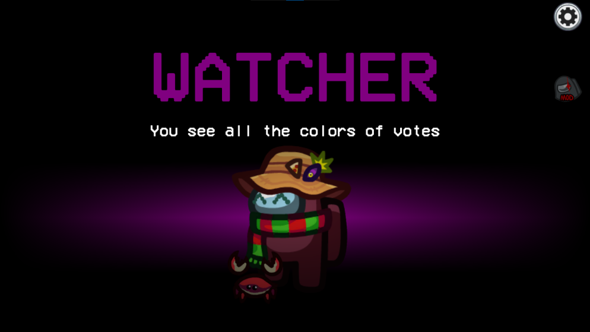

__Type__: Helpful (Global) 
__Ability__: See through anonymous votes 

Origin: [Town of Host](https://github.com/tukasa0001/TownOfHost)

#### Modifier Description
Watcher is a helpful modifier that allows seeing through anonymous votes. 
This can also see any extra votes (if set to be visible). 

------------------------------------------------------------------------------------------------------------------------------------------------------------------------------------------

## Workhorse

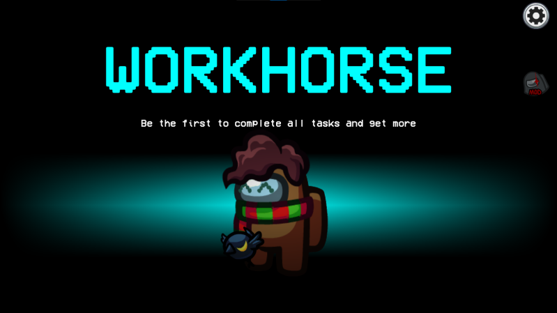

__Type__: Misc (Crew Only) 
__Ability__: Extra tasks 

Origin: [Town of Host](https://github.com/tukasa0001/TownOfHost)

#### Modifier Description
Workhorse is a modifier that is assigned to the first alive crewmate to finish all their tasks. 
Optionally, the [Snitch](#Snitch) can also recieve Workhorse.

------------------------------------------------------------------------------------------------------------------------------------------------------------------------------------------

This mod is not affiliated with Among Us or Innersloth LLC, and the content contained therein is not endorsed or otherwise sponsored by Innersloth LLC. 
Portions of the materials contained herein are property of Innersloth LLC. © Innersloth LLC.

For anyone wondering why there's no available source code, it was not uploaded to prevent code theft by the maintainer and contributors of [Town of Host Enhanced](https://github.com/0xDrMoe/TownofHost-Enhanced).
The maintainer is incredibly malicious and manipulative, so I have to not upload the source code for my own and the mod's safety.

I am sorry for any inconvenience this may have caused.

